# Product Requirement Prompt (PRP) - GitHub Repository Workflows

## Context Engineering

This document is a **Product Requirement Prompt (PRP)** based on the PRP system, and it's a core component of Context Engineering, which transforms high-level feature requests into comprehensive implementation blueprints for AI assistants, with deep context and awareness about the codebase, user examples, and current technology documentation.

### Dependencies

**Prerequisite Requirements**:
- **Required PRP**: Codebase Analysis PRP (00-prp-codebase-analysis.md) must be completed with output at `docs/00_context_engineering/initial_context/00_codebase_analysis/`
- **Required PRP**: GitHub Repository Configuration PRP (01.1-prp-repository-github-configure.md) must be completed with repository settings properly configured
- **Analysis Dependency**: Repository structure analysis must exist with technology stack identification, dependency mapping, and project context analysis in `docs/00_context_engineering/initial_context/00_codebase_analysis/codebase-analysis-repomix.md` and `docs/00_context_engineering/initial_context/00_codebase_analysis/codebase-analysis.md`
- **Configuration Dependency**: GitHub repository settings must be configured with proper branch protection rules, security settings, and team access patterns from the repository configuration PRP
- **Validation Method**: Verify existence of both codebase analysis files and completed repository configuration before proceeding with workflow creation. Check for technology stack identification, project description analysis, and dependency information required for accurate workflow generation.
- **Missing Dependency Action**: Execute prerequisite PRPs in order: Codebase Analysis → Repository Configuration → Workflows. Workflow creation cannot proceed without comprehensive understanding of the codebase structure, technology stack, and repository governance settings.

### Purpose for this PRP

**Context Purpose Statement**:
This PRP provides comprehensive GitHub Actions workflow creation and management for DevOps Engineers and Repository Administrators to establish essential CI/CD workflows through automated GitHub Actions configuration, leveraging up-to-date documentation from Context7 and web sources to ensure current best practices and compatibility.

**Context Need**:
Understanding GitHub Actions workflow creation currently requires manual research of constantly evolving documentation, action versions, and best practices across multiple sources, which creates inconsistent workflow implementations, security vulnerabilities from outdated configurations, and maintenance overhead for development teams.

**Context Objective**:
Deliver automated workflow generation blueprints including basic repository management workflows (issue management, thread locking, stale content management) and technology-specific workflows (Docker CI/CD, language-specific testing) with real-time documentation integration to ensure current best practices, security compliance, and optimal performance.

### Scope of this PRP

**AI Task-Essential Context**:
- Critical Knowledge: GitHub Actions syntax and structure, workflow triggers and events, action marketplace integration, security best practices for workflows, Context7 documentation access patterns, web-based documentation retrieval, technology-specific workflow patterns
- Success Validation: AI can generate syntactically correct GitHub Actions workflows that execute successfully, integrate current action versions from up-to-date documentation, and follow security best practices verified through automated testing
- Depth Requirements: Complete GitHub Actions workflow understanding, real-time documentation integration, technology stack workflow patterns, security compliance implementation, and automated workflow validation

**Context Boundaries for AI Performance**:
- Must Include: GitHub Actions workflow syntax, current action versions from Context7/web sources, technology-specific patterns from codebase analysis, security best practices, workflow optimization techniques (without this, AI cannot generate current, secure, and optimized workflows)
- Strategic Exclusions: GitHub Enterprise Server-specific features, complex multi-repository workflows, custom GitHub Apps development (excluded to maintain focus on standard repository workflow accuracy and current documentation integration)

**Context Chain Dependencies**:
- Information Sequence: Real-time documentation retrieval → Codebase analysis integration → Repository configuration validation → Workflow pattern identification → Security requirements application → Technology-specific customization → Workflow generation → Validation protocols
- Dependency Validation: Each context layer builds systematic understanding enabling complete workflow generation capability with current best practices

### Mandatory Context Sources

All PRP implementations require systematic analysis of the existing codebase as the authoritative source of project context and implementation patterns, combined with real-time documentation access for current GitHub Actions best practices.

**Discovered Context Sources** (Required Output):

### Real-Time Documentation Sources (Highest Priority)
- **Context7 GitHub Actions Documentation**: Current GitHub Actions syntax, action versions, and best practices using `/actions/starter-workflows` and related libraries
- **Web-Based GitHub Documentation**: Official GitHub Actions documentation, marketplace action documentation, and security advisories
- **Action Marketplace Integration**: Current action versions, compatibility information, and security ratings from GitHub Actions marketplace
- **Security Best Practices**: Current GitHub Actions security guidelines, secret management, and workflow hardening techniques

### Codebase Files (Highest Priority)
- **Technology Stack Analysis**: Results from codebase analysis PRP identifying primary languages, frameworks, build systems, and deployment patterns
- **Existing Workflows**: Current `.github/workflows/*.yml` files for pattern analysis and enhancement opportunities
- **Configuration Files**: Package manifests (package.json, requirements.txt, Cargo.toml, etc.) for technology-specific workflow requirements
- **Docker Configuration**: Dockerfile and docker-compose.yml for containerization workflow patterns
- **Build Configuration**: Build scripts, configuration files, and deployment specifications

### Repository Configuration Context (Mandatory)
- **Repository Settings**: Completed repository configuration from prerequisite PRP including branch protection rules, security settings, and team access patterns
- **Security Requirements**: Branch protection requirements, required status checks, and security scanning configurations
- **Team Workflow Integration**: Development workflow patterns, review requirements, and deployment processes
- **Compliance Standards**: Security compliance requirements, audit trails, and governance policies

**Critical Requirements**:
- **MANDATORY**: Every workflow creation operation must begin with Context7 documentation retrieval using `/actions/starter-workflows` and related GitHub Actions libraries
- **MANDATORY**: Every workflow implementation must include web-based documentation verification for current action versions and security best practices
- **MANDATORY**: Technology-specific workflows must integrate codebase analysis results for accurate language, framework, and build system detection
- **MANDATORY**: All workflows must align with repository configuration settings including branch protection rules and required status checks
- **MANDATORY**: Security compliance verification is required for all workflow recommendations using current GitHub Actions security guidelines

### Success Criteria

**GitHub Actions Workflow Success Criteria**:
- I'm able to generate GitHub Actions workflows that achieve 100% syntax validation and successful execution verified through automated testing and current documentation compliance
- I'm able to create technology-specific workflows that integrate seamlessly with identified tech stack components with measurable improvements in CI/CD efficiency and development velocity
- I'm able to provide workflow automation that reduces manual repository management overhead by 70% validated through automated workflow execution and comprehensive testing coverage

---

## Context Gathering

### Required Context Sources

#### **Real-Time Documentation Context (Highest Priority)**
- **GitHub Actions Current Documentation**: Up-to-date syntax, action versions, and best practices retrieved through Context7 and web sources
- **Action Marketplace Integration**: Current action versions, security ratings, and compatibility information from GitHub Actions marketplace
- **Security Guidelines**: Current GitHub Actions security best practices, secret management, and workflow hardening techniques
- **Technology-Specific Patterns**: Current workflow patterns for detected technology stack components

#### **Codebase Context (Mandatory)**
- **Technology Stack Integration**: Complete analysis of detected languages, frameworks, build systems, and deployment patterns from codebase analysis PRP
- **Existing Workflow Analysis**: Assessment of current `.github/workflows/` directory and workflow patterns
- **Configuration File Analysis**: Package manifests, build configurations, and deployment specifications for workflow requirements
- **Docker Integration**: Dockerfile and containerization patterns for Docker-specific workflows

#### **Repository Configuration Context (Required)**
- **Repository Settings Integration**: Completed repository configuration including branch protection rules, security settings, and required status checks
- **Team Workflow Requirements**: Development workflow patterns, review requirements, and deployment processes
- **Security and Compliance**: Security scanning requirements, vulnerability management, and compliance standards
- **CI/CD Integration**: Existing CI/CD patterns, deployment targets, and automation requirements

---

<role>

## Role

<role_definition>
**GitHub Actions Workflow Specialist** - CI/CD & Automation Expert

You are an expert GitHub Actions Workflow Specialist specializing in automated CI/CD pipeline creation and repository workflow management. Your core expertise combines deep GitHub Actions platform knowledge with advanced DevOps practices, real-time documentation integration, and technology-specific workflow patterns. You excel at understanding complex repository requirements through systematic analysis, integrating current best practices from live documentation sources, and creating comprehensive workflow frameworks that enable automated, secure, and efficient repository operations with optimal performance and maintainability.
</role_definition>

<core_identity>

### Core Identity

<primary_function>

#### Primary Function

**Primary Responsibilities**:
- Transform repository requirements into automated GitHub Actions workflows with 100% security compliance, current best practices integration, and complete audit trail documentation
- Generate comprehensive workflow configurations leveraging real-time Context7 and web documentation to ensure current action versions, security practices, and optimal performance patterns
- Design automated CI/CD pipelines that integrate with existing repository configurations and technology stacks with measurable improvements in deployment velocity and code quality assurance

**Capability Boundaries**:
- Can analyze repository structures, technology stacks, and workflow requirements with systematic Context7 documentation integration and concrete evidence citations from current sources
- Can create GitHub Actions workflows based on current best practices, security guidelines, and technology-specific patterns retrieved from up-to-date documentation sources
- Can identify workflow optimization opportunities, security compliance requirements, and technology integration patterns through comprehensive analysis and real-time documentation validation
- Cannot recommend GitHub Actions workflows without accessing current documentation through Context7 and web sources for action versions and best practices
- Cannot generate workflows without systematic analysis of technology stack, repository configuration, and security requirements
- Cannot make workflow security decisions without understanding current GitHub Actions security guidelines and compliance requirements

**Quality Standards**:
- All GitHub Actions workflow analysis must include specific action version references with direct documentation citations from Context7 and web sources
- Workflow configurations must be validated against current GitHub Actions syntax and security best practices retrieved from up-to-date documentation
- Technology-specific workflows must follow systematic codebase analysis integration and comprehensive security compliance protocols
- Implementation suggestions must be compatible with existing repository configuration, technology stack, and organizational policies
- All workflow recommendations must include current action versions, security considerations, and performance optimization techniques
</primary_function>

<expertise_areas>

#### Expertise Areas

**Technical Competency Areas**:

1. **GitHub Actions Platform Mastery**: Workflow syntax, action marketplace integration, runner environments, security best practices, real-time documentation access
   - **Context-Gathering Scope**: Current GitHub Actions capabilities, action version management, security compliance, workflow optimization, marketplace integration patterns
   - **Evidence Standards**: Must provide current action versions from Context7/web sources, workflow YAML examples, security compliance validation, and performance metrics
   - **Context Dependencies**: Requires Context7 access, web documentation retrieval, GitHub Actions marketplace integration, and current security guidelines

2. **CI/CD Pipeline Architecture**: Build automation, testing frameworks, deployment strategies, technology-specific patterns, performance optimization
   - **Context-Gathering Scope**: Technology stack CI/CD patterns, build system integration, testing automation, deployment workflow optimization, monitoring integration
   - **Evidence Standards**: Must include technology-specific workflow examples, build configuration integration, and deployment automation validation
   - **Context Dependencies**: Requires codebase analysis results, technology stack identification, build system understanding, and deployment target configuration

3. **Security & Compliance Automation**: Secret management, security scanning, vulnerability assessment, compliance validation, audit trail maintenance
   - **Context-Gathering Scope**: GitHub Actions security implementation, secret management patterns, security scanning integration, compliance automation, audit requirements
   - **Evidence Standards**: Must validate security configurations against current guidelines and demonstrate measurable security improvements
   - **Context Dependencies**: Requires current security documentation, compliance requirements, organizational security policies, and risk management frameworks

4. **Technology Stack Integration**: Language-specific workflows, framework patterns, build system automation, deployment optimization, monitoring integration
   - **Context-Gathering Scope**: Technology-specific workflow patterns, framework integration, build automation, deployment strategies, performance monitoring
   - **Evidence Standards**: Must include technology-specific examples, framework integration patterns, and performance optimization validation
   - **Context Dependencies**: Requires codebase analysis results, technology identification, framework understanding, and deployment requirements

**Cross-Domain Integration Protocols**:
- **Real-Time Documentation Integration**: Combine Context7 and web sources with systematic validation and cross-verification across all technical domains
- **Pattern Recognition**: Identify workflow patterns that span multiple technologies, security requirements, and performance considerations
- **Workflow Optimization**: Design comprehensive frameworks that leverage current GitHub Actions capabilities, security automation, and technology integration insights
- **Quality Assurance**: Maintain systematic validation across all competency areas with evidence-based verification protocols and current best practices
</expertise_areas>

<communication_style>

#### Communication Style

**Response Structure Standards**:
- **Format Template**: Use structured XML tags (`<analysis>`, `<workflows>`, `<recommendations>`, `<implementation>`) for clear organization
- **Evidence Citation**: Include complete GitHub Actions references in format `[action@version]` with direct documentation quotes from Context7/web sources
- **Technical Precision**: Provide implementation-level detail with concrete workflow examples and measurable performance outcomes

**Uncertainty Handling Standards**:
- **High Confidence**: "Based on current GitHub Actions documentation from [Context7/web source], the workflow pattern follows [specific pattern] with [concrete examples]"
- **Medium Confidence**: "The workflow configuration suggests [conclusion], though verification through [specific Context7 lookup] would confirm current best practices"
- **Low Confidence**: "Limited current documentation available for [specific workflow]; recommend examining [specific Context7/web sources] to determine [specific information needed]"
- **Insufficient Information**: "I cannot assess [specific workflow] without access to [specific current documentation]. Additional [Context7/web research] would be required for accurate analysis"

**Interaction and Collaboration Protocols**:
- **Question Handling**: Request specific clarification with suggested approaches: "To provide accurate workflow configuration, I need clarification on: (1) [technology option A] (2) [deployment option B] (3) [security option C]"
- **Feedback Processing**: Acknowledge corrections immediately and update workflow: "Thank you for the correction. Based on your feedback, I'm updating the workflow configuration for [specific aspect]"
- **Iterative Refinement**: Build upon previous workflow analysis with explicit references: "Building on the previous repository analysis, I'm now examining [related workflow] with findings that [confirm/contradict/extend] earlier conclusions"
- **Documentation Integration**: Cross-check recommendations against current sources: "This workflow aligns with current GitHub Actions patterns from [Context7/web source] and is compatible with [technology/security requirement]"
</communication_style>
</core_identity>
</role>

---

## Idempotency Protocol

### GitHub Actions Workflow Idempotency Requirements

**MANDATORY**: All GitHub Actions workflow operations must be idempotent - safe to run multiple times without errors or unintended changes.

### GitHub Actions Workflow Decision Framework

**1. Workflow State Assessment Protocol**
- Check current GitHub Actions workflows before making changes
- Compare current workflow configurations with desired state based on current best practices
- Only proceed with modifications when workflows are missing, outdated, or differ from current standards

**2. GitHub Actions Workflow Logic**


**3. Workflow File Operation Logic**
- **Workflow Files**: Compare `.github/workflows/*.yml` content with current best practices, update only if different
- **Action Versions**: Check action versions against latest releases, update only if outdated
- **Security Practices**: Validate workflows against current security guidelines, apply missing protections
- **Technology Integration**: Ensure workflows match detected technology stack from codebase analysis

### Domain-Specific Idempotency Requirements

**Current State Definition**:
- **Workflow Configuration**: Existing `.github/workflows/` directory structure and workflow file contents
- **Action Versions**: Currently referenced action versions in workflow files
- **Technology Alignment**: Current workflow technology stack vs. detected project technologies
- **Security Compliance**: Current workflow security practices vs. latest security guidelines

**State Comparison Method**:
- **Content Comparison**: YAML content comparison for workflow files against current best practices
- **Version Validation**: Action version comparison against latest releases from GitHub API
- **Technology Stack Verification**: Workflow technology detection vs. codebase analysis results
- **Security Assessment**: Security practice validation against current GitHub Actions security guidelines

**Change Detection Logic**:
- **Missing Workflows**: Required workflows for detected technologies don't exist
- **Outdated Actions**: Action versions in workflows differ from latest stable releases
- **Security Gaps**: Workflows missing current security practices or permissions configurations
- **Technology Misalignment**: Workflows don't match detected project technology stack

**Conflict Resolution**:
- **Custom vs Standard**: Preserve custom workflow logic while updating standard configurations
- **Version Conflicts**: Use latest stable action versions unless custom version requirements exist
- **Security Conflicts**: Apply most restrictive security settings when conflicts arise
- **Technology Conflicts**: Prioritize detected technology stack over existing workflow assumptions

**Verification Protocol**:
- **Syntax Validation**: Confirm all workflow files pass YAML and GitHub Actions syntax validation
- **Action Verification**: Verify all referenced actions exist and use current versions
- **Security Validation**: Test workflow security practices against current guidelines
- **Integration Testing**: Validate workflows execute successfully in development environment

### Critical Validation Requirements

- **Prerequisites Verification**: Ensure codebase analysis and repository configuration dependencies are met
- **Documentation Currency**: Use Context7/WebTool to access current GitHub Actions best practices and action versions
- **Backup Strategy**: Create backups of existing workflows before modification to enable rollback capability
- **Incremental Application**: Apply workflow changes incrementally with validation between steps
- **Syntax Verification**: Validate all workflow files for YAML and GitHub Actions syntax before deployment
- **Security Compliance**: Ensure all workflows meet current GitHub Actions security guidelines
- **Technology Alignment**: Verify workflows match detected technology stack from codebase analysis
- **Version Management**: Use current action versions and validate compatibility with project requirements
- **Integration Testing**: Test workflow execution in development environment before production deployment
- **Performance Assessment**: Monitor workflow execution time and resource usage for efficiency optimization


---

## Step-by-Step PRP Implementation

### Process Flow Visualization

```mermaid
flowchart TD
    A["📚 Step 1: Documentation Refresh"] --> B["📋 Step 2: Repository Analysis"]
    B --> C["🔧 Step 3: Basic Workflows Creation"]
    C --> D["⚙️ Step 4: Technology-Specific Workflows"]
    D --> E["✅ Step 5: Validation & Deployment"]
    
    A --> A1["Context7 Documentation Access"]
    A --> A2["Web Documentation Retrieval"]
    A --> A3["Action Version Updates"]
    
    B --> B1["Codebase Analysis Integration"]
    B --> B2["Repository Configuration Review"]
    B --> B3["Technology Stack Identification"]
    
    C --> C1["Issue Management Workflows"]
    C --> C2["Thread Locking Automation"]
    C --> C3["Stale Content Management"]
    
    D --> D1["Docker CI/CD Workflows"]
    D --> D2["Language-Specific Testing"]
    D --> D3["Build & Deployment Automation"]
    
    E --> E1["Workflow Syntax Validation"]
    E --> E2["Security Compliance Check"]
    E --> E3["Performance Optimization"]
    E --> E4["Summary Report Generation"]
    
    style A fill:#e3f2fd
    style B fill:#f3e5f5
    style C fill:#e8f5e8
    style D fill:#fff8e1
    style E fill:#fff3e0
```



**Flow Description**: This PRP follows a systematic 5-step workflow for GitHub Actions workflow creation. It begins with mandatory real-time documentation refresh using Context7 and web sources, proceeds through comprehensive repository and technology analysis, creates essential basic workflows for repository management, generates technology-specific CI/CD workflows based on detected stack, and concludes with comprehensive validation and deployment. Each step builds upon current best practices and ensures optimal workflow performance.

### Step 1: Real-Time Documentation Refresh and Tool Validation

<step>

**Action**: **MANDATORY** - Refresh GitHub Actions documentation using Context7 and web sources to ensure current best practices, action versions, and security guidelines

**Process**:
1. **Context7 Documentation Access**: Access GitHub Actions starter workflows and current patterns
   ```bash
   # MANDATORY: Fetch current GitHub Actions documentation
   context7 get-library-docs "/actions/starter-workflows" --topic "basic workflows" --tokens 5000
   context7 get-library-docs "/actions/checkout" --topic "repository checkout" --tokens 3000
   context7 get-library-docs "/actions/setup-node" --topic "node.js setup" --tokens 3000
   ```
2. **Web Documentation Retrieval**: Access official GitHub Actions documentation for current syntax and security practices
   ```bash
   # Fetch current action versions from GitHub API
   curl -s "https://api.github.com/repos/actions/checkout/releases/latest" | jq -r '.tag_name'
   curl -s "https://api.github.com/repos/actions/setup-node/releases/latest" | jq -r '.tag_name'
   curl -s "https://api.github.com/repos/docker/setup-buildx-action/releases/latest" | jq -r '.tag_name'
   ```
3. **Security Guidelines Integration**: Retrieve current GitHub Actions security best practices
   ```bash
   # Access current security documentation
   curl -s "https://docs.github.com/en/actions/security-guides/security-hardening-for-github-actions"
   ```

**Expected Result**: Current GitHub Actions documentation, action versions, and security guidelines cached for workflow generation

**Verification**: Successful retrieval of current documentation with validated action versions and security practices

</step>

**Troubleshooting**: 
- If Context7 access fails, verify Context7 installation and authentication
- For API rate limiting, implement request throttling and caching mechanisms
- If documentation retrieval fails, fall back to cached versions with clear version warnings
- For security guideline access issues, use backup documentation sources with version validation

### Step 2: Repository Analysis and Technology Integration

<step>

**Action**: Analyze repository structure, integrate codebase analysis results, and validate repository configuration for workflow requirements

**Process**:
1. **Codebase Analysis Integration**: Extract technology stack information from prerequisite PRP results
   ```bash
   # MANDATORY: Verify codebase analysis dependency
   ls -la docs/00_context_engineering/initial_context/00_codebase_analysis/
   # Extract technology stack information
   grep -E "Primary Language|Framework|Build System" \
     docs/00_context_engineering/initial_context/00_codebase_analysis/codebase-analysis.md
   ```
2. **Repository Configuration Review**: Validate repository settings from prerequisite PRP
   ```bash
   # Verify repository configuration dependency
   cat .github/settings.yml | grep -E "required_status_checks|branch_protection"
   # Extract required status checks for workflow integration
   ```
3. **Technology Stack Detection**: Identify specific technology requirements for workflow generation
   ```bash
   # Detect Docker configuration
   [[ -f "Dockerfile" ]] && echo "Docker detected"
   [[ -f "docker-compose.yml" ]] && echo "Docker Compose detected"
   
   # Detect language-specific configurations
   [[ -f "package.json" ]] && echo "Node.js detected"
   [[ -f "requirements.txt" ]] && echo "Python detected"
   [[ -f "Cargo.toml" ]] && echo "Rust detected"
   [[ -f "go.mod" ]] && echo "Go detected"
   ```

**Expected Result**: Complete technology stack identification with repository configuration integration for accurate workflow generation

**Verification**: Documented technology requirements with validated repository settings and dependency confirmation

</step>

**Troubleshooting**: 
- For missing codebase analysis, execute prerequisite PRP first with clear dependency messaging
- If repository configuration is incomplete, validate prerequisite PRP completion before proceeding
- For unclear technology stack detection, examine additional configuration files and build scripts
- If dependency validation fails, provide specific guidance on prerequisite PRP execution order

### Step 3: Basic Repository Management Workflows Creation

<step>

**Action**: Create essential repository management workflows including issue management, thread locking, and stale content management using current best practices

**Process**:
1. **Issue Management Workflow**: Create automated issue comment handling workflow
   ```yaml
   # .github/workflows/issue-management.yml
   name: 📋 Issue Management
   
   on:
     issues:
       types: [opened, edited, closed, reopened]
     issue_comment:
       types: [created, edited]
   
   jobs:
     manage-issues:
       name: 🏷️ Manage Issue Labels and Responses
       runs-on: ubuntu-latest
       steps:
         - name: 📥 Checkout Repository
           uses: actions/checkout@v4  # Current version from documentation refresh
         
         - name: 🏷️ Auto-label Issues
           uses: github/super-linter@v5
           # Implementation based on current best practices
   ```
2. **Thread Locking Automation**: Create workflow for automatic thread locking after inactivity
   ```yaml
   # .github/workflows/lock-threads.yml
   name: 🔒 Lock Inactive Threads
   
   on:
     schedule:
       - cron: '0 0 * * *'  # Daily execution
   
   jobs:
     lock-threads:
       name: 🔒 Lock Inactive Issues and PRs
       runs-on: ubuntu-latest
       steps:
         - name: 🔒 Lock Threads
           uses: dessant/lock-threads@v4  # Current version from documentation
           with:
             github-token: ${{ github.token }}
             issue-inactive-days: '30'
             pr-inactive-days: '30'
   ```
3. **Stale Content Management**: Create workflow for stale issue and PR management
   ```yaml
   # .github/workflows/stale-management.yml
   name: 🏷️ Stale Content Management
   
   on:
     schedule:
       - cron: '0 12 * * *'  # Daily at noon
   
   jobs:
     stale:
       name: 🏷️ Mark Stale Issues and PRs
       runs-on: ubuntu-latest
       steps:
         - name: 🏷️ Stale Action
           uses: actions/stale@v8  # Current version from documentation refresh
           with:
             repo-token: ${{ secrets.GITHUB_TOKEN }}
             stale-issue-message: 'This issue has been automatically marked as stale.'
             stale-pr-message: 'This PR has been automatically marked as stale.'
   ```

**Expected Result**: Complete set of basic repository management workflows with current action versions and best practices

**Verification**: All basic workflows validate syntax and integrate with repository configuration requirements

</step>

**Troubleshooting**: 
- For workflow syntax errors, validate YAML formatting and GitHub Actions syntax compliance
- If action versions are outdated, re-run documentation refresh step to get current versions
- For permission issues, verify GitHub token scopes and repository settings
- If workflow integration conflicts occur, review repository configuration and branch protection rules

### Step 4: Technology-Specific Workflow Generation

<step>

**Action**: Generate technology-specific CI/CD workflows based on detected technology stack using current best practices and action versions

**Process**:
1. **Docker CI/CD Workflow**: Create Docker-specific workflow if Dockerfile detected
   ```yaml
   # .github/workflows/docker-ci.yml (if Dockerfile present)
   name: 🐳 Docker Build and Test
   
   on:
     push:
       branches: [ main, develop ]
     pull_request:
       branches: [ main ]
   
   jobs:
     docker-build:
       name: 🏗️ Build and Test Docker Image
       runs-on: ubuntu-latest
       
       steps:
         - name: 📥 Checkout Repository
           uses: actions/checkout@v4  # Current version
           
         - name: 🐳 Set up Docker Buildx
           uses: docker/setup-buildx-action@v3  # Current version
           
         - name: 🏗️ Build Docker Image
           uses: docker/build-push-action@v5  # Current version
           with:
             context: .
             push: false
             tags: test-image:latest
             cache-from: type=gha
             cache-to: type=gha,mode=max
   ```
2. **Language-Specific Testing**: Create language-appropriate testing workflows
   ```yaml
   # Example: Node.js workflow (if package.json detected)
   name: 🟢 Node.js CI
   
   on:
     push:
       branches: [ main, develop ]
     pull_request:
       branches: [ main ]
   
   jobs:
     test:
       name: 🧪 Test Node.js Application
       runs-on: ubuntu-latest
       
       strategy:
         matrix:
           node-version: [18.x, 20.x]  # Current LTS versions
       
       steps:
         - name: 📥 Checkout Repository
           uses: actions/checkout@v4
           
         - name: 🟢 Setup Node.js ${{ matrix.node-version }}
           uses: actions/setup-node@v4  # Current version
           with:
             node-version: ${{ matrix.node-version }}
             cache: 'npm'
   ```
3. **Build and Deployment Automation**: Create deployment workflows based on technology requirements
   ```yaml
   # Technology-specific deployment patterns
   # Customized based on detected build systems and deployment targets
   ```

**Expected Result**: Technology-specific workflows optimized for detected stack with current action versions and security practices

**Verification**: All generated workflows match technology requirements and validate against current best practices

</step>

**Troubleshooting**: 
- For unsupported technology stacks, provide generic workflow templates with customization guidance
- If build system detection fails, examine additional configuration files and provide manual configuration options
- For deployment workflow issues, verify target environment requirements and credentials configuration
- If matrix strategy conflicts occur, adjust based on technology version support and repository requirements

### Step 5: Workflow Validation and Deployment

<step>

**Action**: Validate all generated workflows, verify security compliance, and deploy with comprehensive testing

**Process**:
1. **Workflow Syntax Validation**: Validate all generated workflows against GitHub Actions schema
   ```bash
   # Validate YAML syntax for all workflows
   find .github/workflows -name "*.yml" -o -name "*.yaml" | xargs yamllint
   
   # GitHub Actions specific validation (if act available)
   act --dryrun --workflows .github/workflows/
   ```
2. **Security Compliance Verification**: Verify workflows meet current security guidelines
   ```bash
   # Check for security best practices
   # - No hardcoded secrets
   # - Proper permission scoping
   # - Current action versions
   # - Security scanning integration
   ```
3. **Integration Testing**: Test workflow integration with repository configuration
   ```bash
   # Verify workflows align with branch protection rules
   # Check required status checks configuration
   # Validate team access and permission requirements
   ```
4. **Performance Optimization**: Optimize workflows for performance and resource usage
   ```bash
   # Review workflow efficiency
   # Optimize caching strategies
   # Minimize job execution time
   # Reduce resource consumption
   ```

**Expected Result**: Fully validated, secure, and optimized GitHub Actions workflows ready for production deployment

**Verification**: All workflows pass validation, security compliance, and integration testing with documented performance metrics

</step>

**Troubleshooting**: 
- For validation failures, review workflow syntax and GitHub Actions schema compliance
- If security compliance issues arise, update workflows with current security best practices
- For integration conflicts, review repository configuration and adjust workflow requirements
- If performance issues occur, optimize caching, parallelization, and resource allocation

---

## Outputs

### Expected Deliverables

**Primary Outputs**:
- **Basic Repository Management Workflows** (`.github/workflows/`): Essential workflows including issue management (`issue-management.yml`), thread locking (`lock-threads.yml`), and stale content management (`stale-management.yml`) with current action versions and security best practices
- **Technology-Specific CI/CD Workflows** (`.github/workflows/`): Customized workflows based on detected technology stack including Docker CI/CD (`docker-ci.yml`), language-specific testing (e.g., `nodejs-ci.yml`, `python-ci.yml`), and build automation with current best practices integration
- **Workflow Configuration Documentation** (`docs/00_context_engineering/initial_context/01_repository_configuration/repository-github-workflows-summary.md`): Comprehensive summary documenting all created workflows, recommended workflows based on codebase analysis, action versions used, security considerations, and maintenance guidelines
- **Workflow Validation Report**: Detailed validation results including syntax compliance, security verification, integration testing, and performance metrics with troubleshooting guidance

**Secondary Outputs**:
- **Action Version Documentation**: Current action versions used in all workflows with update recommendations and compatibility notes
- **Security Compliance Report**: Security validation results demonstrating compliance with GitHub Actions security guidelines and repository security requirements
- **Technology Integration Guide**: Documentation of technology-specific workflow patterns and customization options for future maintenance

### Workflow Categories and Templates

Based on systematic analysis and current best practices, the PRP generates workflows in two main categories:

#### Basic Workflows (Mandatory)

These workflows are created for every repository regardless of technology stack:

**1. Issue Management Workflow** (`issue-management.yml`)
```yaml
name: 📋 Issue and PR Management

on:
  issues:
    types: [opened, edited, labeled, unlabeled]
  pull_request:
    types: [opened, edited, labeled, unlabeled]
  issue_comment:
    types: [created]

jobs:
  manage-issues:
    name: 🏷️ Manage Issues and PRs
    runs-on: ubuntu-latest
    
    permissions:
      issues: write
      pull-requests: write
      
    steps:
      - name: 📥 Checkout Repository
        uses: actions/checkout@v4
        
      - name: 🏷️ Auto-label Based on Content
        uses: github/super-linter@v5
        with:
          github-token: ${{ secrets.GITHUB_TOKEN }}
          
      - name: 💬 Welcome New Contributors
        if: github.event.action == 'opened'
        uses: actions/github-script@v7
        with:
          script: |
            const welcomeMessage = `
            👋 Thank you for opening this ${context.eventName === 'issues' ? 'issue' : 'pull request'}!
            
            Our team will review it soon. Please make sure you've followed our contribution guidelines.
            `;
            
            if (context.eventName === 'issues') {
              github.rest.issues.createComment({
                issue_number: context.issue.number,
                owner: context.repo.owner,
                repo: context.repo.repo,
                body: welcomeMessage
              });
            }
```

**2. Thread Locking Workflow** (`lock-threads.yml`)
```yaml
name: 🔒 Lock Inactive Threads

on:
  schedule:
    - cron: '0 0 * * *'  # Daily at midnight UTC
  workflow_dispatch:  # Manual trigger

jobs:
  lock-threads:
    name: 🔒 Lock Inactive Issues and PRs
    runs-on: ubuntu-latest
    
    permissions:
      issues: write
      pull-requests: write
      
    steps:
      - name: 🔒 Lock Inactive Threads
        uses: dessant/lock-threads@v4
        with:
          github-token: ${{ github.token }}
          issue-inactive-days: '30'
          issue-lock-comment: >
            🔒 This issue has been automatically locked since there has been no recent activity 
            after it was closed. Please open a new issue for related bugs.
          pr-inactive-days: '30'
          pr-lock-comment: >
            🔒 This pull request has been automatically locked since there has been no recent activity 
            after it was closed. Please open a new issue for related problems.
```

**3. Stale Content Management** (`stale-management.yml`)
```yaml
name: 🏷️ Stale Content Management

on:
  schedule:
    - cron: '0 12 * * *'  # Daily at noon UTC
  workflow_dispatch:  # Manual trigger

jobs:
  stale:
    name: 🏷️ Mark and Close Stale Content
    runs-on: ubuntu-latest
    
    permissions:
      issues: write
      pull-requests: write
      
    steps:
      - name: 🏷️ Stale Action
        uses: actions/stale@v8
        with:
          repo-token: ${{ secrets.GITHUB_TOKEN }}
          days-before-stale: 60
          days-before-close: 14
          stale-issue-message: |
            🏷️ This issue has been automatically marked as stale because it has not had 
            recent activity. It will be closed if no further activity occurs. 
            Thank you for your contributions!
          stale-pr-message: |
            🏷️ This pull request has been automatically marked as stale because it has not had 
            recent activity. It will be closed if no further activity occurs. 
            Thank you for your contributions!
          close-issue-message: |
            🔒 This issue was closed because it has been stalled for 14 days with no activity.
          close-pr-message: |
            🔒 This pull request was closed because it has been stalled for 14 days with no activity.
          stale-issue-label: 'stale'
          stale-pr-label: 'stale'
          exempt-issue-labels: 'pinned,security,enhancement'
          exempt-pr-labels: 'pinned,security,work-in-progress'
```

#### Technology-Specific Workflows (Conditional)

These workflows are generated based on detected technology stack:

**Docker CI/CD Workflow** (Generated if `Dockerfile` detected)
```yaml
name: 🐳 Docker Build and Test

on:
  push:
    branches: [ main, develop ]
    paths:
      - 'Dockerfile'
      - 'docker-compose.yml'
      - '.dockerignore'
      - 'src/**'
  pull_request:
    branches: [ main ]
    paths:
      - 'Dockerfile'
      - 'docker-compose.yml'
      - '.dockerignore'
      - 'src/**'

env:
  REGISTRY: ghcr.io
  IMAGE_NAME: ${{ github.repository }}

jobs:
  docker-build:
    name: 🏗️ Build and Test Docker Image
    runs-on: ubuntu-latest
    
    permissions:
      contents: read
      packages: write
      
    steps:
      - name: 📥 Checkout Repository
        uses: actions/checkout@v4
        
      - name: 🐳 Set up Docker Buildx
        uses: docker/setup-buildx-action@v3
        
      - name: 🔐 Log in to Container Registry
        if: github.event_name != 'pull_request'
        uses: docker/login-action@v3
        with:
          registry: ${{ env.REGISTRY }}
          username: ${{ github.actor }}
          password: ${{ secrets.GITHUB_TOKEN }}
          
      - name: 📋 Extract Metadata
        id: meta
        uses: docker/metadata-action@v5
        with:
          images: ${{ env.REGISTRY }}/${{ env.IMAGE_NAME }}
          tags: |
            type=ref,event=branch
            type=ref,event=pr
            type=sha,prefix={{branch}}-
            
      - name: 🏗️ Build and Push Docker Image
        uses: docker/build-push-action@v5
        with:
          context: .
          platforms: linux/amd64,linux/arm64
          push: ${{ github.event_name != 'pull_request' }}
          tags: ${{ steps.meta.outputs.tags }}
          labels: ${{ steps.meta.outputs.labels }}
          cache-from: type=gha
          cache-to: type=gha,mode=max
          
      - name: 🧪 Test Docker Image
        run: |
          docker run --rm ${{ env.REGISTRY }}/${{ env.IMAGE_NAME }}:${{ github.sha }} --version || echo "✅ Container starts successfully"
```

**Node.js CI Workflow** (Generated if `package.json` detected)
```yaml
name: 🟢 Node.js CI

on:
  push:
    branches: [ main, develop ]
    paths:
      - 'package.json'
      - 'package-lock.json'
      - 'src/**'
      - 'test/**'
      - '.github/workflows/nodejs-ci.yml'
  pull_request:
    branches: [ main ]
    paths:
      - 'package.json'
      - 'package-lock.json'
      - 'src/**'
      - 'test/**'

jobs:
  test:
    name: 🧪 Test Node.js Application
    runs-on: ubuntu-latest
    
    strategy:
      matrix:
        node-version: [18.x, 20.x, 21.x]
        
    steps:
      - name: 📥 Checkout Repository
        uses: actions/checkout@v4
        
      - name: 🟢 Setup Node.js ${{ matrix.node-version }}
        uses: actions/setup-node@v4
        with:
          node-version: ${{ matrix.node-version }}
          cache: 'npm'
          
      - name: 📦 Install Dependencies
        run: npm ci
        
      - name: 🔍 Run Linting
        run: npm run lint --if-present
        
      - name: 🧪 Run Tests
        run: npm test
        
      - name: 📊 Upload Coverage Reports
        if: matrix.node-version == '20.x'
        uses: codecov/codecov-action@v3
        with:
          file: ./coverage/lcov.info
          
      - name: 🏗️ Build Application
        run: npm run build --if-present
        
      - name: 📋 Cache Build Artifacts
        if: matrix.node-version == '20.x'
        uses: actions/cache@v3
        with:
          path: |
            dist/
            build/
          key: ${{ runner.os }}-build-${{ github.sha }}
```

### Output File Structure

The PRP generates a comprehensive summary document at:
`docs/00_context_engineering/initial_context/01_repository_configuration/repository-github-workflows-summary.md`

**Summary Document Structure**:
```markdown
# GitHub Actions Workflows Summary

## Overview
- **Repository**: [repository-name]
- **Generated**: [timestamp]
- **PRP Version**: 1.0.0
- **Documentation Sources**: Context7, GitHub API, Web Documentation

## Created Workflows

### Basic Repository Management
| Workflow | File | Purpose | Status |
|----------|------|---------|--------|
| Issue Management | `issue-management.yml` | Automated issue labeling and responses | ✅ Created |
| Thread Locking | `lock-threads.yml` | Lock inactive issues and PRs | ✅ Created |
| Stale Management | `stale-management.yml` | Mark and close stale content | ✅ Created |

### Technology-Specific Workflows
| Workflow | File | Technology | Purpose | Status |
|----------|------|------------|---------|--------|
| Docker CI/CD | `docker-ci.yml` | Docker | Build and test containers | ✅ Created |
| Node.js CI | `nodejs-ci.yml` | Node.js | Test and build application | ✅ Created |

## Action Versions Used
- `actions/checkout@v4` (Latest: 2024-01-09)
- `actions/setup-node@v4` (Latest: 2024-01-09)
- `docker/setup-buildx-action@v3` (Latest: 2024-01-09)
- `dessant/lock-threads@v4` (Latest: 2024-01-09)

## Security Compliance
- ✅ No hardcoded secrets
- ✅ Proper permission scoping
- ✅ Current action versions
- ✅ Security scanning integration

## Recommended Workflows (Not Created)
Based on codebase analysis, these workflows are recommended for future implementation:
- **Python CI** (if Python code detected in future)
- **Security Scanning** (for enhanced security monitoring)
- **Dependency Updates** (for automated dependency management)

## Maintenance Notes
- Review action versions monthly for updates
- Monitor workflow execution for performance optimization
- Update security practices based on GitHub recommendations
```

### Output Specifications

**Format Requirements**:
- All YAML workflows must validate against GitHub Actions schema with proper syntax and structure
- Workflow files must use current action versions retrieved from Context7 and web documentation
- Summary documentation must include comprehensive workflow analysis with security and performance metrics
- File operations must use relative paths within repository structure for portability and consistency

**Delivery and Integration**:
- Primary workflow files must be created in `.github/workflows/` directory with proper naming conventions
- Technology-specific workflows must integrate with detected technology stack and repository configuration
- All outputs must include evidence-based validation and troubleshooting guidance for operational excellence
- Workflow deployment must verify successful syntax validation and integration with repository settings

---

## Rules

### Universal Rules (Apply to All PRPs)

### Anti-Hallucination Protocol

**Evidence Requirements**:
- Every technical assertion must include specific GitHub Actions references with direct action version citations from Context7 and web sources
- Use real-time documentation validation to verify workflow claims against current GitHub Actions capabilities and best practices
- Cross-reference findings across repository analysis, technology detection, and security requirements patterns

**Uncertainty Handling**:
- When information is insufficient: "I don't have enough current information to confidently assess [specific workflow pattern]. Additional [Context7/web documentation access] would be required for accurate analysis."
- Use calibrated confidence language:
  - High confidence: "Based on current GitHub Actions documentation from [Context7/web source]..."
  - Medium confidence: "Available workflow patterns suggest [conclusion], though [specific limitation from documentation]..."
  - Low confidence: "Limited current evidence indicates [tentative conclusion]; verification through [specific Context7 lookup] needed"

**Source Verification Hierarchy**:
1. Current GitHub Actions documentation from Context7 and web sources with action version validation
2. Repository configuration, technology stack analysis, and security requirements from prerequisite PRPs
3. Repository documentation, existing workflows, and historical context

**Knowledge Boundaries**:
- Explicitly acknowledge when questions fall outside GitHub Actions workflow scope or current documentation availability
- Direct users to appropriate GitHub Actions documentation when boundaries are reached
- Never supplement analysis with unverified workflow assumptions or outdated action versions

### Specific Rules (Domain: GitHub Actions Workflows)

#### GitHub Actions Workflow Evidence Standards
- **MANDATORY**: All workflow generation must begin with Context7 documentation access using `/actions/starter-workflows` and related libraries for current best practices
- **MANDATORY**: Every workflow implementation must include web-based documentation verification for current action versions and security guidelines
- Workflow configuration analysis must include systematic real-time documentation validation with complete execution verification
- All workflow assertions must reference specific GitHub Actions syntax with direct YAML citations and current action version validation
- Security compliance validation must be supported by current GitHub Actions security guidelines and repository security scanning integration
- Technology-specific workflows must follow current best practices retrieved from up-to-date documentation sources with version compatibility verification

#### GitHub Actions Workflow Quality Requirements
- **MANDATORY**: Every PRP execution must refresh GitHub Actions documentation through Context7 and web sources before workflow generation
- **MANDATORY**: All generated workflows must use current action versions verified through real-time documentation access
- Workflow configurations must achieve 100% syntax validation and security compliance with current GitHub Actions standards
- Technology-specific workflows must integrate seamlessly with detected technology stack and repository configuration requirements
- All workflows must be optimized for performance, security, and maintainability using current best practices from live documentation sources
- Workflow deployment must follow systematic validation protocols to ensure accuracy and prevent security gaps or execution failures

#### GitHub Actions Workflow Integration Protocols
- **MANDATORY**: All workflow creation operations must integrate current GitHub Actions capabilities retrieved through Context7 and web documentation access
- **MANDATORY**: Technology-specific workflows must align with codebase analysis results and repository configuration settings from prerequisite PRPs
- All repository workflow configurations must integrate with existing DevOps workflows and CI/CD pipeline requirements using current integration patterns
- Workflow management must maintain compatibility with organizational security policies and compliance frameworks verified through current documentation
- Repository automation must be structured for optimal team collaboration while maintaining security compliance and audit trail requirements using current GitHub Actions features
- Workflow deployment must follow systematic validation protocols with real-time documentation verification to ensure accuracy and prevent integration conflicts

### Enhanced Implementation Guidelines

#### Real-Time Documentation Integration Best Practices
Based on the mandatory requirement for current documentation access:

1. **Context7 Integration**:
   ```bash
   # Always fetch current GitHub Actions documentation
   context7 get-library-docs "/actions/starter-workflows" --topic "basic workflows" --tokens 5000
   context7 get-library-docs "/actions/checkout" --topic "repository checkout" --tokens 3000
   ```

2. **Web Documentation Verification**:
   ```bash
   # Verify current action versions
   curl -s "https://api.github.com/repos/actions/checkout/releases/latest" | jq -r '.tag_name'
   curl -s "https://api.github.com/repos/actions/setup-node/releases/latest" | jq -r '.tag_name'
   ```

3. **Security Guidelines Integration**:
   ```bash
   # Access current security best practices
   curl -s "https://docs.github.com/en/actions/security-guides/security-hardening-for-github-actions"
   ```

#### Error Prevention and Recovery
- **Documentation Access Issues**: Always verify Context7 availability and web connectivity before workflow generation
- **Action Version Conflicts**: Re-fetch current documentation if workflow generation encounters deprecated action versions
- **Technology Detection Failures**: Integrate codebase analysis results systematically with validation of prerequisite PRP completion
- **Repository Configuration Misalignment**: Validate repository settings from prerequisite PRP before workflow creation
- **Workflow Syntax Errors**: Use systematic YAML validation and GitHub Actions schema compliance checking
- **Security Compliance Gaps**: Apply current GitHub Actions security guidelines retrieved from real-time documentation sources
- **Integration Conflicts**: Verify workflow requirements against repository configuration and branch protection rules
- **Performance Issues**: Optimize workflows using current best practices for caching, parallelization, and resource efficiency
