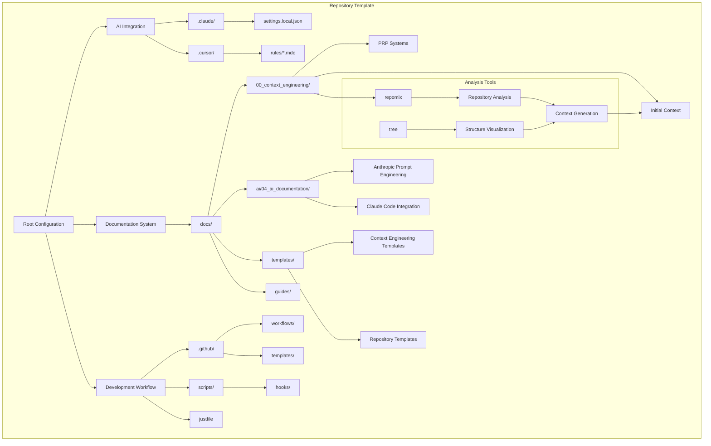

# Comprehensive Codebase Analysis

## Repository Classification

**Project Type**: Repository Template & Context Engineering Framework  
**Status**: Development/Template State  
**Primary Purpose**: AI-assisted development workflow template with context engineering capabilities  
**Technology Stack**: Documentation-driven, multi-language support template

## Repository Overview

This is a comprehensive repository template designed for AI-assisted development workflows, featuring extensive context engineering capabilities and documentation systems. The repository serves as a foundational template for creating AI-friendly codebases with systematic analysis tools and structured knowledge frameworks.

## Complete Directory Structure

```
.
├── .claude
│   └── settings.local.json
├── .cursor
│   └── rules
│       ├── anthropic-prompt-engineering.mdc
│       ├── cursor-documentation-clarity-enforcement.mdc
│       ├── cursor-repository-context-review.mdc
│       ├── cursor-repository-context-updates.mdc
│       ├── cursor-rule-create-command.mdc
│       ├── cursor-rules-creation-standards.mdc
│       ├── cursor-rules-editing-standards.mdc
│       ├── cursor-rules-location.mdc
│       ├── cursor-task-breakdown-enforcement.mdc
│       ├── docs-markdown-formatting.mdc
│       ├── docs-markdown-metadata.mdc
│       ├── dotfiles-management.mdc
│       ├── justfile-main-task-executor.mdc
│       └── shell-script-compliance.mdc
├── .dockerignore
├── .editorconfig
├── .gitattributes
├── .github
│   ├── CODEOWNERS
│   ├── ISSUE_TEMPLATE
│   │   ├── bug_report.yml
│   │   ├── documentation.yml
│   │   ├── feature_request.yml
│   │   └── rfc.yml
│   ├── PULL_REQUEST_TEMPLATE.md
│   ├── auto-comment.yml
│   ├── config.yml
│   ├── labeler.yml
│   ├── no-response.yml
│   ├── settings.yml
│   ├── stale.yml
│   └── workflows
│       ├── bump.yml
│       ├── ci-docker.yaml
│       ├── ci-typescript.yaml
│       ├── issue-comment-created.yml
│       ├── jsr-publish.yml
│       ├── lock-threads.yml
│       └── stale-actions.yaml
├── .gitignore
├── .npmignore
├── .pre-commit-config.yaml
├── .shellcheckrc
├── .vscode
│   └── settings.json
├── CODE_OF_CONDUCT.md
├── CONTRIBUTING.md
├── LICENSE
├── Makefile
├── README.md
├── SECURITY.md
├── docs
│   ├── 00_context_engineering
│   │   ├── 00-prp-codebase-analysis.md
│   │   ├── examples
│   │   └── initial_context
│   │       └── 00_codebase_analysis
│   │           └── codebase-analysis-repomix.md
│   ├── 01_overview
│   │   ├── about-this-repo.md
│   │   ├── persona-definition.md
│   │   └── quick-start.md
│   ├── 02_concepts
│   ├── 03_product
│   ├── 04_architecture
│   ├── 05_persistance
│   ├── 06_ci
│   ├── 07_release
│   ├── 08_references
│   │   ├── 08_1_internal
│   │   ├── 08_2_external
│   │   └── 08_2_libs
│   ├── 08_stdlib_ai_agents
│   ├── 99_archive
│   ├── ai
│   │   ├── 01_tasks
│   │   ├── 02_scratchpads
│   │   ├── 03_product_requirement_prompts
│   │   └── 04_ai_documentation
│   │       ├── 04.1_anthropic_prompt_engineering
│   │       │   ├── anthropic-be-clear-direct-and-detailed.md
│   │       │   ├── anthropic-building-with-extended-thinking.md
│   │       │   ├── anthropic-chain-complex-prompts-for-stronger-performance.md
│   │       │   ├── anthropic-claude-4-prompt-engineering-best-practices.md
│   │       │   ├── anthropic-extending-thinking.md
│   │       │   ├── anthropic-keep-claude-in-character-with-role-prompting-and-prefilling.md
│   │       │   ├── anthropic-let-claude-think-chain-of-thought-prompting-to-increase-performance.md
│   │       │   ├── anthropic-long-context-prompting-tips.md
│   │       │   ├── anthropic-prefill-claudes-response-for-greater-output-control.md
│   │       │   ├── anthropic-reduce-hallucinations.md
│   │       │   ├── anthropic-use-examples-multishot-prompting-to-guide-claudes-behavior.md
│   │       │   └── anthropic-use-xml-tags-to-structure-your-prompts.md
│   │       └── 04.2_claude_code
│   │           ├── claude-code-administration.md
│   │           ├── claude-code-commands.md
│   │           ├── claude-code-common-workflows.md
│   │           ├── claude-code-deployment.md
│   │           ├── claude-code-documentation-overview.md
│   │           ├── claude-code-github-actions.md
│   │           ├── claude-code-hooks.md
│   │           ├── claude-code-mcp.md
│   │           ├── claude-code-memory.md
│   │           ├── claude-code-monitoring.md
│   │           ├── claude-code-overview.md
│   │           ├── claude-code-settings.md
│   │           └── claude_code_troubleshoot.md
│   ├── development_workflow
│   ├── guides
│   │   ├── 01_styleguides
│   │   └── 02_codebase_analysis
│   │       ├── codebase-analysis-repomix.md
│   │       └── codebase-analysis-tree.md
│   ├── templates
│   │   ├── 01-repository-readiness-specification.md
│   │   ├── 01_context_engineering
│   │   │   ├── 01-prp-initcontext-github-repository.md
│   │   │   ├── 02-prp-initcontext-product-identity-definition.md
│   │   │   ├── 03-prp-initcontext-problem-value-proposition.md
│   │   │   ├── 04-prp-initcontext-features.md
│   │   │   ├── 05-prp-initcontext-architecture-patterns.md
│   │   │   ├── 06-prp-initcontext-ux-design-principles.md
│   │   │   ├── 07-prp-initcontext-tech-stack.md
│   │   │   ├── 08-prp-initcontext-development-setup.md
│   │   │   ├── 1-prp-initial-context-base-v1.md
│   │   │   ├── 11-prp-initcontext-domain-patterns.md
│   │   │   ├── 12-prp-initcontext-reference-documentation.md
│   │   │   ├── evals
│   │   │   │   └── 00-user-input-form-v1-golang-cli.md
│   │   │   ├── init-context-example.md
│   │   │   ├── init-context-helper-prompt.md
│   │   │   ├── init-context-type-full.md
│   │   │   ├── shared-header-template.md
│   │   │   └── user-input-form-v1.md
│   │   └── guides
│   │       └── 1-guide-base-v1.md
│   └── user
│       ├── 00_guides
│       │   ├── configuration_reference.md
│       │   └── troubleshooting.md
│       └── faq.md
├── justfile
├── repomix-analysis.md
├── repomix-output.xml
├── repomix.config.json
└── scripts
    ├── hooks
    │   └── pre-commit-init.sh
    └── setup

42 directories, 60 files
```

## Folder Analysis and Content Summary

### Root Configuration Files

**Purpose**: Essential project configuration and automation  
**Tested Repomix Command**: `repomix --include "justfile,Makefile,*.json,*.yaml,*.yml" --style markdown`

- **justfile**: Just command runner with development workflow automation
- **Makefile**: Additional build automation support
- **repomix.config.json**: Repomix configuration for repository analysis
- **README.md**: Template-based project documentation with customization placeholders

### `.claude/` - Claude Code Configuration

**Purpose**: Claude Code AI assistant configuration  
**Tested Repomix Command**: `repomix --include ".claude/**" --style markdown`

**Content Summary**: Contains Claude Code settings and permissions configuration, enabling specific tool access including tree, git, repomix, and MCP integrations.

### `.cursor/` - Cursor IDE Rules

**Purpose**: Cursor IDE automation and rule enforcement  
**Tested Repomix Command**: `repomix --include ".cursor/**" --style markdown`

**Content Summary**: Comprehensive rule set for AI-assisted development including prompt engineering standards, documentation formatting, repository context management, and code quality enforcement.

### `.github/` - GitHub Configuration

**Purpose**: GitHub repository automation and project management  
**Tested Repomix Command**: `repomix --include ".github/**" --style markdown`

**Content Summary**: Complete GitHub automation suite with CI/CD workflows, issue templates, PR templates, automated commenting, labeling, and repository maintenance tools.

### `docs/00_context_engineering/` - Context Engineering Framework

**Purpose**: AI context generation and repository analysis systems  
**Tested Repomix Command**: `repomix --include "docs/00_context_engineering/**" --style markdown`

**Content Summary**: Contains PRP (Product Requirement Prompt) systems for codebase analysis, initial context generation frameworks, and systematic repository understanding tools.

### `docs/01_overview/` - Project Overview Documentation

**Purpose**: High-level project documentation and onboarding  
**Tested Repomix Command**: `repomix --include "docs/01_overview/**" --style markdown`

**Content Summary**: Project overview materials, persona definitions, and quick-start guides for understanding the repository template.

### `docs/ai/` - AI Documentation and Resources

**Purpose**: Comprehensive AI assistant integration documentation  
**Tested Repomix Command**: `repomix --include "docs/ai/**" --style markdown`

**Content Summary**: Extensive AI documentation including Anthropic prompt engineering best practices, Claude Code integration guides, and AI workflow optimization resources.

### `docs/guides/` - Implementation Guides

**Purpose**: Technical implementation guides and analysis tools  
**Tested Repomix Command**: `repomix --include "docs/guides/**" --style markdown`

**Content Summary**: Styleguides and codebase analysis methodologies including repomix and tree command usage patterns.

### `docs/templates/` - Template Library

**Purpose**: Reusable template systems for various development scenarios  
**Tested Repomix Command**: `repomix --include "docs/templates/**" --style markdown`

**Content Summary**: Comprehensive template collection including context engineering templates, repository readiness specifications, and structured documentation frameworks.

### `scripts/` - Automation Scripts

**Purpose**: Development workflow automation and tooling  
**Tested Repomix Command**: `repomix --include "scripts/**" --style markdown`

**Content Summary**: Pre-commit hook initialization and setup automation scripts for development environment configuration.

## Technology Stack Analysis

### Core Technologies
- **Documentation**: Markdown-based with structured metadata
- **Automation**: Just command runner, Make build system
- **Version Control**: Git with extensive GitHub automation
- **AI Integration**: Claude Code, Cursor IDE, context engineering systems

### Development Environment
- **Code Quality**: Pre-commit hooks, shellcheck, editor configuration
- **CI/CD**: GitHub Actions workflows for multiple language support
- **Package Management**: NPM configuration with .npmignore
- **Containerization**: Docker support with .dockerignore

### AI Assistant Integration
- **Claude Code**: Full integration with settings and permissions
- **Cursor IDE**: Comprehensive rule-based automation
- **Context Engineering**: Systematic repository analysis and AI context generation
- **Prompt Engineering**: Anthropic best practices integration

## Mermaid Diagram: Repository Structure and Relationships



## Special Analysis: docs/ Folder Documentation Types

The `docs/` folder contains a sophisticated documentation ecosystem organized into multiple specialized categories:

### Primary Documentation Categories

1. **Context Engineering (`00_context_engineering/`)**
   - PRP (Product Requirement Prompt) systems
   - Systematic repository analysis frameworks
   - AI context generation tools

2. **AI Integration (`ai/`)**
   - Anthropic prompt engineering resources (12 specialized guides)
   - Claude Code comprehensive documentation (13 integration guides)
   - AI workflow optimization resources

3. **Template Systems (`templates/`)**
   - Context engineering templates (15 specialized templates)
   - Repository readiness specifications
   - Structured documentation frameworks

4. **Implementation Guides (`guides/`)**
   - Style guides
   - Codebase analysis methodologies
   - Technical implementation patterns

5. **User Documentation (`user/`)**
   - Configuration references
   - Troubleshooting guides
   - FAQ systems

### Documentation Relationship Mapping

The documentation system follows a hierarchical relationship pattern:
- Context Engineering drives AI Integration
- AI Integration utilizes Template Systems  
- Template Systems provide Implementation Guides
- Implementation Guides support User Documentation

## Repository Analysis Summary

This repository represents a sophisticated template system designed for AI-assisted development workflows. Key characteristics:

**Strengths:**
- Comprehensive AI integration framework
- Systematic context engineering capabilities  
- Extensive documentation and template library
- Robust automation and workflow systems
- Multi-language and multi-framework support

**Use Cases:**
- AI-assisted software development
- Repository template creation
- Context engineering for AI systems
- Documentation-driven development workflows
- Systematic codebase analysis and understanding

**Integration Points:**
- Claude Code AI assistant
- Cursor IDE automation
- GitHub Actions workflows
- Repomix repository analysis
- Pre-commit hook systems

This repository serves as a foundational template for creating AI-friendly development environments with systematic context generation and comprehensive documentation frameworks.