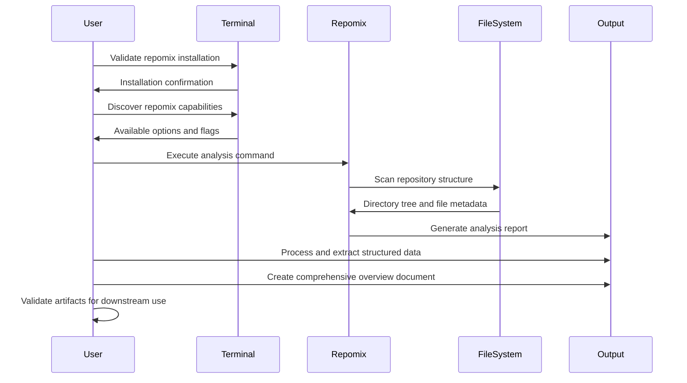

# Codebase Analysis with Repomix Guide

## Purpose & Scope

**Learning Objective**: After completing this guide, you will be able to systematically analyze any codebase using repomix to extract architectural patterns, generate comprehensive documentation, and create structured repository overviews for AI-assisted development workflows.

**Target Audience**: This guide is designed for software engineers, technical leads, and developers who need to quickly understand unfamiliar codebases, perform repository analysis, or create comprehensive documentation for AI context engineering.

**Problem Statement**: This guide addresses the challenge of quickly understanding complex codebases by providing a systematic approach using repomix analysis tools to generate structured, AI-consumable documentation and repository overviews.

**Scope**: This guide covers repomix installation verification, tool discovery, configuration options, execution commands, output processing, and comprehensive analysis generation. It does not cover specific programming language analysis or manual code review techniques.

### Guide Context

<context>

**Background**: Repomix is a powerful repository analysis tool that generates comprehensive, AI-friendly representations of codebases. It creates structured markdown output containing directory trees, file metadata, content analysis, and repository statistics, making it ideal for context engineering and AI-assisted development workflows. Repomix includes built-in security scanning to detect and exclude suspicious files containing credentials or sensitive information.

**Prerequisites**:

- Basic command-line experience and terminal navigation
- Understanding of repository structures and version control concepts
- Read/write access to the target repository for analysis
- Familiarity with markdown format and file organization

**Assumptions**: This guide assumes you have terminal access, basic file system navigation skills, and the ability to install and run command-line tools. It also assumes you're working with Git repositories that contain standard development project structures.

</context>

## Overview

**Process Overview**: Seven-step systematic approach for comprehensive repository analysis using repomix, from tool validation to comprehensive documentation generation.

**Major Phases**:
1. **Tool Validation**: Verify repomix installation and executable status
2. **Capability Discovery**: Understand tool options and configuration possibilities
3. **Analysis Execution**: Run repomix with optimal settings for comprehensive output
4. **Output Processing**: Extract and catalog repository structure and metadata
5. **Content Analysis**: Parse complete repomix output for comprehensive understanding
6. **Documentation Generation**: Create structured overview documents for downstream use
7. **Validation & Presentation**: Ensure artifacts meet quality standards for consumption

**Estimated Time**: 15-30 minutes depending on repository size and complexity (note: output files can be 1-2MB+ for typical repositories)

**Complexity Level**: Intermediate

## Step-by-Step Instructions

### Visual Flow (Optional)

**Process Flow**: Sequential workflow for comprehensive repomix-based codebase analysis



**Key Elements**:
- **Input**: Target repository with standard project structure
- **Decision Points**: Analysis depth (full content vs. structure-only), output format selection
- **Outputs**: Primary analysis document and structured overview for AI consumption
- **Validation Steps**: Tool validation, output completeness, and artifact readiness verification

### Step 1: Validate Repomix Installation

<step>

**Action**: Verify that repomix is installed and executable on your system before proceeding with analysis.

**Command/Code**:

```bash
# Primary validation command
command -v repomix

# Alternative validation if not in PATH
which repomix

# Fallback location checks
ls ~/.local/bin/repomix
ls ./node_modules/.bin/repomix

# Confirm executable status
repomix --version
```

**Expected Result**: Command should return the path to repomix executable and version information. If repomix is properly installed, you should see output like `/usr/local/bin/repomix` and version details.

**Verification**: The `repomix --version` command should execute successfully and display version information without errors.

</step>

**Troubleshooting**: If repomix is not found, install it using `npm install -g repomix` or check the official installation documentation. Ensure your PATH includes the installation directory.

### Step 2: Discover Tool Capabilities

<step>

**Action**: Understand available repomix options, flags, and configuration possibilities to select optimal analysis settings.

**Command/Code**:

```bash
# Display all available options and usage information
repomix --help

# Check if repository has a repomix configuration file
ls -la repomix.config.json

# Review configuration file if it exists
cat repomix.config.json

# Review common flags for analysis
# --style: Output format (markdown, xml, plain) - may be set in config
# --compress: Enable content compression - may be set in config
# --remove-empty-lines: Clean output formatting
# --no-files: Structure-only analysis
# --include-empty-directories: Show complete directory structure
# --ignore: Exclude specific file patterns
# -o: Specify output file location - overrides config file settings
```

**Expected Result**: Comprehensive help output showing all available flags, options, usage examples, and configuration override possibilities. If `repomix.config.json` exists, you'll see the repository's default settings for output style, compression, security checks, and ignore patterns.

**Verification**: You should understand compression options, styling formats, filtering capabilities, output customization, and any repository-specific configuration before proceeding.

</step>

**Troubleshooting**: If help output is unclear, refer to repomix documentation. Most flags are optional and have sensible defaults for standard analysis. Configuration files take precedence over defaults but can be overridden with command-line flags.

### Step 3: Execute Comprehensive Analysis

<step>

**Action**: Create the output directory and run repomix with optimal configuration to generate comprehensive codebase analysis.

**Command/Code**:

```bash
# IMPORTANT: Create output directory first
mkdir -p docs/00_context_engineering

# If repository has repomix.config.json, repomix will use those settings automatically
# Check configuration first to understand default behavior
if [ -f "repomix.config.json" ]; then
    echo "Using repository configuration from repomix.config.json"
    cat repomix.config.json | grep -E '"style"|"compress"|"output"' | head -5
fi

# Primary recommended command (uses config file if present, or specify overrides)
repomix -o docs/00_context_engineering/repomix-analysis.md

# Override config file settings if needed (markdown format with compression)
repomix --style markdown --compress --remove-empty-lines -o docs/00_context_engineering/repomix-analysis.md

# For large repositories (structure-only analysis)
repomix --no-files --style markdown --include-empty-directories -o docs/00_context_engineering/repomix-structure.md

# For deep analysis (uncompressed with full content)
repomix --style markdown -o docs/00_context_engineering/repomix-full.md

# Custom filtering example (exclude noise files)
repomix --style markdown --compress --ignore "*.log,*.tmp,node_modules" -o docs/00_context_engineering/repomix-analysis.md
```

**Expected Result**: Successful command execution with complete output file generation. Expect large files (1-2MB+ for typical repositories) with comprehensive analysis. Repomix will display file statistics, security scan results, and processing summary. If using repository configuration, output format may be XML or other format as specified in `repomix.config.json`.

**Verification**: Check that the output file exists at the specified location and contains complete directory structure, file metadata, and content analysis sections. File should be substantial in size (typically 1MB+ for real projects). If repository has configuration file, verify output format matches config settings unless overridden.

</step>

**Troubleshooting**: If analysis fails, check disk space, file permissions, and repository size. For very large repositories, use `--no-files` flag for structure-only analysis. If you get "ENOENT" errors, ensure output directory exists with `mkdir -p docs/00_context_engineering`.

### Step 4: Extract and Catalog Repository Structure

<step>

**Action**: Process the generated repomix output to extract directory structure, file inventory, and repository metadata for structured analysis.

**Command/Code**:

```bash
# Verify file was created and check size
ls -la docs/00_context_engineering/repomix-analysis.md

# Examine file header and summary
head -30 docs/00_context_engineering/repomix-analysis.md

# Extract directory structure section (look for "# Directory Structure")
grep -A 50 "# Directory Structure" docs/00_context_engineering/repomix-analysis.md

# Count total file entries in the analysis
grep -c "^## File:" docs/00_context_engineering/repomix-analysis.md

# Examine file classification patterns by extension
grep "^## File:" docs/00_context_engineering/repomix-analysis.md | grep -E "\.(js|ts|py|go|rs|java|cpp|md|json|yml|yaml)" | head -20

# Check for security-related files and content
grep -i "security\|SECURITY" docs/00_context_engineering/repomix-analysis.md | head -5

# Note: Security scan results appear during repomix execution but aren't stored in the output file
# Review the terminal output from Step 3 for actual security findings
echo "Security scan results are displayed during repomix execution but not stored in the output file. Review terminal output during Step 3 for security findings."
```

**Expected Result**: Successful extraction of ASCII directory tree, complete file listing with file headers (## File: path), and repository processing metadata including security scan results, exclusion patterns, and compression settings.

**Verification**: Confirm that directory structure is complete, file entries are properly formatted with "## File:" headers, metadata includes total file counts, and any security findings are documented.

</step>

**Troubleshooting**: If sections are missing, re-run repomix with different flags. For large files, use `less` instead of `cat` for viewing. If security scan shows excluded files, review them manually for actual sensitivity.

### Step 5: Comprehensive Content Analysis

<step>

**Action**: Read and analyze the complete repomix output file to understand repository structure, technology stack, development patterns, and configuration details.

**Command/Code**:

```bash
# Read complete file for comprehensive analysis
less docs/00_context_engineering/repomix-analysis.md

# Search for specific technology patterns
grep -i "package\.json\|cargo\.toml\|requirements\.txt\|go\.mod" docs/00_context_engineering/repomix-analysis.md

# Identify build and automation patterns
grep -i "makefile\|justfile\|dockerfile\|\.github" docs/00_context_engineering/repomix-analysis.md

# Find configuration and environment files
grep -E "\.(env|config|yml|yaml|toml|ini)" docs/00_context_engineering/repomix-analysis.md

# Analyze documentation structure
grep -i "readme\|docs/\|\.md" docs/00_context_engineering/repomix-analysis.md
```

**Expected Result**: Complete understanding of project type, technology stack, development tools, configuration patterns, documentation structure, and automation workflows.

**Verification**: You should be able to identify the primary programming languages, frameworks, build tools, testing setups, and development environment requirements.

</step>

**Troubleshooting**: For very large outputs, use `grep` with specific patterns to focus analysis. Consider using `--compress` flag if output is overwhelming.

### Step 6: Generate Structured Overview Document

<step>

**Action**: Create a comprehensive but lightweight repository overview document that synthesizes repomix analysis findings into organized, consumable format.

**Command/Code**:

```bash
# Create the overview document
touch docs/00_context_engineering/codebase-awareness-overview.md

# Template structure for manual completion:
cat > docs/00_context_engineering/codebase-awareness-overview.md << 'EOF'
# Repository Overview: [Repository Name]

**Source Reference**: `repomix-analysis.md` (for detailed queries)

## Repomix Analysis Metadata
- **Analysis Date**: [Current Date]
- **Total Files Processed**: [X files from analysis]
- **Content Processing**: [Compressed/Full/Structure-only]
- **Exclusion Patterns**: [Ignored file patterns]

## Executive Summary
[2-3 paragraph repository overview based on repomix findings]

## Repository Classification
- **Project Type**: [Web App/CLI Tool/Library/Template]
- **Primary Language(s)**: [Languages from file analysis]
- **Development Status**: [Active/Template/Archived]

## Technology Stack Analysis
[Technology details from configuration files]

## Development Environment Configuration
[Build tools, task runners, CI/CD from repomix]

## Quick Reference Guide
[Key files, commands, entry points identified]
EOF
```

**Expected Result**: Well-structured overview document containing executive summary, repository classification, technology analysis, and quick reference information derived from repomix analysis.

**Verification**: Overview document should provide immediate repository understanding while properly referencing the detailed repomix analysis file.

</step>

**Troubleshooting**: If manual creation is complex, use templates or scripts to automate overview generation based on repomix output patterns.

### Step 7: Validate Artifacts and Presentation

<step>

**Action**: Perform final validation to ensure both analysis and overview documents are complete, accurate, and ready for downstream consumption.

**Command/Code**:

```bash
# Verify primary artifact exists and has content
ls -la docs/00_context_engineering/repomix-analysis.md
wc -l docs/00_context_engineering/repomix-analysis.md

# Verify overview document exists and references primary artifact
ls -la docs/00_context_engineering/codebase-awareness-overview.md
grep -i "repomix-analysis.md" docs/00_context_engineering/codebase-awareness-overview.md

# Check for proper cross-references and relative paths
grep -E "\.\./" docs/00_context_engineering/codebase-awareness-overview.md

# Validate markdown formatting
markdownlint docs/00_context_engineering/*.md 2>/dev/null || echo "Markdown validation complete"

# Generate final artifact confirmation
echo "✅ Repository analysis complete"
echo "📁 Primary artifact: repomix-analysis.md"
echo "📄 Overview document: codebase-awareness-overview.md"
```

**Expected Result**: Both artifacts exist with proper content, cross-references are functional, and documents are ready for AI consumption and downstream context engineering processes.

**Verification**: Final confirmation shows successful artifact creation with proper file sizes, cross-references, and markdown formatting compliance.

</step>

**Troubleshooting**: If validation fails, review file permissions, check relative path accuracy, and ensure both documents contain required sections and proper formatting.

## Validation & Testing

<validation>

**Validation Checklist**:

- [ ] Repomix tool successfully validated and executable
- [ ] Help documentation reviewed and capabilities understood
- [ ] Analysis command executed successfully without errors
- [ ] Primary artifact (repomix-analysis.md) generated in correct directory
- [ ] Complete repomix output read and analyzed thoroughly
- [ ] Overview document (codebase-awareness-overview.md) created successfully
- [ ] Cross-references between documents functional and accurate
- [ ] Both artifacts ready for downstream AI consumption

**Testing Procedures**:

1. **Tool Functionality Test**: Execute `repomix --version` to confirm installation
   - Expected Result: Version information displayed without errors
   - Pass Criteria: Command completes successfully with version output

2. **Analysis Generation Test**: Run analysis command on sample repository
   - Expected Result: Complete analysis file generated with all sections
   - Pass Criteria: Output file exists and contains directory structure, file metadata, and content

3. **Output Completeness Test**: Verify all required sections present in analysis
   - Expected Result: File summary, directory structure, and content analysis sections complete
   - Pass Criteria: No truncated output or missing sections

4. **Cross-Reference Test**: Validate overview document references primary analysis
   - Expected Result: Proper relative path references to repomix-analysis.md
   - Pass Criteria: Links functional and paths accurate

**Quality Verification**:

- Analysis depth: Repository structure, technology stack, and configuration patterns identified
- Content accuracy: File classifications and metadata extraction successful
- Documentation completeness: Both primary and overview artifacts contain required information
- Artifact readiness: Documents formatted properly for AI consumption and context engineering

**Final Acceptance Test**: Successfully analyze a real repository and generate both primary analysis and overview documents that enable immediate repository understanding and serve as foundation for downstream AI-assisted development workflows.

</validation>

## Troubleshooting

<troubleshooting>

### Common Issues

**Issue**: Repomix command not found or installation failures

- **Symptoms**: `command not found` errors when running repomix commands
- **Cause**: Tool not installed or not in system PATH
- **Solution**: Install repomix using `npm install -g repomix` and verify PATH configuration
- **Prevention**: Use `command -v repomix` before starting analysis to verify installation

**Issue**: Security scan excludes files from analysis

- **Symptoms**: Repomix shows "suspicious file(s) detected and excluded" message
- **Cause**: Files contain patterns that resemble credentials or sensitive information
- **Solution**: Review excluded files manually to determine if they're actually sensitive
- **Prevention**: Use .gitignore or repomix ignore patterns to exclude test files with fake credentials

**Issue**: Analysis output truncated or incomplete

- **Symptoms**: Generated file missing sections or appears cut off
- **Cause**: Large repository size exceeding memory limits or disk space constraints
- **Solution**: Use `--compress` flag or `--no-files` for structure-only analysis
- **Prevention**: Check available disk space (ensure 3-5x repository size free space) and use appropriate flags for repository size

**Issue**: Empty or minimal analysis output

- **Symptoms**: Repomix generates file but with minimal content
- **Cause**: Repository lacks standard files or all content excluded by default patterns
- **Solution**: Review exclusion patterns and use `--include-empty-directories` flag
- **Prevention**: Examine repository structure before analysis and adjust ignore patterns

**Issue**: Permission errors during analysis or file creation

- **Symptoms**: Access denied errors when reading repository or writing output
- **Cause**: Insufficient file permissions or write access to output directory
- **Solution**: Check file permissions and ensure output directory exists and is writable
- **Prevention**: Verify read access to repository and write access to output location

**Issue**: Unexpected output format or settings

- **Symptoms**: Output file format differs from command-line flags (e.g., XML instead of markdown)
- **Cause**: Repository contains `repomix.config.json` that overrides default settings
- **Solution**: Either use config file settings or override with explicit command-line flags
- **Prevention**: Check for `repomix.config.json` in repository root and review its settings before running analysis

### Error Messages

**Error**: `ENOENT: no such file or directory`

- **Meaning**: Output directory doesn't exist or path is incorrect
- **Resolution**: Create output directory with `mkdir -p docs/00_context_engineering` or verify path accuracy before running repomix

**Error**: `Error: Repository too large for analysis`

- **Meaning**: Repository exceeds repomix processing limits
- **Resolution**: Use `--no-files` flag for structure-only analysis or exclude large directories

**Error**: `Permission denied: cannot read repository`

- **Meaning**: Insufficient permissions to access repository files
- **Resolution**: Check file permissions and ensure read access to all repository directories

### Debugging Strategies

1. **Incremental Analysis**: Start with structure-only analysis (`--no-files`) then add content if needed
2. **Verbose Output**: Use debug flags if available to understand processing issues
3. **Manual Verification**: Compare repomix output with manual directory listing to verify completeness
4. **Alternative Approaches**: If repomix fails, use standard tools (`find`, `tree`) for basic structure analysis

### Recovery Procedures

**Scenario**: Analysis fails due to memory or size constraints

- **Recovery Steps**: 
  1. Clear system memory and close unnecessary applications
  2. Use `--compress` and `--no-files` flags for minimal analysis
  3. Exclude large directories using `--ignore` patterns
  4. Process repository in smaller chunks if needed
- **Data Safety**: Original repository remains unchanged; only output files affected

**Scenario**: Corrupted or incomplete output files

- **Recovery Steps**:
  1. Delete incomplete output files
  2. Re-run analysis with different configuration
  3. Verify repository integrity and file permissions
  4. Use alternative output formats if markdown fails
- **Data Safety**: Re-running analysis overwrites previous output but preserves repository

</troubleshooting>

## Additional Resources

<resources>

### Related Guides

- [Repository Template Setup](../01_setup/repository-initialization.md): Repository structure and organization patterns

### Official Documentation

- [Repomix Official Guide](https://repomix.com/guide/) - Comprehensive documentation and tutorials
- [Configuration Guide](https://repomix.com/guide/configuration/) - Detailed configuration options and examples
- [Command Line Options](https://repomix.com/guide/command-line-options/) - Complete reference for all CLI flags and parameters
- [Output Formats](https://repomix.com/guide/output-formats/) - XML, Markdown, and Plain text format specifications
- [Security Features](https://repomix.com/guide/security/) - Security scanning, sensitive data detection, and exclusion patterns
- [GitHub Repository Processing](https://repomix.com/guide/github-repository-processing/) - Git-aware analysis and repository-specific features
- [Basic Usage Examples](https://repomix.com/guide/basic-usage/) - Fundamental usage patterns and common workflows

### Documentation References

- [Repomix GitHub Repository](https://github.com/yamadashy/repomix): Source code, issues, and community discussions

</resources>
