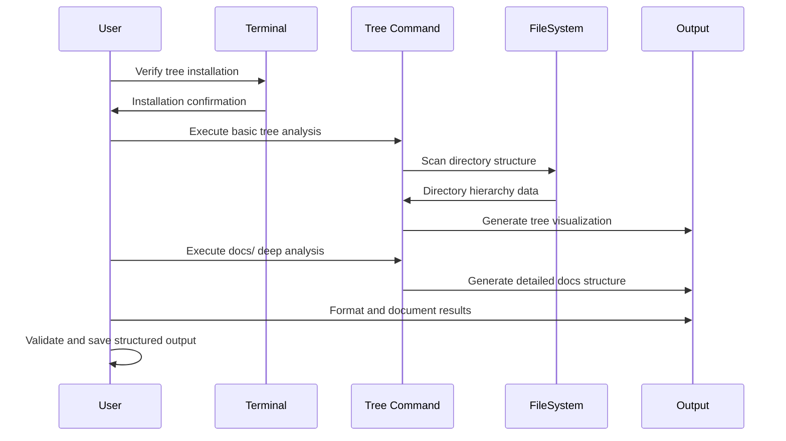

# Codebase Structure Analysis with Tree Command Guide

## Purpose & Scope

**Learning Objective**: After completing this guide, you will be able to systematically analyze codebase directory structures using the tree command to visualize project hierarchies, understand organizational patterns, and create comprehensive structural documentation for development workflows.

**Target Audience**: This guide is designed for software engineers, technical leads, and developers who need to quickly understand project structures, document codebase organization, or create visual representations of directory hierarchies for team communication and documentation.

**Problem Statement**: This guide addresses the challenge of understanding complex project structures and directory hierarchies by providing a systematic approach using the tree command to generate visual representations and analyze codebase organization patterns.

**Scope**: This guide covers tree command installation verification, option discovery, basic and advanced directory analysis, output formatting, and documentation generation. It does not cover file content analysis or detailed code review techniques.

### Guide Context

<context>

**Background**: The tree command is a powerful Unix/Linux utility that displays directory contents in a hierarchical tree-like format. It provides visual representation of folder structures, making it easier to understand project organization, verify directory layouts, and document codebase architecture. Unlike file listing commands, tree shows the nested relationship between directories and files in an intuitive graphical format.

**Prerequisites**:

- Basic command-line experience and terminal navigation
- Understanding of directory structures and file system concepts
- Access to Unix/Linux system or compatible environment (macOS, WSL, Cygwin)
- Familiarity with basic shell commands and output redirection

**Assumptions**: This guide assumes you have terminal access, basic file system navigation skills, and the ability to install command-line tools. It also assumes you're working with standard directory structures commonly found in software development projects.

</context>

## Overview

**Process Overview**: Five-step systematic approach for comprehensive directory structure analysis using tree command, from tool validation to documentation generation.

**Major Phases**:
1. **Tool Validation**: Verify tree command installation and capabilities
2. **Basic Structure Analysis**: Generate standard directory tree visualizations
3. **Advanced Analysis**: Use specialized options for detailed structure examination
4. **Documentation-Focused Analysis**: Deep analysis of docs/ folders and critical directories
5. **Output Capture**: Save analysis results for integration into workflows or further processing

**Estimated Time**: 10-20 minutes depending on project complexity and analysis requirements

**Complexity Level**: Beginner to Intermediate

## Step-by-Step Instructions

### Visual Flow (Optional)

**Process Flow**: Sequential workflow for comprehensive tree-based directory structure analysis



**Key Elements**:
- **Input**: Target repository or project directory
- **Decision Points**: Analysis depth selection, output format choice, documentation focus areas
- **Outputs**: Visual directory trees, structured documentation, formatted analysis reports
- **Validation Steps**: Tool verification, output completeness, documentation accuracy

### Step 1: Verify Tree Command Installation

<step>

**Action**: Verify that the tree command is installed and functional on your system before proceeding with directory analysis.

**Command/Code**:

```bash
# Primary verification command
tree --version

# Alternative verification
which tree

# Check if tree is available in PATH
command -v tree

# Test basic functionality
tree --help | head -10

# If tree is not installed, install it:
# Ubuntu/Debian:
sudo apt install tree

# macOS with Homebrew:
brew install tree

# Fedora/CentOS:
sudo dnf install tree

# Arch Linux:
sudo pacman -S tree
```

**Expected Result**: Command should return version information (e.g., "tree v1.8.0") and help output should display available options. Installation commands should complete successfully if tree is not present.

**Verification**: The `tree --version` command should execute without errors and display version information, confirming the tool is properly installed and accessible.

</step>

**Troubleshooting**: If tree is not found, use the appropriate installation command for your system. On some systems, tree may be in `/usr/local/bin` or require additional PATH configuration.

### Step 2: Basic Directory Structure Analysis

<step>

**Action**: Generate basic directory tree visualizations to understand overall project structure and organization patterns.

**Command/Code**:

```bash
# Basic tree of current directory
tree

# Tree with limited depth (recommended for large projects)
tree -L 2

# Tree with deeper analysis (3-4 levels)
tree -L 3

# Show directories only (no files)
tree -d

# Show directories only with limited depth
tree -d -L 2

# Include hidden files and directories
tree -a -L 2

# Show full paths for each item
tree -f -L 2

# Exclude common build/cache directories
tree -I 'node_modules|.git|dist|build|__pycache__|.cache'

# Show file sizes in human-readable format
tree -h -L 2

# Combine multiple options for comprehensive view
tree -d -L 3 -I '.git|node_modules|dist|build'
```

**Expected Result**: Clear hierarchical display of directory structure showing nested relationships, proper indentation with tree graphics, and accurate representation of project organization. Output should be readable and properly formatted.

**Verification**: Verify that the tree structure accurately represents the actual directory layout, all major directories are visible at the specified depth, and the output is clear and well-formatted.

</step>

**Troubleshooting**: If output is too large, use `-L` to limit depth. If important directories are missing, check if they're being excluded by default patterns or use `-a` to show hidden directories.

### Step 3: Advanced Structure Analysis with Filtering

<step>

**Action**: Use advanced tree options to perform detailed analysis with specific filtering, sorting, and display options for comprehensive project understanding.

**Command/Code**:

```bash
# Show only specific file types (e.g., configuration files)
tree -P '*.json|*.yml|*.yaml|*.toml|*.ini'

# Exclude specific patterns while showing files
tree -I '*.log|*.tmp|*~|*.bak' -L 3

# Show file permissions and ownership
tree -p -u -g -L 2

# Show modification dates
tree -D -L 2

# Show file sizes with directories first
tree -s --dirsfirst -L 2

# Generate output without tree graphics (useful for parsing)
tree -i -f -L 3

# Show inode numbers (useful for link analysis)
tree --inodes -L 2

# Comprehensive analysis with multiple options
tree -a -p -u -g -h -D --dirsfirst -L 3 -I '.git|node_modules|dist|build|__pycache__'

# Sort by modification time
tree -t -L 2

# Reverse alphabetical order
tree -r -L 2
```

**Expected Result**: Detailed directory analysis with specific filtering applied, additional metadata displayed (permissions, sizes, dates), and organized output according to specified sorting criteria.

**Verification**: Confirm that filtering works correctly, metadata is accurate, and the output provides the intended level of detail for analysis purposes.

</step>

**Troubleshooting**: If filtering doesn't work as expected, check pattern syntax. Use quotes around patterns containing special characters. Test patterns with simple examples first.

### Step 4: Documentation-Focused Deep Analysis

<step>

**Action**: Perform comprehensive analysis of documentation directories and other critical project areas, with special attention to docs/ folders requiring complete structural understanding.

**Command/Code**:

```bash
# Deep analysis of docs/ directory (all levels)
if [ -d "docs" ]; then
    echo "=== DOCS DIRECTORY ANALYSIS ==="
    tree docs/
    echo ""
    echo "=== DOCS STRUCTURE WITH METADATA ==="
    tree -a -p -h -D docs/
    echo ""
fi

# Analyze other critical directories with full depth
if [ -d "src" ]; then
    echo "=== SOURCE CODE STRUCTURE ==="
    tree src/ -L 4 -I '__pycache__|*.pyc|node_modules'
    echo ""
fi

if [ -d "config" ] || [ -d "configs" ]; then
    echo "=== CONFIGURATION STRUCTURE ==="
    tree config* -a
    echo ""
fi

# Look for common project structure patterns
echo "=== PROJECT ROOT ANALYSIS ==="
tree -L 1 -a

# Analyze test directories
if [ -d "test" ] || [ -d "tests" ]; then
    echo "=== TEST STRUCTURE ==="
    tree test* -L 3
    echo ""
fi

# Check for scripts and tools directories
if [ -d "scripts" ] || [ -d "tools" ] || [ -d "bin" ]; then
    echo "=== SCRIPTS/TOOLS STRUCTURE ==="
    tree scripts/ tools/ bin/ 2>/dev/null || echo "Some directories not found"
    echo ""
fi

# Comprehensive project analysis command
echo "=== COMPLETE PROJECT STRUCTURE ==="
tree -L 3 -a -I '.git|node_modules|dist|build|__pycache__|.cache|*.log'
```

**Expected Result**: Complete structural analysis of all critical project directories, with special emphasis on documentation folders showing full hierarchy, comprehensive metadata for important directories, and clear separation of different project areas.

**Verification**: Ensure docs/ directory shows complete structure without depth limits, all critical project areas are covered, and output provides comprehensive understanding of project organization.

</step>

**Troubleshooting**: If directories don't exist, the script will handle gracefully. Adjust directory names based on your project's conventions. Use `find . -name "docs" -type d` to locate documentation directories.

### Step 5: Capture and Document Analysis Results

<step>

**Action**: Capture tree analysis results for documentation, reference, or integration into other workflows as needed by the specific use case.

**Command/Code**:

```bash
# Save tree output to file for later use
tree -L 2 -a -I '.git|node_modules|dist|build' > tree-output.txt

# Generate comprehensive analysis with multiple views
tree -d -L 3 > directories-only.txt
tree -a -L 3 -I '.git|node_modules|dist|build|__pycache__' > complete-structure.txt

# Create timestamped output for archival
tree -a -L 3 -I '.git|node_modules|dist|build' > "tree-$(date +%Y%m%d-%H%M).txt"

# Capture docs structure separately if it exists
if [ -d "docs" ]; then
    tree docs/ > docs-structure.txt
fi

# Capture source structure if it exists
if [ -d "src" ]; then
    tree src/ -L 3 -I '__pycache__|*.pyc|node_modules' > src-structure.txt
fi

# Display analysis summary
echo "=== TREE ANALYSIS COMPLETE ==="
echo "Available outputs:"
ls -la *structure*.txt tree*.txt 2>/dev/null || echo "Output files created"
```

**Expected Result**: Tree analysis captured in text files suitable for integration into documentation workflows, reference materials, or further processing by other tools and guides.

**Verification**: Verify that output files contain the expected tree structure data and are accessible for use in subsequent documentation or analysis workflows.

</step>

**Troubleshooting**: If file creation fails, check write permissions in the current directory. Adjust file naming conventions based on your project's documentation standards.

## Validation & Testing

<validation>

**Validation Checklist**:

- [ ] Tree command successfully installed and accessible
- [ ] Basic tree output displays correct directory structure
- [ ] Advanced filtering options work as expected
- [ ] Docs/ directory analysis shows complete structure without limits
- [ ] Output files created successfully and contain expected tree data
- [ ] All project areas (src, docs, config, etc.) properly analyzed
- [ ] Tree patterns and exclusions work correctly

**Testing Procedures**:

1. **Installation Test**: Execute `tree --version` to confirm tool availability
   - Expected Result: Version information displayed without errors
   - Pass Criteria: Command completes successfully with version output

2. **Basic Functionality Test**: Run `tree -L 2` on test directory
   - Expected Result: Hierarchical structure displayed with proper indentation
   - Pass Criteria: Output shows correct directory relationships and formatting

3. **Filtering Test**: Use `tree -I 'node_modules|.git'` to test exclusion patterns
   - Expected Result: Specified directories excluded from output
   - Pass Criteria: Excluded patterns do not appear in tree output

4. **Output Capture Test**: Execute complete Step 5 script
   - Expected Result: Tree output files created with analysis data
   - Pass Criteria: Files exist and contain expected tree structure information

**Quality Verification**:

- Tree structure accuracy: Visual output matches actual directory structure
- Pattern filtering effectiveness: Exclusion and inclusion patterns work correctly
- Output formatting: Tree graphics display properly and content is readable
- Output completeness: Generated files contain expected tree analysis data

**Final Acceptance Test**: Successfully analyze a real project directory and capture comprehensive structure information suitable for integration into documentation workflows or further analysis processes.

</validation>

## Troubleshooting

<troubleshooting>

### Common Issues

**Issue**: Tree command not found or installation failures

- **Symptoms**: `command not found` errors when running tree commands
- **Cause**: Tree utility not installed or not in system PATH
- **Solution**: Install tree using appropriate package manager for your system (apt, brew, dnf, pacman)
- **Prevention**: Verify installation with `tree --version` before starting analysis

**Issue**: Output too large or overwhelming

- **Symptoms**: Extremely long output that's difficult to read or process
- **Cause**: Large directory structures without depth limits or filtering
- **Solution**: Use `-L` option to limit depth (e.g., `-L 3`) and `-I` to exclude large directories
- **Prevention**: Start with limited depth analysis and gradually increase as needed

**Issue**: Important directories not showing in output

- **Symptoms**: Expected directories missing from tree display
- **Cause**: Directories may be hidden (start with .) or excluded by default patterns
- **Solution**: Use `-a` flag to show hidden files/directories and check exclusion patterns
- **Prevention**: Use `-a` option when comprehensive analysis is needed

**Issue**: Pattern matching not working as expected

- **Symptoms**: `-I` or `-P` patterns don't filter correctly
- **Cause**: Incorrect pattern syntax or shell interpretation of special characters
- **Solution**: Quote patterns containing special characters and test with simple examples first
- **Prevention**: Use single quotes around patterns and test incrementally

**Issue**: Permission errors when accessing directories

- **Symptoms**: "Permission denied" errors during tree traversal
- **Cause**: Insufficient permissions to read certain directories
- **Solution**: Run with appropriate permissions or exclude problematic directories
- **Prevention**: Check directory permissions before analysis

**Issue**: Output file creation fails

- **Symptoms**: Tree output files not created or script errors
- **Cause**: Write permissions, file naming issues, or shell script problems
- **Solution**: Check write permissions in current directory and verify script syntax
- **Prevention**: Test individual tree commands before running complete analysis script

### Error Messages

**Error**: `tree: command not found`

- **Meaning**: Tree utility is not installed on the system
- **Resolution**: Install tree using your system's package manager (see Step 1)

**Error**: `tree: cannot open directory: Permission denied`

- **Meaning**: Insufficient permissions to read the specified directory
- **Resolution**: Use `sudo` if appropriate or exclude the problematic directory with `-I`

**Error**: `tree: invalid option`

- **Meaning**: Using an option not supported by your version of tree
- **Resolution**: Check `tree --help` for available options in your version

### Debugging Strategies

1. **Incremental Analysis**: Start with basic `tree` command and add options gradually
2. **Pattern Testing**: Test exclusion/inclusion patterns with simple directory structures first
3. **Depth Limiting**: Use `-L 1` or `-L 2` to start, then increase depth as needed
4. **Verbose Debugging**: Use `tree -a` to see all files and understand what's being filtered

### Recovery Procedures

**Scenario**: Analysis produces unusable output due to size or formatting

- **Recovery Steps**: 
  1. Use depth limiting with `-L 2` or `-L 3`
  2. Add exclusion patterns for large directories: `-I 'node_modules|.git|dist|build'`
  3. Focus on directories only with `-d` option
  4. Redirect output to file for easier review: `tree > output.txt`
- **Data Safety**: Tree command is read-only and doesn't modify the file system

**Scenario**: Output capture fails or produces incomplete results

- **Recovery Steps**:
  1. Check and fix file permissions in current directory
  2. Verify file naming conventions and adjust as needed
  3. Test individual tree commands before running complete script
  4. Use simpler tree commands if complex analysis fails
- **Data Safety**: Failed output capture doesn't affect source directories

</troubleshooting>

## Additional Resources

<resources>

### Related Guides

- [Codebase Analysis with Repomix](codebase-analysis-repomix.md): Comprehensive file content analysis approach

### Official Documentation

- [Tree Command Manual](https://manpages.ubuntu.com/manpages/trusty/man1/tree.1.html) - Complete reference for all tree command options
- [Unix/Linux Folder Tree Tutorial](https://centerkey.com/tree/) - Practical examples and shell script implementations
- [Tree Command Tutorial](https://www.tutorialspoint.com/unix_commands/tree.htm) - Comprehensive tutorial with examples

### Documentation References

- [Tree Command GitHub Repository](https://github.com/Old-Man-Programmer/tree) - Source code and community discussions
- [Linux Command Line Reference](http://linuxcommand.org/) - General Unix/Linux command documentation

</resources>
