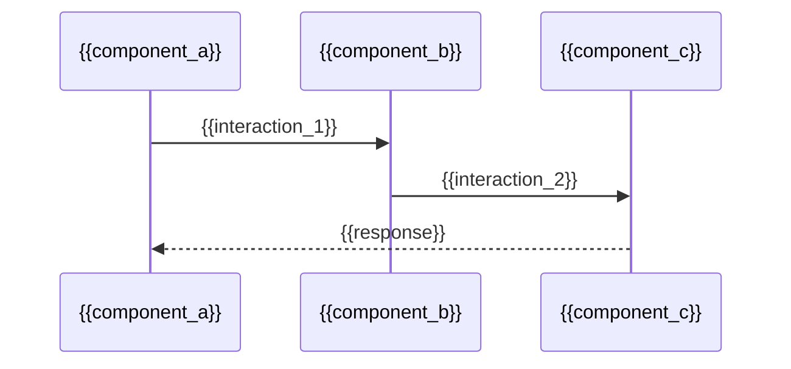

# Initial Context Engineering: Architecture Patterns & Design

> **💡 Context Engineering Note:** This document provides comprehensive architecture and design patterns context for AI assistants, AI Agents, and Developers/Maintainers using proven context engineering methodologies. Architecture patterns serve as the blueprint for system design, ensuring scalable, maintainable, and robust software solutions that align with business requirements and technical constraints.

## What is Architecture Patterns Context?

Architecture patterns context engineering establishes systematic methodologies for selecting, implementing, and evolving architectural patterns that create reliable, scalable software systems. This includes both high-level system architecture and detailed software architecture patterns.

### Key Components:

1. **System Architecture Design**: High-level component organization and interaction patterns
2. **Software Architecture Patterns**: Code-level organizational patterns and design principles
3. **Integration Patterns**: Service communication and data flow architectural patterns
4. **Scalability Patterns**: Architectural approaches for handling growth and load
5. **Security Architecture Patterns**: Security-by-design architectural considerations

### Architecture Patterns vs Ad-Hoc Design:

| **Ad-Hoc Design** | **Architecture Patterns Context** |
|:---|:---|
| ❌ Inconsistent system structure | ✅ Proven, repeatable architectural blueprints |
| ❌ Poor scalability and maintainability | ✅ Built-in scalability and evolution strategies |
| ❌ Security and reliability afterthoughts | ✅ Security and reliability by design |
| ❌ Difficult to understand and modify | ✅ Well-documented, industry-standard patterns |
| ❌ Technology-specific solutions | ✅ Technology-agnostic architectural principles |

---

## Document Dependencies

This document is part of a comprehensive context engineering system. Related documents include:

- **[00-prp-initcontext-initial-codebase-awareness.md](00-prp-initcontext-initial-codebase-awareness.md)** - Initial codebase analysis
- **[01-prp-initcontext-github-repository.md](01-prp-initcontext-github-repository.md)** - GitHub repository context
- **[04-prp-initcontext-features.md](04-prp-initcontext-features.md)** - Core feature definitions
- **[07-prp-initcontext-tech-stack.md](07-prp-initcontext-tech-stack.md)** - Technology stack specification

---

## Context Engineering Architecture Patterns

### 5.1. System Architecture Patterns

**Process Flow for AI Assistant:**

When defining system architecture, follow this systematic approach:

1. **Application Type Assessment**: Determine the primary application type (Web App, API Service, CLI Tool, Desktop App, AI Agent, Library/SDK)
2. **Component Identification**: Map the essential system components based on application type
3. **Integration Pattern Selection**: Choose appropriate patterns for component communication
4. **Performance and Scalability Analysis**: Design for expected load and growth patterns
5. **Security Architecture Integration**: Embed security patterns throughout the architecture

**System Architecture Protocol:**

For system architecture definition, systematically document:

- **Application Type Classification**: Clear identification of the primary application pattern
- **Component Architecture**: Essential system components and their responsibilities
- **Data Flow Patterns**: How information moves through the system
- **Integration Boundaries**: External system integration points and protocols
- **Performance Requirements**: Specific performance benchmarks and constraints

#### Output Format

**System Architecture Template:**

```markdown
## Application Type Assessment
**Application Type:** {{application_type}}
**Rationale:** {{type_justification}}

## Core System Components
### {{component_name}}
**Responsibility:** {{component_responsibility}}
**Technology Focus:** {{component_tech_stack}}
**Integration Points:** {{component_interfaces}}

## System Architecture Diagram
```mermaid
graph TD
    subgraph "{{system_boundary}}"
        A[{{component_a}}] --> B[{{component_b}}]
        B --> C[{{component_c}}]
    end
    
    subgraph "External Systems"
        D[{{external_service}}]
    end
    
    B --> D
```

## Performance & Scalability Requirements
- **Performance Benchmarks:** {{performance_targets}}
- **Scalability Approach:** {{scaling_strategy}}
- **Load Expectations:** {{expected_load}}

## Security Architecture Considerations
- **Security Boundaries:** {{security_boundaries}}
- **Authentication/Authorization:** {{auth_approach}}
- **Data Protection:** {{data_security_measures}}
```

---

### 5.2. Software Architecture Patterns

**Software Design Pattern Selection Strategy:**

Establish systematic approach for software architecture patterns:

- **Architectural Style Definition**: Choose overall architectural approach (Clean Architecture, Layered, Hexagonal, etc.)
- **Design Pattern Recommendations**: Select 2-3 key patterns appropriate for the application type and tech stack
- **Component Organization**: Define how code components are structured and interact
- **Dependency Management**: Establish clear dependency flow and inversion strategies
- **Testing Architecture**: Design for testability with clear boundaries and mock points

**Software Architecture Protocol:**

For software architecture definition:

- **Architectural Style Justification**: Clear rationale for chosen architectural approach
- **Pattern Selection Criteria**: Why specific design patterns are recommended
- **Code Organization Strategy**: Directory structure and module organization
- **Quality Attributes Achievement**: How patterns support maintainability, testability, etc.
- **Technology-Specific Adaptations**: How patterns adapt to the chosen tech stack

#### Output Format

**Software Architecture Template:**

```markdown
## Architectural Style Definition
**Primary Style:** {{architectural_style}}
**Justification:** {{style_rationale}}

## Recommended Design Patterns
### {{pattern_name}}
**Application:** {{pattern_usage}}
**Implementation Example:** {{pattern_example}}
**Quality Benefits:** {{pattern_benefits}}

## Project Structure Recommendation
```
{{repository_name}}/
├── {{primary_directory}}/
│   ├── {{subdirectory_1}}/
│   └── {{subdirectory_2}}/
├── {{secondary_directory}}/
└── {{configuration_files}}
```

## Component Interaction Patterns


## Quality Attributes Achievement
- **Maintainability:** {{maintainability_strategy}}
- **Testability:** {{testing_strategy}}
- **Reliability:** {{reliability_approach}}
- **Modularity:** {{modularity_design}}
```

---

### 5.3. Integration Architecture Patterns

**Integration Pattern Framework:**

Systematic approach to integration architecture:

- **Service Communication Patterns**: Define how services communicate (REST, GraphQL, message queues, etc.)
- **Data Exchange Patterns**: Establish data formats and transformation strategies
- **Error Handling Patterns**: Design resilient integration with proper error handling
- **Authentication Patterns**: Secure service-to-service communication
- **Monitoring and Observability**: Integration health monitoring and debugging

**Integration Architecture Protocol:**

For integration architecture:

- **Communication Protocol Selection**: Choice of integration protocols with justification
- **Data Format Standardization**: Consistent data exchange formats across integrations
- **Error Recovery Strategies**: How integrations handle failures and recover
- **Security Integration**: Authentication and authorization across service boundaries
- **Performance Optimization**: Caching, connection pooling, and optimization strategies

#### Output Format

**Integration Architecture Template:**

```markdown
## Service Communication Patterns
**Primary Protocol:** {{communication_protocol}}
**Data Format:** {{data_format}}
**Authentication Method:** {{auth_method}}

## Integration Points
| Service | Protocol | Authentication | Data Format | Error Handling |
|:---|:---|:---|:---|:---|
| {{service_name}} | {{protocol}} | {{auth_type}} | {{format}} | {{error_strategy}} |

## Error Handling & Resilience
**Retry Strategy:** {{retry_approach}}
**Circuit Breaker:** {{circuit_breaker_config}}
**Fallback Mechanisms:** {{fallback_strategy}}

## Performance Optimization
**Caching Strategy:** {{caching_approach}}
**Connection Management:** {{connection_strategy}}
**Rate Limiting:** {{rate_limit_strategy}}
```

---

### 5.4. Security Architecture Patterns

**Security-by-Design Framework:**

Comprehensive approach to security architecture:

- **Threat Modeling**: Systematic identification of security threats and attack vectors
- **Defense in Depth**: Multiple layers of security controls throughout the architecture
- **Zero Trust Principles**: Never trust, always verify approach to security design
- **Data Protection Patterns**: Encryption, access control, and data governance patterns
- **Incident Response Integration**: Security monitoring and response capabilities

**Security Architecture Protocol:**

For security architecture design:

- **Threat Assessment**: Identification of primary security threats for the application type
- **Security Control Placement**: Where and how security controls are implemented
- **Authentication/Authorization Design**: User and service authentication patterns
- **Data Classification and Protection**: How sensitive data is identified and protected
- **Compliance Requirements**: Regulatory and compliance considerations

#### Output Format

**Security Architecture Template:**

```markdown
## Threat Model Assessment
**Primary Threats:** {{threat_categories}}
**Attack Vectors:** {{attack_vectors}}
**Risk Assessment:** {{risk_evaluation}}

## Security Control Framework
| Security Layer | Controls | Implementation | Technology |
|:---|:---|:---|:---|
| {{layer_name}} | {{controls}} | {{implementation}} | {{tech_stack}} |

## Authentication & Authorization
**User Authentication:** {{user_auth_pattern}}
**Service Authentication:** {{service_auth_pattern}}
**Authorization Model:** {{authz_model}}

## Data Protection Strategy
**Data Classification:** {{data_classification}}
**Encryption Requirements:** {{encryption_strategy}}
**Access Control:** {{access_control_model}}

## Compliance & Monitoring
**Compliance Requirements:** {{compliance_needs}}
**Security Monitoring:** {{monitoring_strategy}}
**Incident Response:** {{incident_response_plan}}
```

---

### 5.5. Scalability Architecture Patterns

**Scalability Design Framework:**

Systematic approach to scalability architecture:

- **Horizontal Scaling Patterns**: Designing for scale-out across multiple instances
- **Vertical Scaling Considerations**: Optimizing for scale-up within single instances
- **Data Scaling Patterns**: Database and data storage scaling strategies
- **Performance Optimization**: Caching, CDN, and performance enhancement patterns
- **Load Distribution**: Load balancing and traffic distribution strategies

**Scalability Architecture Protocol:**

For scalability architecture:

- **Scaling Requirements**: Expected growth patterns and scaling triggers
- **Bottleneck Identification**: Primary scalability bottlenecks and constraints
- **Scaling Strategy Selection**: Horizontal vs. vertical scaling approach
- **Data Scaling Design**: How data layer scales with application growth
- **Performance Monitoring**: Metrics and monitoring for scalability management

#### Output Format

**Scalability Architecture Template:**

```markdown
## Scaling Requirements Analysis
**Expected Growth:** {{growth_projections}}
**Performance Targets:** {{performance_benchmarks}}
**Scaling Triggers:** {{scaling_thresholds}}

## Scaling Strategy
**Primary Approach:** {{scaling_strategy}}
**Scaling Dimensions:** {{scaling_dimensions}}
**Technology Constraints:** {{tech_constraints}}

## Architecture Scalability Patterns
| Component | Scaling Pattern | Technology | Monitoring |
|:---|:---|:---|:---|
| {{component}} | {{pattern}} | {{tech_solution}} | {{monitoring_metrics}} |

## Performance Optimization
**Caching Strategy:** {{caching_design}}
**CDN Usage:** {{cdn_strategy}}
**Database Optimization:** {{db_optimization}}

## Load Distribution
**Load Balancing:** {{load_balancer_config}}
**Traffic Routing:** {{routing_strategy}}
**Geographic Distribution:** {{geo_distribution}}
```

## Confidence & Risk Assessment

**Confidence Level:** High

**Justification for Confidence:**
- Architecture patterns framework comprehensively covers all major architectural concerns
- Templates provide systematic approach to architecture design and documentation
- Integration with existing context engineering methodology ensures consistency
- Patterns are technology-agnostic while providing specific implementation guidance

**Identified Risks & Mitigation Strategies:**
- **Risk:** Architecture patterns might be too complex for simple applications
- **Mitigation:** Provide simplified pattern selection based on application type and scale
- **Risk:** Pattern selection without proper context analysis could lead to over-engineering
- **Mitigation:** Emphasize context analysis and gradual pattern adoption based on actual needs
- **Risk:** Architecture documentation might become outdated as system evolves
- **Mitigation:** Build in architecture review cycles and evolution tracking mechanisms 
