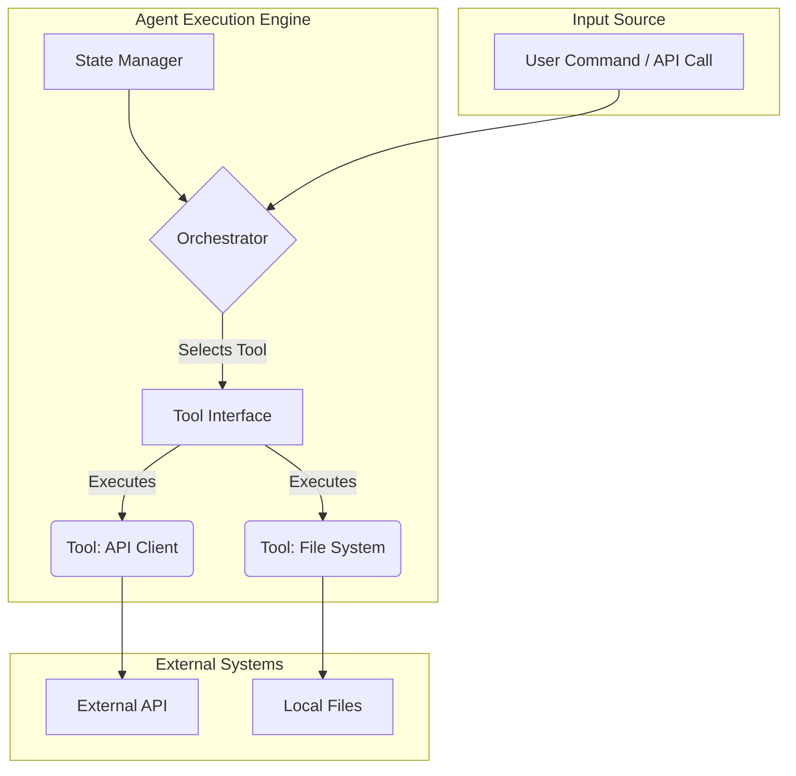
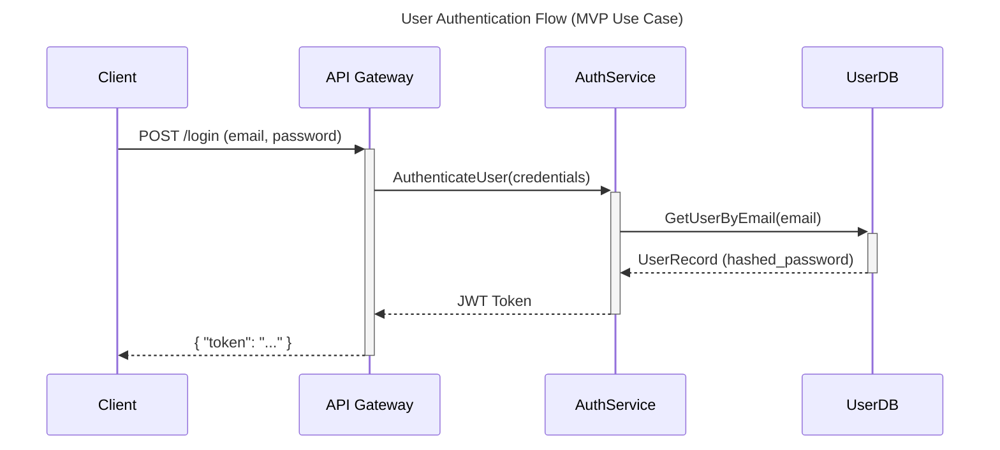
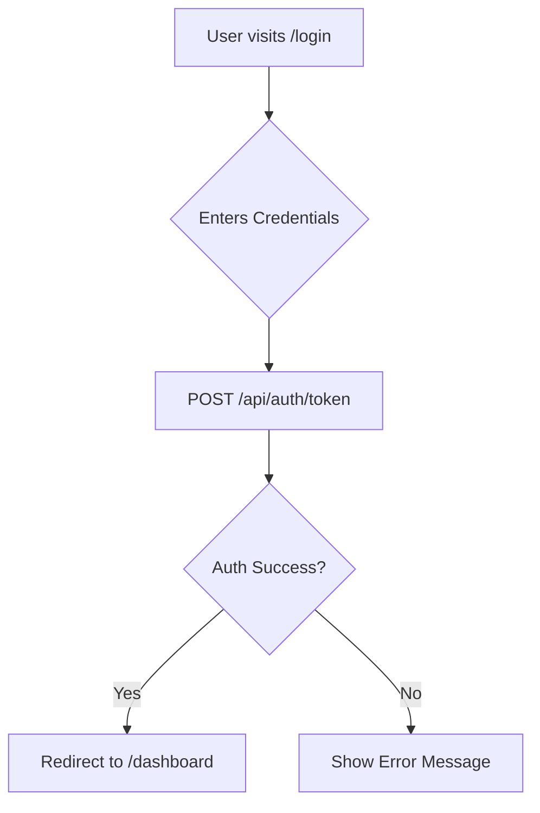
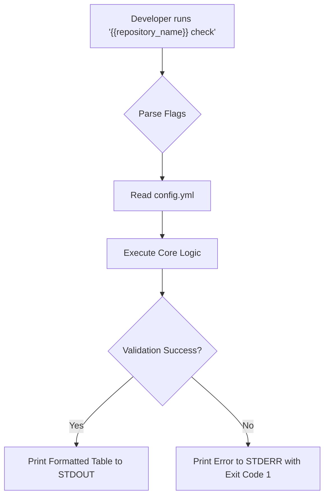

# Initial Context Engineering: {{repository_name}}

> **💡 Context Engineering Note:** This document provides comprehensive repository context for AI assistants, AI Agents, and Developers/Maintainers using proven context engineering methodologies. As highlighted by industry leaders in 2025, context engineering represents a fundamental shift from experimental AI use to enterprise-grade AI operations, providing 10x better accuracy and 100x fewer production failures compared to traditional "vibe coding" approaches. It serves as the foundation for understanding the complete project landscape and enables generation of detailed architecture, tech stack, reference documentation, and other downstream documents.

## What is Context Engineering?

Context engineering has emerged as the dominant methodology in AI development, representing a paradigm shift from simple prompt crafting to comprehensive information architecture design. As noted by [Analytics India Magazine](https://analyticsindiamag.com/ai-features/context-engineering-is-the-new-vibe-coding/), "when LLMs fail, it's not because the model is broken — it's because the system around it didn't set it up for success."

### Key Components of Context Engineering

**Information Ecosystem Management:**

- **System Instructions and Role Definitions**: Clear, structured directives that define AI behavior and capabilities
- **Conversation History and Memory Management**: Tracking past interactions to maintain coherence and build upon previous context
- **Relevant Documents and Knowledge Base**: Curated external knowledge injection with proper prioritization and chunking
- **Tool Outputs and API Integration**: Real-time data from external systems integrated seamlessly into context
- **Structured Information Architecture**: Organizing data to fit within token constraints while maximizing relevance

**Systems-Level Approach:**
Unlike prompt engineering's focus on individual interactions, context engineering orchestrates multiple layers of information to create a dynamic, intelligent environment. This approach transforms AI from simple responders into intelligent collaborators capable of understanding nuance, user preferences, and complex workflows.

### Context Engineering vs. Traditional Approaches

| Approach | Focus | Methodology | Outcomes |
|----------|-------|-------------|----------|
| **Prompt Engineering** | Individual instructions | Crafting better prompts | Variable results, limited scalability |
| **Vibe Coding** | Intuitive AI interaction | "Feeling your way" through tasks | Experimental, high failure rate |
| **Context Engineering** | Information ecosystem | Systematic framework design | Enterprise-grade reliability, scalable AI operations |

---

## Table of Contents

- [Initial Context Engineering: {{repository\_name}}](#initial-context-engineering-repository_name)
  - [What is Context Engineering?](#what-is-context-engineering)
    - [Key Components of Context Engineering](#key-components-of-context-engineering)
    - [Context Engineering vs. Traditional Approaches](#context-engineering-vs-traditional-approaches)
  - [Table of Contents](#table-of-contents)
  - [Operational Protocol \& Consistency Mandate](#operational-protocol--consistency-mandate)
    - [Execution Structure](#execution-structure)
    - [Critical Document Consistency Framework](#critical-document-consistency-framework)
      - [Mandatory Cross-Section Dependencies](#mandatory-cross-section-dependencies)
      - [Consistency Enforcement Protocol](#consistency-enforcement-protocol)
      - [Section-Specific Consistency Guidelines](#section-specific-consistency-guidelines)
      - [Consistency Failure Prevention](#consistency-failure-prevention)
  - [AI Operational Workflow: Document Completion](#ai-operational-workflow-document-completion)
    - [Three-Phase Completion Protocol](#three-phase-completion-protocol)
    - [Workflow Rationale](#workflow-rationale)
  - [Context Engineering Initial Context](#context-engineering-initial-context)
    - [1. Initial Codebase Awareness](#1-initial-codebase-awareness)
      - [Output Format](#output-format)
    - [2. Product, Application, or Tool Description](#2-product-application-or-tool-description)
    - [2.1 GitHub Repository](#21-github-repository)
      - [Output Format](#output-format-1)
    - [2.2 Product Identity \& Definition](#22-product-identity--definition)
      - [Output Format](#output-format-2)
    - [2.3 Problem \& Value Proposition](#23-problem--value-proposition)
      - [Output Format](#output-format-3)
    - [3. Features](#3-features)
      - [Output Format](#output-format-4)
    - [4. Architecture](#4-architecture)
      - [Output Format](#output-format-5)
    - [5. Software Architecture](#5-software-architecture)
      - [Output Format](#output-format-6)
    - [6. User \& Developer Experience (UX/DX)](#6-user--developer-experience-uxdx)
      - [Output Format](#output-format-7)
    - [7. Tech Stack](#7-tech-stack)
      - [Output Format](#output-format-8)
    - [8. Third Party Integrations](#8-third-party-integrations)
      - [Output Format](#output-format-9)
    - [9. Local Development Setup](#9-local-development-setup)
      - [Output Format](#output-format-10)
    - [10. Deployment](#10-deployment)
      - [Output Format](#output-format-11)
    - [11. AI Assistant Guidance](#11-ai-assistant-guidance)
      - [Output Format](#output-format-12)
    - [12. Reference \& Documentation](#12-reference--documentation)
      - [Output Format](#output-format-13)

---

## Operational Protocol & Consistency Mandate

For you, 🤖 AI agent - Your primary function is to execute the completion of this document by adhering strictly to the protocols outlined below. This is not a guide; it is your operational mandate. Each section must be processed in sequence, using the defined structure and validation checks.

### Execution Structure

Every section in this document adheres to the following mandatory structure. You MUST parse and act upon each component:

- **🤖 AI Assistant Instructions**: This block contains your direct, non-negotiable instructions for the section. Execute them precisely.
- **⬇️ Expected Outcomes**: This block defines the required output. You MUST generate all specified artifacts to mark the section as complete. Your output must be validated against these outcomes.
- **📋 Template Variables**: This block lists variables (e.g., `{{repository_name}}`) that require substitution. You MUST replace them with the correct values from the established context.

### Critical Document Consistency Framework

> [!IMPORTANT]
> **Interdependent Sections Consistency Requirements**
>
> This document contains interdependent sections that must maintain consistency to ensure coherent context engineering. Each section builds upon previous sections and informs subsequent ones. You are required to follow these consistency protocols without deviation.

#### Mandatory Cross-Section Dependencies

**(Corrected Section Numbers)**

**Primary Dependencies (Critical):**
- Section 3 (Features) → Section 4 (Architecture)
- Section 3 (Features) → Section 5 (Software Architecture)
- Section 3 (Features) → Section 6 (User & Developer Experience)
- Section 4 (Architecture) → Section 5 (Software Architecture)
- Section 4 (Architecture) → Section 10 (Deployment)
- Section 7 (Tech Stack) → Section 8 (Third Party Integrations)
- Section 7 (Tech Stack) → Section 9 (Local Development Setup)
- Section 7 (Tech Stack) → Section 11 (AI Assistant Guidance)
- Section 7 (Tech Stack) → Section 12 (Reference & Documentation)

**Secondary Dependencies (Important):**
- Section 5 (Software Architecture) → Section 7 (Tech Stack)
- Section 6 (User & Developer Experience) → Section 7 (Tech Stack)
- Section 8 (Third Party Integrations) → Section 9 (Local Development Setup)
- Section 8 (Third Party Integrations) → Section 10 (Deployment)
- Section 8 (Third Party Integrations) → Section 11 (AI Assistant Guidance)

**Coherence Dependencies (Application-Type Specific):**
- Section 3 (Features) → Section 4 (Architecture)
- Section 4 (Architecture) → Section 6 (User & Developer Experience)
- Section 6 (User & Developer Experience) → Section 7 (Tech Stack)
- Section 10 (Deployment) → Section 4 (Architecture)

#### Consistency Enforcement Protocol

**Before completing any section, you MUST:**

1. **Read Dependencies:** Completely read all sections referenced in the current section's requirements.
2. **Validate Alignment:** Ensure all generated content aligns with the established context from referenced sections.
3. **Verify Coherence:** Cross-check all interdependent elements for logical consistency.
4. **Iterate if Needed:** If inconsistencies are detected, you must revise the content until full consistency is achieved.

#### Section-Specific Consistency Guidelines

- **For sections with dependencies:** Each section's `NOTE` block includes specific cross-reference requirements. Follow the detailed validation steps provided. Ensure all template variables are used consistently.
- **For sections without dependencies:** Focus on the section-specific requirements and ensure the output supports downstream dependent sections.

#### Consistency Failure Prevention

**You MUST avoid the following common consistency failures:**

- Creating system architecture without referencing the actual application type and MVP features.
- Creating sequence diagrams that do not map to the Primary Use Cases in Section 3.
- Defining UX patterns for applications without user interfaces (e.g., CLI tools, APIs).
- Including frontend architecture components for non-UI applications.
- Defining implementation requirements incompatible with the chosen tech stack.
- Documenting third-party integrations without corresponding tech stack support.
- Writing setup procedures that do not match specified technology versions.
- Creating deployment strategies incompatible with the system architecture.
- Documenting AI pitfalls irrelevant to the project's technology choices.

**Application-Type Coherence Failures:**
- **CLI Applications:** Do NOT include traditional frontend architecture or web-based UX patterns.
- **Web Applications:** MUST include both frontend architecture and a comprehensive UX section.
- **API Services:** Do NOT include user interface components or end-user UX patterns.
- **Libraries/SDKs:** Do NOT include deployment sections or end-user UX patterns.

**Validation Checkpoints:**
- Before finalizing any section, verify all cross-references are accurate.
- Confirm all interdependent content aligns properly.
- Validate that section outcomes support all dependent sections.
- Verify application-type coherence across architecture, UX, and deployment sections.

---

## AI Operational Workflow: Document Completion

This section outlines the mandatory workflow you must follow to complete this `init-context-type-full.md` document. Your purpose is to act as the primary agent in transforming initial user inputs into a comprehensive, structured, and consistent context document.

This document, once completed, serves as the foundational input for all subsequent documentation and code generation tasks.

### Three-Phase Completion Protocol

You will execute the following three phases in sequence. Do not proceed to the next phase until the current one is complete and validated.

**Phase 1: Context Priming and Analysis**
Your first step is to gather and analyze the initial project information provided by the user.

* **Action:** Process the inputs from the user, which may include responses to a helper prompt, direct instructions, or example files.
* **Process:**
    1.  Analyze all provided materials to establish a foundational understanding of the project's purpose, scope, and technical stack.
    2.  If repository analysis tools (e.g., `repomix`) are available, execute them to get a structural overview of the codebase.
    3.  Synthesize this initial data to prepare for populating the sections below.
* **Output:** A preliminary, in-memory model of the project's key attributes.

**Phase 2: Structured Content Generation**
Your primary task is to systematically populate each numbered section of this document, from "1. Initial Codebase Awareness" to "13. Reference & Documentation".

* **Action:** For each section, generate the required content based on the established context.
* **Process:**
    1.  Adhere strictly to the **🤖 AI Assistant Instructions** provided in each section.
    2.  Generate all artifacts specified in the **⬇️ Expected Outcomes** block for each section.
    3.  Strictly follow the **Critical Document Consistency Framework** by cross-referencing dependent sections to ensure coherence.
* **Output:** A fully populated `init-context-type-full.md` document.

**Phase 3: Final Validation**
Before concluding, you must perform a final validation pass on the entire document.

* **Action:** Review the completed document for internal consistency and adherence to all protocols.
* **Process:**
    1.  Verify that all mandatory cross-section dependencies are met.
    2.  Check for any application-type coherence failures (e.g., a CLI tool having a web UX section).
    3.  Ensure all `{{template_variables}}` have been correctly substituted.
* **Output:** A validated, final version of `init-context-type-full.md` ready for use in downstream tasks.

### Workflow Rationale

This phased approach ensures a systematic and rigorous process. By separating initial analysis from content generation and final validation, it minimizes errors, prevents context-drift, and guarantees that the final document is a reliable and coherent foundation for any subsequent AI-driven development tasks.

---

## Context Engineering Initial Context

### 1. Initial Codebase Awareness

> [!NOTE]
> **🤖 Instructions for AI Assistant:**
>
> **📋 Process Flow - Follow these steps in order:**
>
> ```
> 1. 🔧 VALIDATE TOOL → Verify `repomix` is installed and executable.
> 2. 🔍 DISCOVER → Run `repomix --help` to understand tool capabilities.
> 3. 📊 ANALYZE → Execute `repomix` to get the complete codebase structure.
> 4. 🌳 EXTRACT & CATALOG → Generate ASCII tree and create a table of ALL initial files.
> 5. 📝 SYNTHESIZE & PRESENT → Produce a comprehensive summary based on the analysis.
> ```
>
> **🔧 Detailed Steps:**
>
> - **Tool Validation:** Execute `command -v repomix`. If the tool is not found, report an error and halt. This step is mandatory.
> - **Tool Discovery:** Execute `repomix --help` to understand available options and the expected output format.
> - **Codebase Analysis:** Run `repomix` on the current directory to perform a comprehensive structural analysis.
> - **Initial State Cataloging:**
>     - From the `repomix` output, generate a complete ASCII directory tree.
>     - Create a table listing **all** discovered files. For new repositories, every file is relevant.
>     - For each file, classify its type (e.g., `dotfile`, `configuration`, `task-runner`, `documentation`) and infer its purpose based on conventions (`.gitignore` ignores files, `Justfile` defines tasks, etc.).
> - **Synthesize Analysis:** Write a brief narrative summary that interprets the structured findings (the tree and table). This summary should state the inferred project status (e.g., "newly initialized," "template-based") and highlight the purpose of the existing tooling.
> - 🚫 **Constraint:** Do not perform a deep analysis of file *contents*. The focus is on structure, configuration, and tooling at this stage.
>
> **✅ Validation Requirements:**
>
> - `repomix` command is successfully validated before proceeding.
> - ASCII tree accurately represents the repository's initial file structure.
> - The "Initial Files" table is exhaustive for the new repository state.
> - The final analysis is a direct synthesis of the tree and table, not new information.

#### Output Format

**Repomix Tool Capabilities:**
```bash
# Output from repomix --help command
(Tool capabilities, options, and usage information)
```

**Complete Codebase Structure:**
```
(ASCII tree representation of the repository structure from repomix output)
```

**Initial Files Catalog:**
| File/Directory | Type | Inferred Purpose & Configuration Details |
| --- | --- | --- |
| (e.g., .gitignore) | dotfile | Standard Git ignore file. Configured to ignore node_modules, .env, etc. |
| (e.g., Justfile) | task-runner | Defines project automation tasks. Contains recipes for build, test, lint. |
| (e.g., README.md) | documentation | Project's primary documentation file. Currently contains initial template text. |

**Initial Codebase Synthesis:**
(A concise, 1-2 paragraph summary interpreting the findings above.)

Example Synthesis:
"The repository {{repository_name}} appears to be newly initialized from a project template. The structure includes standard configuration files such as .gitignore and a README.md. A Justfile is present, indicating that project tasks like building and testing are intended to be managed via the just task runner. The initial state suggests the project is set up for [Language/Framework] development but contains no application source code yet."

---

### 2. Product, Application, or Tool Description

### 2.1 GitHub Repository

> [!NOTE]
> **🤖 Instructions for AI Assistant:**
>
> **📋 Process Flow - Follow these steps in order:**
>
> ```
> 1. 🔧 VALIDATE TOOL → Verify `gh` (GitHub CLI) is installed and authenticated.
> 2. 🔍 PARSE & GATHER → Extract explicit user requirements for the repository.
> 3. ⚙️ SYNTHESIZE & GENERATE → Create a complete YAML configuration in memory.
> 4. ✅ VALIDATE → Ensure the generated YAML is syntactically correct and complete.
> 5. 📝 WRITE OR UPDATE FILE → Create or update the `.github/settings.yml` file.
> 6. 📊 GENERATE SUMMARY → Create a human-readable summary table *from* the final YAML.
> 7. 📤 PRESENT → Output the final YAML and the summary table.
> ```
>
> **🔧 Detailed Steps:**
>
> - **Tool Validation:** Execute `gh auth status`. If the CLI is not installed or authenticated, report an error and halt. This step is mandatory.
> - **Input Analysis:** Parse the user-provided information for the repository `name`, `description`, required `topics`, `team` permissions, and `branch protection` rules.
> - **Configuration Synthesis:**
>     - Use the user's input as the primary source for the configuration.
>     - For any settings *not* specified by the user, apply the default best practices defined in the schema below (e.g., `require_code_owner_reviews: true`).
>     - Auto-infer technology-specific `labels` and CI/CD `contexts` based on the tech stack that will be defined in Section 7. Use placeholders if the stack is currently unknown.
> - **YAML Generation:** Create a single, complete `settings.yml` configuration block in memory. **You MUST substitute all `{{template_variables}}` with their actual values.**
> - **File Operation:**
>     - Check if `.github/settings.yml` exists.
>     - If it exists, update it with the generated configuration.
>     - If it does not exist, create the file at `.github/settings.yml` and write the generated configuration to it.
> - **Summary Table Generation:** After creating the final YAML, generate the "Repository Summary Table" as a high-level view.
>
> **✅ Validation Requirements:**
>
> - The generated YAML MUST be syntactically correct.
> - All required configuration fields (e.g., `repository.name`) MUST have a value.
> - Branch protection rules must adhere to security best practices (e.g., `required_approving_review_count` should be at least 1).

#### Output Format

**Mandatory Structure - Present in this exact order:**

1.  **Complete GitHub Repository Settings (`.github/settings.yml`):**

    *(This is the actual file content that will be written to `.github/settings.yml`)*

    ```yml
    # GitHub Repository Settings Configuration
    # Generated from user requirements and best practice defaults
    
    repository:
      name: {{repository_name}}
      description: {{repository_description}}
      topics: {{tech_stack_topics}}
      private: {{is_private}}
      has_issues: true
      has_projects: true
      has_wiki: false
      has_downloads: true
      default_branch: main
      allow_squash_merge: true
      allow_merge_commit: false
      allow_rebase_merge: true
      delete_branch_on_merge: true
      enable_automated_security_fixes: true
      enable_vulnerability_alerts: true
    
    # Team Access Configuration
    teams:
      - name: {{team_maintainers}}
        permission: admin
      - name: {{team_contributors}}
        permission: push
    
    # Technology-Specific Labels
    labels:
      - name: {{primary_language}}
        color: "{{language_color}}"
        description: "{{primary_language}} related changes"
      - name: {{framework_name}}
        color: "{{framework_color}}"
        description: "{{framework_name}} specific functionality"
      - name: bug
        color: "d73a4a"
        description: "Something isn't working"
      - name: enhancement
        color: "a2eeef"
        description: "New feature or request"
      - name: documentation
        color: "0075ca"
        description: "Improvements or additions to documentation"
    
    # Branch Protection Rules
    branches:
      - name: main
        protection:
          required_pull_request_reviews:
            required_approving_review_count: {{min_reviewers}}
            require_code_owner_reviews: {{require_codeowners}}
            dismiss_stale_reviews: true
            require_review_from_code_owners: true
          required_status_checks:
            strict: true
            contexts: {{ci_status_checks}}
          enforce_admins: true
          restrictions:
            users: [{{repository_owner}}]
            teams: [{{admin_team}}]
          required_linear_history: true
          allow_force_pushes: false
          allow_deletions: false
    
    # Automated Security and Maintenance
    security_and_analysis:
      secret_scanning:
        status: enabled
      secret_scanning_push_protection:
        status: enabled
      dependabot_security_updates:
        status: enabled
      private_vulnerability_reporting:
        status: enabled
    ```

2.  **Repository Summary Table:**

    | Setting Category | Configuration | Value |
    |------------------|---------------|-------|
    | **Repository Info** | Name | `{{repository_name}}` |
    | | Description | `{{repository_description}}` |
    | | Topics | `{{tech_stack_topics}}` |
    | | Visibility | `{{visibility_status}}` |
    | **Team Access** | Maintainers | `{{team_maintainers}}` (admin) |
    | | Contributors | `{{team_contributors}}` (push) |
    | **Branch Protection** | Required Reviewers | `{{min_reviewers}}` |
    | | Code Owner Reviews | `{{require_codeowners}}` |
    | | Status Checks | `{{ci_status_checks}}` |
    | **Security** | Secret Scanning | Enabled |
    | | Dependabot | Enabled |
    | | Vulnerability Alerts | Enabled |
    | **Labels** | Technology | `{{primary_language}}`, `{{framework_name}}` |
    | | Standard | `bug`, `enhancement`, `documentation` |

3.  **File Operation Summary:**

    ```
    📁 File Operation: [CREATED/UPDATED] .github/settings.yml
    📊 Configuration Status: ✅ Valid YAML syntax
    🔧 GitHub CLI Status: ✅ Authenticated and ready
    ⚙️ Settings Applied: [NUMBER] configuration sections
    ```

### 2.2 Product Identity & Definition

> [!NOTE]
> **🤖 Instructions for AI Assistant:**
>
> **📋 Process Flow - Follow these steps in order:**
>
> ```
> 1. 🔍 PARSE & SYNTHESIZE → Consolidate context from Sections 1 & 2.1.
> 2. 📝 GENERATE SUMMARY → Create the comprehensive narrative product summary.
> 3. ⚙️ DEFINE & POPULATE TABLE → Define the product's names and populate the definition table.
> 4. ✅ VALIDATE → Ensure all definitions are consistent and correctly formatted.
> 5. 📤 PRESENT → Output the product summary and the definition table.
> ```
>
> **🔧 Detailed Steps:**
>
> - **Context Synthesis:** Review the `Initial Codebase Synthesis` (Section 1) and the `Repository Summary Table` (Section 2.1) to establish the project's context.
> - **Product Summary Generation:** Based on the synthesized context and the user-provided `repository_description`, write a comprehensive product summary (2-3 paragraphs). This summary should be written from the perspective of a product manager explaining the product's purpose, value, and target audience to a stakeholder. This is the primary generative task of this section.
> - **Product Definition Table Generation:**
>     - Set the `Technical Name` to be the exact `repository_name` from Section 2.1.
>     - Create the `Display Name` by converting the `Technical Name` into a human-readable title case format (e.g., "cloud-cost-cli" becomes "Cloud Cost CLI").
>     - Use the `repository_description` from Section 2.1 for the `Description` field.
>     - Populate the "Product Definition Table" with these values.
>
> **✅ Validation Requirements:**
>
> - The `Technical Name` in the table MUST exactly match the `repository.name` from Section 2.1.
> - The `Display Name` MUST be a properly formatted, title-cased version of the `Technical Name`.
> - The generated `Product Summary` must be coherent and align logically with the one-sentence `Description` in the table.

#### Output Format

**Mandatory Structure - Present in this exact order:**

1.  **Product Summary:**

    *(A comprehensive, 2-3 paragraph overview of the product, its purpose, and its value proposition. This is the primary narrative artifact.)*

    Example:
    > CloudCost CLI is a powerful command-line interface (CLI) tool designed to help cloud engineers and DevOps teams streamline their Amazon Web Services infrastructure management. By providing intelligent cost analysis, resource rightsizing recommendations, and automated optimization strategies, this tool transforms complex cloud resource management into a simple, actionable process.
    >
    > The CLI leverages advanced algorithmic analysis to scan existing AWS environments, identifying underutilized or overprovisioned resources. Engineers can quickly generate comprehensive reports that highlight potential cost savings and recommend precise adjustments. With built-in safety checks and preview modes, teams can confidently optimize their cloud infrastructure without risking service disruptions.

2.  **Product Definition Table:**

    *(This table is the structured source of truth for the product's identity.)*

| Field | Value | Purpose |
| :--- | :--- | :--- |
| **Technical Name** | `{{repository_name}}` | Used for configs, environment variables, and scripts. |
| **Display Name** | `{{display_name}}` | Used for documentation, UI, and marketing. |
| **Description** | `{{repository_description}}` | A concise, one-sentence summary of the product. |

### 2.3 Problem & Value Proposition

> [!NOTE]
> **🤖 Instructions for AI Assistant:**
>
> **📋 Process Flow - Follow these steps in order:**
>
> ```
> 1. 🔄 SYNTHESIZE → Ingest context from Product Summary (Sec 2.2) and user input.
> 2. 🎯 DEFINE PROBLEM → Abstract the "what" and "why" into a clear Problem Statement.
> 3. 💡 FORMULATE VALUE → Define the "how" and "benefit" as a compelling Value Proposition.
> 4. ✅ VALIDATE → Ensure the Problem and Value are distinct and logically linked.
> 5. 📤 PRESENT → Output the two distinct narrative blocks.
> ```
>
> **🔧 Detailed Steps:**
>
> - **Context Synthesis:** Your primary source of truth is the `Product Summary` from Section 2.2. Use the user's input for this section as supplementary detail.
> - **Problem Statement Generation:**
>     - Analyze the synthesized context to identify the core pain point or challenge this project addresses.
>     - Articulate this problem in 1-2 sentences. The language MUST be clear, concise, and understandable to a non-technical stakeholder (e.g., a project manager or business analyst).
>     - Frame the problem in terms of the user's or business's need, not the technical implementation.
> - **Value Proposition Generation:**
>     - Based on the Problem Statement, define how this project provides a unique and effective solution.
>     - Articulate this value in 1-2 sentences, focusing on the primary benefit or outcome for the user.
>     - The value proposition must directly address the problem you defined.
>
> **✅ Validation Requirements:**
>
> - The `Problem Statement` and `Value Proposition` MUST be two distinct, non-overlapping blocks of text.
> - The `Value Proposition` must offer a clear solution or benefit directly related to the `Problem Statement`.
> - The language used MUST avoid technical jargon and be accessible to a business audience.
> - The content MUST be consistent with the `Product Summary` defined in Section 2.2.

#### Output Format

**Mandatory Structure - Present in this exact order:**

1.  **Problem Statement:**

    *(A clear, jargon-free explanation of the specific problem, pain point, or challenge this project is designed to solve.)*

    *Example:*
    > Finance and DevOps teams often struggle to attribute rising cloud costs to specific projects or teams. Without clear visibility into resource consumption, budgets are difficult to forecast and control, leading to significant and unexpected operational expenses.

2.  **Value Proposition:**

    *(A concise statement describing the unique benefit this project delivers to solve the stated problem.)*

    *Example:*
    > This tool provides engineers with an on-demand command-line interface to instantly generate detailed cost-attribution reports. It empowers teams to take ownership of their spending and provides leadership with the actionable data needed to manage cloud resources effectively.

---

### 3. Features

> [!NOTE]
> **🤖 Instructions for AI Assistant:**
>
> **📋 Process Flow - Follow these steps in order:**
>
> ```
> 1. 🔄 SYNTHESIZE → Ingest context from Sec 2.2, 2.3, and user input.
> 2. 🗂️ DEFINE EPICS → Group user requirements into high-level feature categories (Epics).
> 3. 📖 FORMULATE USER STORIES → For each Epic, define specific, testable capabilities as user stories.
> 4. 🎯 PRIORITIZE → Classify each Epic and its User Stories into tiers (MVP, etc.).
> 5. ✅ VALIDATE → Ensure absolute coherence with Application Type and Problem Statement.
> 6. 📤 PRESENT → Output the features in the structured format below.
> ```
>
> **🔧 Detailed Steps:**
>
> - **Context Synthesis:** Your primary inputs are the `Problem & Value Proposition` (Sec 2.3) and the user-provided feature list.
> - **Epic Definition:** Analyze the user's requirements and group them into logical, high-level categories that are applicable to any application type (e.g., `Core Functionality`, `User Management`, `Data Processing`, `Integration`). These are your "Epics."
> - **User Story Formulation:** For each Epic, define its capabilities as concrete, testable user stories.
>     - **Format:** "As a `[Persona]`, I want to `[Action]` so that `[Benefit]`."
>     - **Persona:** Must be a specific, relevant user role (e.g., `DevOps Engineer`, `End User`, `System Administrator`).
>     - **Action:** Must describe a single, verifiable capability. The action should be granular enough to be the basis for a set of implementation tasks, but not the tasks themselves.
>     - **Benefit:** Must align directly with the `Value Proposition` from Section 2.3.
> - **Prioritization:** Assign each Epic and its constituent User Stories to one of three tiers:
>     - **MVP (Minimum Viable Product):** Essential for the core, functional version.
>     - **Next Phase:** Important enhancements for after the MVP is stable.
>     - **Nice to Have:** Desirable features that improve the experience but are not critical.
>
> **✅ Validation Requirements:**
>
> - All Epics and User Stories MUST be coherent with the `Application Type` (e.g., no "Interactive Dashboard" stories for a CLI tool).
> - Every User Story's `[Benefit]` MUST directly support the `Value Proposition` (Sec 2.3).
> - The set of MVP stories, when combined, MUST fully address the `Problem Statement` (Sec 2.3).
> - This section defines the **scope** of work. It MUST NOT contain the implementation details (tasks) or granular test criteria (UAC), which are generated from this section.

#### Output Format

**MVP Features (Core Functional Scope)**

* **Epic: `[Name of the first high-level feature category]`**
    * **Target Persona:** `[Primary user for this epic]`
    * **User Stories:**
        * As a `[Persona]`, I want to `[Action]` so that `[Benefit]`.
        * As a `[Persona]`, I want to `[Action]` so that `[Benefit]`.

* **Epic: `[Name of the second high-level feature category]`**
    * **Target Persona:** `[Primary user for this epic]`
    * **User Stories:**
        * As a `[Persona]`, I want to `[Action]` so that `[Benefit]`.

**Next Phase Features (Key Enhancements)**

* **Epic: `[Name of the third high-level feature category]`**
    * **Target Persona:** `[Primary user for this epic]`
    * **User Stories:**
        * As a `[Persona]`, I want to `[Action]` so that `[Benefit]`.

**Nice to Have Features (Future Improvements)**

* **Epic: `[Name of the fourth high-level feature category]`**
    * **Target Persona:** `[Primary user for this epic]`
    * **User Stories:**
        * As a `[Persona]`, I want to `[Action]` so that `[Benefit]`.

> [!IMPORTANT]
> **Downstream Artifact Generation**
> The Epics and User Stories defined in this section are the foundational input for generating more detailed, scoped documents. Subsequent AI processes (PRPs) will use this section to generate:
> - **Product Requirements Documents (PRDs):** Expanding each Epic with detailed context.
> - **Engineering Task Tickets:** Breaking down each User Story into granular, actionable implementation tasks.
> - **Test Plans:** Creating detailed User Acceptance Criteria (UAC) and test cases for each User Story.

---

### 4. Architecture

> [!NOTE]
> **🤖 Instructions for AI Assistant:**
>
> **📋 Process Flow - Follow these steps in order:**
>
> ```
> 1. 🏗️ DETERMINE TYPE → Identify the Application Type from Section 3.
> 2. 🏛️ SELECT COMPONENTS → Choose the relevant architectural components based on the type.
> 3. ✍️ GENERATE CONTENT → Populate the subsections for the selected components.
> 4. 📊 GENERATE DIAGRAM → Create a high-level System Architecture Diagram using Mermaid syntax.
> 5. 📝 WRITE RATIONALE → Justify the architectural choices, tailored to the application type.
> 6. ✅ VALIDATE → Ensure 100% coherence with Section 3 and the application type.
> 7. 📤 PRESENT → Output the complete, adaptive architecture specification.
> ```
>
> **🔧 Detailed Steps:**
>
> - **Application Type Determination:** Your first action is to read Section 3 and explicitly state the `Application Type` by choosing from the expanded list in the rules below. This determination will govern the structure of your entire output for this section.
> - **Component Selection & Generation:** Based on the `Application Type`, you will generate content for the relevant subsections only. Adhere strictly to the `Critical Coherence Rules` below. For example, if the type is `AI Agent`, you will omit `Frontend Architecture`.
> - **System Architecture Diagram:** You MUST generate a high-level system diagram using **Mermaid syntax**. The diagram MUST be representative of the chosen application type (e.g., a desktop app diagram should not show a CDN).
> - **Architectural Rationale:** You must write a justification for your architectural decisions. This rationale must be tailored to the application type, explaining how the chosen architecture effectively supports the MVP features from Section 3 and addresses common concerns for that type (e.g., for a SaaS App, address multi-tenancy; for a script, address portability).
>
> **🔗 Cross-Section Dependencies:**
> 
> This section has a critical dependency on Section 3 (Features). The architecture you define here MUST be capable of supporting all defined MVP User Stories.
>
> **✅ Validation Requirements:**
>
> - The `Application Type Assessment` MUST be the first output.
> - The generated subsections MUST be 100% coherent with the assessed `Application Type`.
> - The Mermaid diagram MUST be syntactically correct and accurately reflect the described components for the specific application type.
> - The `Architectural Rationale` MUST provide a clear and logical justification for the design choices.
> - All architectural components defined MUST directly enable the MVP features from Section 3.
>
> **🚨 Critical Coherence Rules (Mandatory & Expanded):**
>
> - **If `Web Application`:** MUST include `Frontend`, `Backend`, and `Database` sections.
> - **If `API Service`:** OMIT `Frontend`. MUST include `Backend` and `Database`.
> - **If `CLI Tool`:** OMIT `Frontend`. OMIT `Database` unless explicitly required. Rename `Backend` to `Core Logic`.
> - **If `Desktop Application`:** MUST include `Frontend (Native UI)` and `Core Logic`. `Database` should be described as `Local Storage/Persistence`.
> - **If `AI Agent / Automation`:** OMIT `Frontend` and `Database`. Rename `Backend` to `Agent Execution Engine`. Focus on data flow, state management, and tool integration.
> - **If `Library / SDK`:** OMIT all except `Core Logic`. Rename to `Library Core Architecture`. Focus on the public API and module design.

#### Output Format

**Application Type Assessment:**
*(State the determined application type here. Example: "Based on the features in Section 3, the application type is an **AI Agent**.")*

**(The following subsections are conditional based on the assessment above)**

**Database/Persistence Architecture:**
*(Define data storage approach. Omit if not applicable.)*

**Frontend Architecture:**
*(Specify client-side/UI architecture. Omit if not applicable.)*

**Backend/Core Logic/Agent Execution Engine:**
*(Define the primary processing architecture for the application.)*

**System Architecture Diagram:**
*(Provide a high-level overview using Mermaid syntax that is appropriate for the application type.)*



**Architectural Rationale:**
*(Provide a comprehensive technical justification for the chosen architecture. Your rationale MUST explicitly address and define the project's core Performance, Scalability, and Security requirements within this explanation. Explain how the architectural decisions directly enable these requirements and support the MVP features from Section 3 for this specific application type.)*

*Required Coverage:*
- **Performance Requirements:** Define specific performance benchmarks, response times, and throughput targets that this architecture must achieve
- **Scalability Requirements:** Specify horizontal and vertical scaling capabilities and how the architecture supports growth
- **Security Requirements:** Identify security constraints, threat mitigation strategies, and compliance standards the architecture addresses

---

### 5. Software Architecture

> [!NOTE]
> **🤖 Instructions for AI Assistant:**
>
> **📋 Process Flow - Follow these steps in order:**
>
> ```
> 1. 🔄 SYNTHESIZE → Ingest Application Type (Sec 4) and MVP Features (Sec 3).
> 2. 🏛️ DEFINE & RECOMMEND → Define the architectural style, recommend key design patterns, and map main components.
> 3. 📁 GENERATE PROJECT STRUCTURE → Create a well-thought-out, idiomatic project structure.
> 4. 📊 GENERATE DIAGRAM → Create a detailed, context-specific Mermaid Sequence Diagram for MVP use cases.
> 5. 📝 WRITE RATIONALE → Justify all software architecture and pattern choices.
> 6. ✅ VALIDATE → Ensure 100% coherence between all generated artifacts and prior sections.
> ```
>
> **🔧 Detailed Steps:**
>
> - **Context Synthesis:** Your primary inputs are the `Application Type Assessment` from Section 4 and the `MVP Features` from Section 3.
> - **Define Style, Patterns & Components:**
>     - Define the overall software architecture style (e.g., Clean Architecture, Layered).
>     - **Recommend and justify** 2-3 key software design patterns that are idiomatic for the `Application Type` and anticipated `Tech Stack`. (e.g., "For this Go CLI, the **Builder Pattern** is recommended for constructing complex API request objects.").
>     - List the main software components (e.g., `Authentication Service`, `Data Processing Module`) and their responsibilities.
> - **Generate Project Structure:** Create an ASCII tree for the recommended source code directory structure. This structure MUST be **extremely well-thought-out and idiomatic** for the specific `Application Type` and `Tech Stack`. Do not use generic examples.
> - **Generate Sequence Diagram:** You MUST create a **Mermaid sequence diagram** illustrating the primary MVP use cases from Section 3. The diagram must be detailed, naming the actual software components you defined above. The nature of the diagram must adapt to the application type (see rules below).
>
> **🔗 Cross-Section Dependencies:**
> 
> This section has critical dependencies on Section 3 (Features) and Section 4 (Architecture).
> - The `MVP Sequence Diagram` MUST implement the `Primary Use Cases` from Section 3.
> - The software components defined here MUST be a direct implementation of the system components in Section 4.
>
> **✅ Validation Requirements:**
>
> - The `Software Architecture Style` and `Recommended Design Patterns` MUST be consistent with the system-level decisions in Section 4 and appropriate for the `Application Type`.
> - The `Recommended Project Structure` MUST be verifiably idiomatic for the `Application Type` and anticipated `Tech Stack`.
> - The `MVP Sequence Diagram` MUST feature the specific components defined in this section and accurately model the MVP use cases from Section 3.
>
> **🚨 Critical Coherence Rules for Diagrams & Structure (Mandatory):**
>
> - **For `Web/Desktop App`:** Diagram shows end-user interaction flows. Structure separates client, server, and shared logic.
> - **For `API Service`:** Diagram shows client API calls and internal service interactions. Structure follows idiomatic backend patterns (e.g., feature-based folders, domain-driven design).
> - **For `CLI Tool`:** Diagram shows command execution flow. Structure is idiomatic for the language (e.g., Go's `cmd/` and `internal/`).
> - **For `Library/SDK`:** Diagram shows primary API call sequences. Structure prioritizes a clear public API surface (`/pkg` or `/lib`).
> - **For `AI Agent/Automation`:** Diagram shows the agent's `State -> Plan -> Tool -> Observation` loop. Structure separates the agent core, tools, and state management.

#### Output Format

**Software Design & Patterns:**
*(Define the architectural style. Recommend and justify 2-3 key, idiomatic design patterns with examples of where they would apply. List the main software components and their responsibilities. Your recommendations MUST explicitly address how the chosen patterns achieve key Quality Attributes such as maintainability, testability, reliability, and modularity.)*

**Recommended Project Structure:**
*(Present a well-thought-out, idiomatic directory structure with justifications for key organizational choices.)*

*Example for a Go CLI Tool:*

```
{{repository_name}}/
├── cmd/{{repository_name}}/   # Main application entry point
│   └── main.go
├── internal/               # Private application and library code
│   ├── command/            # CLI command definitions and logic
│   ├── config/             # Configuration loading and management
│   └── provider/           # Interfaces to external services (e.g., AWS)
├── pkg/                    # Public library code (if any)
└── Makefile                # Build and task automation
```

*Rationale: This structure follows Go community best practices, clearly separating the executable entry point from private internal logic, ensuring maintainability and a clean project layout.*

**MVP Sequence Diagram:**
*(Create a specific Mermaid sequence diagram for the MVP use cases from Section 3.)*

*Example for an API Service:*


**Architectural Rationale:**
*(Provide a comprehensive technical justification for the chosen software architecture, design patterns, and project structure. Your rationale MUST explicitly address how the design achieves key Quality Attributes and provides Resilience against common failure modes. Explain how the architecture creates a robust, maintainable, and scalable solution for the problems defined in earlier sections.)*

*Required Coverage:*
- **Quality Attributes Achievement:** Explain how the chosen patterns and structure specifically enhance maintainability, testability, reliability, and modularity
- **Failure Mode Resilience:** Identify common failure modes for this application type and explain how the architecture mitigates these risks
- **Technical Debt Prevention:** Describe how the design choices prevent accumulation of technical debt and support long-term evolution

---

### 6. User & Developer Experience (UX/DX)

> [!NOTE]
> **🤖 Instructions for AI Assistant:**
>
> **📋 Process Flow - Follow these steps in order:**
>
> ```
> 1. 🔍 ASSESS → Determine if the focus is UX or DX based on Application Type (Sec 4).
> 2. 🗺️ GENERATE FLOWS → Create Mermaid diagrams for primary user/developer journeys.
> 3. 🎨 DEFINE PRINCIPLES → Outline the core design and interaction principles.
> 4. ♿ SPECIFY STANDARDS → Define accessibility and usability standards.
> 5. ✅ VALIDATE → Ensure 100% coherence with Application Type and Features (Sec 3).
> 6. 📤 PRESENT → Output the artifacts in the adaptive format below.
> ```
>
> **🔧 Detailed Steps:**
>
> - **Applicability Assessment:** Your first action is to state whether this section will define a **User Experience (UX)** for applications with direct user interaction (Web, Desktop, Mobile) or a **Developer Experience (DX)** for programmatic tools (API, CLI, Library, Agent). This assessment is mandatory.
> - **Generate Journey/Flow Diagrams:** You MUST create **Mermaid `flowchart` diagrams** to illustrate the critical journeys.
>     - For **UX**, map the primary user flows for the MVP User Stories from Section 3.
>     - For **DX**, map the primary developer interaction flows (e.g., API call sequence, CLI command workflow).
> - **Define Core Principles:** Based on the application type, define the core principles that will guide the experience.
>     - For **UX**, this includes UI patterns, visual hierarchy, and interaction design philosophy.
>     - For **DX**, this includes API design principles (e.g., RESTful, idempotent), command-line interface conventions, and documentation standards.
> - **Define Standards:** Specify the accessibility and usability standards.
>     - For **UX**, this includes WCAG compliance levels, keyboard navigation, etc.
>     - For **DX**, this includes clear error messaging standards, comprehensive help text (`--help`), and predictable outputs.
>
> **🔗 Cross-Section Dependencies:**
> 
> This section has critical dependencies on Section 3 (Features) and Section 4 (Architecture).
> - The UX/DX flows MUST directly support the MVP User Stories from Section 3.
> - The experience defined MUST be implementable with the System Architecture from Section 4.
>
> **✅ Validation Requirements:**
>
> - The `Experience Type Assessment` MUST be the first output.
> - All generated artifacts MUST be coherent with the assessed UX or DX focus.
> - The Mermaid diagrams MUST be syntactically correct and accurately model the primary journeys.
> - The Core Principles MUST be idiomatic for the `Application Type`.

#### Output Format

**Experience Type Assessment:**
*(State the determined focus here. Example: "Based on the Application Type (CLI Tool), this section will define the **Developer Experience (DX)**.")*

---

**(The structure of the following output is ADAPTIVE based on the assessment above)**

**IF UX (Web/Desktop/Mobile App):**

**1. Primary User Journey Maps:**
*(Provide Mermaid `flowchart` diagrams for the most critical MVP user journeys from Section 3.)*

*Example User Login Flow:*


**2. Core UX/UI Principles:**
| Principle | Description |
| :--- | :--- |
| Clarity | The interface will prioritize clear, unambiguous labels and visual hierarchy to minimize cognitive load. |
| Consistency | UI components and interaction patterns will be consistent across the entire application. |

**3. Accessibility & Usability Standards:**

**Standard:** WCAG 2.1 AA

**Requirements:** Full keyboard navigability, screen reader compatibility, sufficient color contrast.

---

**IF DX (API/CLI/Library/Agent):**

**1. Primary Developer Journey Maps:**
*(Provide Mermaid `flowchart` diagrams for the most critical MVP developer interactions from Section 3.)*

*Example CLI Command Flow:*


**2. Core DX Principles:**
| Principle | Description |
| :--- | :--- |
| Predictability | The CLI will provide predictable outputs. Successful commands exit with code 0; failures exit with non-zero codes. |
| Discoverability| All commands and flags will be fully documented via a --help flag. Error messages will be actionable. |

**3. API/CLI Design Standards:**

**Standard:** RESTful principles for APIs / POSIX conventions for CLIs.

**Requirements:** Idempotent write operations, clear and consistent naming for flags and endpoints, comprehensive error codes.

---

### 7. Tech Stack

> [!NOTE]
> **🤖 Instructions for AI Assistant:**
>
> **📋 Process Flow - Follow these steps in order:**
>
> ```
> 1. 🔄 SYNTHESIZE → Ingest context from all prior sections, especially Features (3) and Architecture (4, 5).
> 2. 🤔 ANALYZE USER INPUT → Determine if the user has provided a complete tech stack or a high-level goal.
> 3. ⚙️ GENERATE OR DOCUMENT → Either document the user's stack or recommend an optimal one.
> 4. 📝 WRITE RATIONALE → Justify the final tech stack with a clear rationale.
> 5. ✅ VALIDATE → Ensure the stack is complete, versioned, and coherent.
> 6. 📤 PRESENT → Output the tech stack in the structured format.
> ```
>
> **🔧 Detailed Steps:**
>
> - **Context Synthesis:** Your primary inputs are the `Features` (Sec 3), `Architecture` (Sec 4), and `Software Architecture` (Sec 5).
> - **Input Analysis:**
>     - **If the user provides a specific tech stack:** Your role is to document it with precision.
>     - **If the user provides a goal (e.g., "a scalable web app"):** Your role is to recommend a complete tech stack that is optimal for the project's requirements as defined in the preceding sections.
> - **Stack Definition:**
>     - For every core technology (language, framework, database), you MUST specify a **concrete version number** (e.g., `Go 1.21`, `Node.js 20.x`, `React 18`). Do not use "latest."
>     - The stack must be broken down into logical categories as defined in the `Output Format`.
> - **Technology Rationale Generation:** You must write a clear rationale for the chosen stack.
>     - If the stack was user-provided, the rationale should explain how this stack aligns with the project's goals and note any potential considerations (e.g., regarding outdated choices).
>     - If you recommended the stack, you must justify your choices against alternatives, explaining how your recommendation supports the architectural requirements.
>
> **🔗 Cross-Section Dependencies:**
> 
> The `Tech Stack` is a foundational section that constrains most subsequent sections.
> - It MUST be able to implement the `Software Architecture` (Sec 5).
> - It MUST support the `UX/DX` principles (Sec 6).
>
> **✅ Validation Requirements:**
>
> - Every core technology listed MUST include a specific version.
> - The chosen stack MUST be coherent with the `Application Type` (e.g., a CLI tool should not have a frontend framework like React in its core stack).
> - The `Technology Rationale` must provide a clear, logical justification for the stack.

#### Output Format

**1. Primary Language & Runtime:**
| Technology | Version | Purpose |
| :--- | :--- | :--- |
| (e.g., Go) | `1.21` | Core language for the backend/CLI logic. |
| (e.g., Node.js)| `20.x` | Runtime for the backend services. |

**2. Core Frameworks & Libraries:**
| Technology | Version | Purpose |
| :--- | :--- | :--- |
| (e.g., React) | `18.2` | Frontend UI component library. |
| (e.g., Cobra) | `1.7` | Framework for building powerful CLI applications in Go. |
| (e.g., Express)| `4.18` | Backend web application framework for Node.js. |

**3. Database / Persistence:**
| Technology | Version | Purpose |
| :--- | :--- | :--- |
| (e.g., PostgreSQL)| `15` | Primary relational database for application data. |
| (e.g., Redis) | `7.0` | In-memory cache for session management and performance. |

**4. Development & Build Tooling:**
| Technology | Version | Purpose |
| :--- | :--- | :--- |
| (e.g., Docker) | `24.x` | Containerization for development and production environments. |
| (e.g., Vite) | `4.x` | Frontend build tool and development server. |

**5. Technology Rationale:**
*(A 2-3 paragraph justification for the chosen tech stack. Explain why these technologies are a good fit for the project's features, architecture, and non-functional requirements.)*

*Example Rationale for a Go CLI:*
> The selection of Go (`1.21`) as the primary language is driven by its strong performance, static typing, and excellent support for building self-contained, cross-platform command-line applications. The Cobra framework (`1.7`) is chosen to provide a robust structure for commands and flags, aligning with the DX principle of discoverability. This minimalist stack ensures a small binary size and fast startup times, which are critical performance requirements for a CLI tool.

---

### 8. Third Party Integrations

> [!NOTE]
> **🤖 Instructions for AI Assistant:**
>
> **📋 Process Flow - Follow these steps in order:**
>
> ```
> 1. 🔍 ASSESS → Determine if third-party integrations are required based on Features (3) and Architecture (4).
> 2. 📝 IDENTIFY & CATALOG → If required, identify each external service and catalog its critical attributes in the table.
> 3. 🔐 DEFINE PROTOCOLS → Detail the authentication, data exchange, and error handling for each service.
> 4. ✅ VALIDATE → Ensure all integrations are compatible with the Tech Stack (Sec 7).
> 5. 📤 PRESENT → Output the assessment and the detailed integration table.
> ```
>
> **🔧 Detailed Steps:**
>
> - **Applicability Assessment:** Your first action is to analyze Sections 3 and 4. State whether the project requires third-party integrations. If none are required, state this clearly and produce no other artifacts for this section.
> - **Identify & Catalog Integrations:** For each required integration:
>     - **Service:** Name the service (e.g., `Stripe`, `OpenAI API`, `Auth0`).
>     - **Purpose:** Explain its role in the system, linking it directly to a feature from Section 3 (e.g., "Handles payment processing for the 'Subscription' feature").
>     - **Authentication:** Specify the exact authentication method (e.g., `API Key (Bearer Token)`, `OAuth 2.0`).
>     - **Key SDK / Endpoints:** List the primary SDK library (including language) or the critical API endpoints that will be used.
> - **Define Protocols:** In the rationale, describe the data formats (e.g., `JSON`), key protocols, and the expected error handling strategy for these integrations.
>
> **🔗 Cross-Section Dependencies:**
> 
> This section is critically dependent on **Section 7 (Tech Stack)**. All specified SDKs and integration methods must be compatible with the chosen technologies.
>
> **✅ Validation Requirements:**
>
> - The `Applicability Assessment` MUST be the first output.
> - If integrations are present, the table MUST be fully populated for each service.
> - The `Purpose` for each integration MUST trace back to a specific feature in Section 3.
> - The specified `Key SDK` MUST be compatible with the `Primary Language` defined in Section 7.

#### Output Format

**Applicability Assessment:**
*(State whether third-party integrations are required. Example: "Based on the features in Section 3, this project requires integrations with external payment processing and authentication services.")*

**(Omit the following if no integrations are required)**

**Third-Party Integration Catalog:**
| Service | Purpose & Feature Link | Authentication Method | Key SDK / Endpoints |
| :--- | :--- | :--- | :--- |
| (e.g., Stripe) | Handles payment processing for the "User Subscriptions" feature (Sec 3). | API Key (via HTTP Bearer Token) | `stripe-node` (Node.js SDK) |
| (e.g., Auth0) | Manages user authentication and authorization (Sec 3). | OAuth 2.0 (Authorization Code Flow) | `auth0-react` (React SDK) |
| (e.g., OpenAI API) | Provides text generation capabilities for the "Content Automation" feature (Sec 3). | API Key (via HTTP Bearer Token) | `openai` (Python SDK) |

**Integration Rationale & Protocols:**
*(Provide a brief summary of the integration strategy. Describe the standard data exchange format (e.g., JSON), protocols, and the high-level error handling and resilience strategy (e.g., "All external API calls will be wrapped in a retry mechanism with exponential backoff to handle transient network failures."))*

---

### 9. Local Development Setup

> [!NOTE]
> **🤖 Instructions for AI Assistant:**
>
> **📋 Process Flow - Follow these steps in order:**
>
> ```
> 1. 🔄 SYNTHESIZE → Ingest Tech Stack (7) and Third Party Integrations (8).
> 2. ⚙️ DERIVE COMMANDS → Generate specific, version-locked installation and setup commands.
> 3. 📝 DOCUMENT CONFIG → Detail environment variable and configuration file setup.
> 4. ✅ CREATE VALIDATION → Provide explicit commands to verify the setup is correct.
> 5. 🔍 GENERATE TROUBLESHOOTING → List common issues and solutions for this specific stack.
> 6. 📤 PRESENT → Output the complete, actionable setup guide.
> ```
>
> **🔧 Detailed Steps:**
>
> - **Derive Commands:** You will not use generic placeholders. You will generate the **exact commands** needed to set up the environment based on the `Tech Stack` (Sec 7).
>     - If `Docker` is specified, provide the `docker build` command.
>     - If `Node.js` is specified, provide the `npm install` or `yarn install` command.
>     - If `Go` is specified, provide the `go build` command.
> - **Document Configuration:** Detail the process for setting up local configuration, such as creating a `.env` file from an example, and specify the variables required for the `Third Party Integrations` (Sec 8).
> - **Create Validation Steps:** For each setup step, provide a corresponding command that a developer can run to verify its success (e.g., `go version`, `npm test`).
> - **Generate Troubleshooting Guide:** Based on the chosen `Tech Stack`, generate a list of 2-3 common problems and their solutions (e.g., "Problem: `poetry` fails to resolve dependencies. Solution: Run `poetry lock --no-update`.").
>
> **🔗 Cross-Section Dependencies:**
> 
> This section is critically dependent on **Section 7 (Tech Stack)** and **Section 8 (Third Party Integrations)**.
>
> **✅ Validation Requirements:**
>
> - All installation commands MUST use the exact versions specified in Section 7.
> - The configuration steps MUST account for all services listed in Section 8.
> - The validation commands MUST provide a reliable way to confirm the environment is correctly configured.

#### Output Format

**1. Prerequisites & Installation:**
*(Provide the specific, version-locked commands to install the language/runtime and dependencies from Section 7.)*

*Example for a Node.js project:*
```bash
# 1. Install Node.js (version 20.x is required)
nvm install 20
nvm use 20

# 2. Clone the repository
git clone git@github.com:user/{{repository_name}}.git
cd {{repository_name}}

# 3. Install dependencies
npm install
```

**2. Configuration:**
*(Detail the steps to configure the local environment, including .env files and credentials for services from Section 8.)*

*Example:*
```bash
# 1. Create a local environment file
cp .env.example .env

# 2. Add your Stripe API Key to the .env file
STRIPE_API_KEY="sk_test_..."
```

**3. Environment Validation:**
*(Provide a sequence of commands to verify the setup is complete and correct.)*

*Example:*
```bash
# 1. Verify Node.js version
node -v 
# Expected output: v20.x.x

# 2. Run all unit tests to confirm setup
npm test
# Expected output: All tests passing
```

**4. Troubleshooting:**
| Common Issue | Solution |
| :--- | :--- |
| Dependency Installation Failure | Run `npm cache clean --force` and then `npm install` again. |
| Test Authentication Error | Ensure your `STRIPE_API_KEY` in the `.env` file is correct and has the necessary permissions. |

---

### 10. Deployment

> [!NOTE]
> **🤖 Instructions for AI Assistant:**
>
> **📋 Process Flow - Follow these steps in order:**
>
> ```
> 1. 🔍 ASSESS → Determine Application Type (Sec 4) to select the correct deployment strategy.
> 2. 📝 DEFINE STRATEGY → Outline the deployment strategy and target platforms.
> 3. ⚙️ GENERATE ARTIFACTS → Create necessary configuration files (e.g., Dockerfile, CI/CD pipeline).
> 4. 🔐 DETAIL OPERATIONS → Document environment management, security, and monitoring.
> 5. ✅ VALIDATE → Ensure the strategy is coherent with the Architecture (Sec 4) and Tech Stack (Sec 7).
> 6. 📤 PRESENT → Output the complete, adaptive deployment specification.
> ```
>
> **🔧 Detailed Steps:**
>
> - **Applicability Assessment:** Your first action is to state the `Application Type` from Section 4. The entire output of this section must be adapted to that type. If the type does not require deployment (e.g., a local script), state this and produce no other artifacts.
> - **Strategy Definition:** Based on the `Architecture` (Sec 4), define the deployment strategy (e.g., "Containerized deployment to AWS ECS," "Static site deployment to Vercel," "Publishing to NPM package registry").
> - **Generate Configuration Artifacts:** Generate the complete, ready-to-use text for key deployment configuration files.
>     - For containerized apps, generate the `Dockerfile`.
>     - For CI/CD, generate the `.github/workflows/deploy.yml` or equivalent.
> - **Detail Operations:** Describe how environments (staging, production) are managed, how secrets are handled in production, and what the monitoring/alerting strategy is.
>
> **🔗 Cross-Section Dependencies:**
> 
> This section is critically dependent on **Section 4 (Architecture)** and **Section 7 (Tech Stack)**.
>
> **✅ Validation Requirements:**
>
> - The deployment strategy MUST be coherent with the `Application Type`.
> - The generated `Dockerfile` MUST use the exact versions from the `Tech Stack` (Sec 7).
> - The CI/CD pipeline configuration MUST be syntactically correct and use appropriate actions/commands for the `Tech Stack`.

#### Output Format

**Applicability Assessment:**
*(State the determined application type and its deployment implications. Example: "The application type is a **Web Application**, which requires a cloud-based deployment strategy.")*

**(The structure of the following output is ADAPTIVE based on the assessment above)**

**IF Web App / API Service:**

**1. Deployment Strategy & Platform:**
*(Describe the high-level strategy and name the specific services from Sec 4. Example: "The application will be deployed as a containerized service on AWS ECS, with static assets served from an S3 bucket via CloudFront.")*

**2. Deployment Configuration (`Dockerfile`):**
```dockerfile
# Use the official image for the language and version from Sec 7
FROM node:20-alpine

# Set working directory
WORKDIR /usr/src/app

# Copy and install dependencies
COPY package*.json ./
RUN npm install

# Copy app source
COPY . .

# Expose port and define start command
EXPOSE 3000
CMD [ "npm", "start" ]
```

**3. CI/CD Pipeline (`.github/workflows/deploy.yml`):**
```yaml
name: Deploy to Production
on:
  push:
    branches:
      - main
jobs:
  deploy:
    runs-on: ubuntu-latest
    steps:
      - uses: actions/checkout@v3
      - name: Build and Push Docker Image
        uses: docker/build-push-action@v4
        with:
          context: .
          push: true
          tags: user/{{repository_name}}:latest
      # ... further steps to deploy to ECS, etc.
```

**4. Environment Management & Operations:**
| Area | Strategy |
| :--- | :--- |
| Environments | A staging environment for testing and a production environment for live traffic. |
| Secrets | Production secrets (API keys, DB credentials) are managed via AWS Secrets Manager. |
| Monitoring | Application health and performance are monitored using AWS CloudWatch Alarms. |

**IF CLI Tool / Library:**

**1. Release & Publishing Strategy:**
*(Describe how the tool/library will be distributed. Example: "The CLI tool will be compiled into cross-platform binaries and published to GitHub Releases. The library will be published to the NPM package registry.")*

**2. Publishing Pipeline (`.github/workflows/release.yml`):**
```yaml
name: Release and Publish
on:
  push:
    tags:
      - 'v*'
jobs:
  publish:
    runs-on: ubuntu-latest
    steps:
      - uses: actions/checkout@v3
      - name: Publish to NPM
        uses: JS-DevTools/npm-publish@v2
        with:
          token: ${{ secrets.NPM_TOKEN }}
```

**3. Versioning Strategy:**
| Strategy | Description |
| :--- | :--- |
| Versioning | The project uses Semantic Versioning (SemVer). Releases are created by pushing a vX.Y.Z tag to the main branch. |

---

### 11. AI Assistant Guidance

> [!NOTE]
> **🤖 Instructions for AI Assistant:**
>
> **📋 Process Flow - Follow these steps in order:**
>
> ```
> 1. 🔄 SYNTHESIZE → Ingest context from Tech Stack (7), SW Architecture (5), and UX/DX (6).
> 2. 🧠 DERIVE PITFALLS → Based on the stack and patterns, generate the AI Common Pitfalls table.
> 3. 🎯 DEFINE GUIDANCE → Formulate explicit behavioral rules and domain patterns.
> 4. ✅ VALIDATE → Ensure guidance is actionable and directly relevant to the project context.
> 5. 📤 PRESENT → Output the complete guidance protocol.
> ```
>
> **🔧 Detailed Steps:**
>
> - **Context Synthesis:** Your primary inputs are the `Tech Stack` (Sec 7), `Software Architecture` (Sec 5), and `UX/DX` (Sec 6).
> - **Derive AI Pitfalls:** You will not list generic pitfalls. You will **derive specific pitfalls** directly from the project's context.
>     - For each core technology in the `Tech Stack`, identify 1-2 common, high-risk errors (e.g., for `React`: "Incorrectly managing state, leading to unnecessary re-renders"; for `Go`: "Ignoring error returns, leading to nil pointer panics").
>     - For each architectural pattern in `Software Architecture`, identify a potential misapplication.
> - **Define Behavioral Guidance:** Formulate a list of 3-5 non-negotiable rules for any agent working on this codebase (e.g., "Always generate unit tests for new business logic," "Ask for clarification before modifying a core module").
> - **Define Domain-Specific Patterns:** Codify the project's conventions. This includes preferred coding styles, naming conventions, and specific implementation patterns that should be followed (e.g., "All new API endpoints MUST use the defined `api.Controller` struct.").
>
> **✅ Validation Requirements:**
>
> - Every pitfall listed in the table MUST be directly relevant to a technology or pattern used in this project.
> - Behavioral guidance rules MUST be clear, unambiguous, and actionable.
> - Domain-specific patterns MUST be concrete and provide examples where necessary.

#### Output Format

**1. AI Common Pitfalls:**
*(This table provides guardrails for future AI agents to prevent common, context-specific errors.)*

| Pitfall | What It Is | How to Identify | How to Solve/Overcome |
| :--- | :--- | :--- | :--- |
| (e.g., Forgetting `defer` in Go) | In Go, failing to use `defer` for cleanup actions like closing files can lead to resource leaks. | Look for functions that open resources (`os.Open`, `db.Conn`) but lack a corresponding `defer resource.Close()` call immediately after. | **Mandatory Protocol:** Immediately after successfully opening a resource that requires closing, the very next line MUST be the `defer` statement to close it. |
| (e.g., Prop Drilling in React) | Passing props down through multiple layers of components instead of using a state management solution or Context API. | A component receives and passes on props without using them itself. The same prop appears at many levels of the component tree. | **Mandatory Protocol:** For state shared by more than 2-3 levels of components, use the established state management library (`Zustand`/`Redux`) or React's Context API. Do not pass props through intermediate components. |

**2. Behavioral Guidance (Mandatory Protocols):**
- **Principle of Least Astonishment:** Generated code should follow the existing patterns in the codebase. Do not introduce new design patterns without explicit instruction.
- **Confirmation Before Destructive Actions:** You MUST ask for explicit user confirmation before generating code that performs destructive actions (e.g., `DELETE` from a database, `rm -rf`).
- **Test Generation Requirement:** All new public functions or methods containing business logic MUST be accompanied by a corresponding unit test.

**3. Domain-Specific Patterns & Conventions:**
- **Naming Conventions:** All Go interfaces will be named with an `-er` suffix (e.g., `Reader`, `Writer`).
- **API Error Responses:** All API error responses MUST conform to the `APIError` struct defined in `/pkg/errors/errors.go`.
- **State Management:** Global UI state is managed via the `Zustand` store defined in `src/state/store.js`. Do not use component-local state for data that needs to be shared globally.

---

### 12. Reference & Documentation

> [!NOTE]
> **🤖 Instructions for AI Assistant:**
>
> **📋 Process Flow - Follow these steps in order:**
>
> ```
> 1. 🔄 SYNTHESIZE → Ingest Tech Stack (7) and user-provided links.
> 2. 🔍 GATHER & VALIDATE → Collect and verify URLs for all external references.
> 3. 📝 CREATE KNOWLEDGE BASE → Synthesize critical information into a local markdown file.
> 4. 📊 POPULATE TABLES → Fill out the External Links and Internal Knowledge Base tables.
> 5. ✅ VALIDATE → Ensure the knowledge base is coherent and all links are verified.
> 6. 📤 PRESENT → Output all generated artifacts.
> ```
>
> **🔧 Detailed Steps:**
>
> - **Gather External Links:**
>     - Based on the `Tech Stack` (Sec 7), perform web searches to find the official, canonical documentation URL for each core technology.
>     - Ingest any links provided directly by the user.
>     - For every URL, validate that it is accessible (returns a 200 OK status). If a link is broken, find the most current alternative.
> - **Create Internal Knowledge Base:**
>     - This is the most critical step. You will create a new file in the repository at `docs/ai_knowledge_base.md`.
>     - For each core technology, you will visit its documentation URL, extract the most critical information (e.g., installation commands, core concepts, "Getting Started" examples), and **synthesize** it into a concise section within `docs/ai_knowledge_base.md`.
>     - This file is the permanent, local, and verifiable documentation store for the project.
> - **Populate Output Tables:**
>     - Fill the `External Reference Links` table with the validated URLs.
>     - Fill the `Internal Knowledge Base Summary` table by creating a summary of the content you just wrote to `docs/ai_knowledge_base.md`.
>
> **✅ Validation Requirements:**
>
> - The file `docs/ai_knowledge_base.md` MUST be created and populated.
> - All links in the `External Reference Links` table MUST be validated and return a 200 OK status.
> - The `Internal Knowledge Base Summary` must accurately reflect the contents of the generated markdown file.

#### Output Format

**1. Internal Knowledge Base Summary:**
*(This section summarizes the permanent, locally-stored documentation artifact that you have created.)*

| File Location | Purpose | Key Contents Summarized |
| :--- | :--- | :--- |
| `docs/ai_knowledge_base.md` | The canonical, locally-stored knowledge base for this project. It serves as the primary, verifiable source of truth for all future AI agents. | - **Go (1.21):** Installation via `go install`, core concepts of goroutines and channels.<br>- **React (18.2):** Setup with `create-react-app`, key concepts of JSX, components, and hooks.<br>- **Docker (24.x):** Basic `Dockerfile` structure and common commands. |

**2. External Reference Links:**
*(This is a catalog of high-quality external links for human developer reference.)*

| Documentation | Link | Validation Status |
| :--- | :--- | :--- |
| **Official Go Documentation** | `https://go.dev/doc/` | ✅ Verified (200 OK) |
| **Official React Documentation** | `https://react.dev/` | ✅ Verified (200 OK) |
| **Official Docker Documentation** | `https://docs.docker.com/` | ✅ Verified (200 OK) |

**3. File Operation Summary:**

📁 File Operation: CREATED docs/ai_knowledge_base.md
📊 Content Status: ✅ Synthesized [N] key technologies into local knowledge base.
🔗 Link Status: ✅ Verified [M] external reference URLs.
