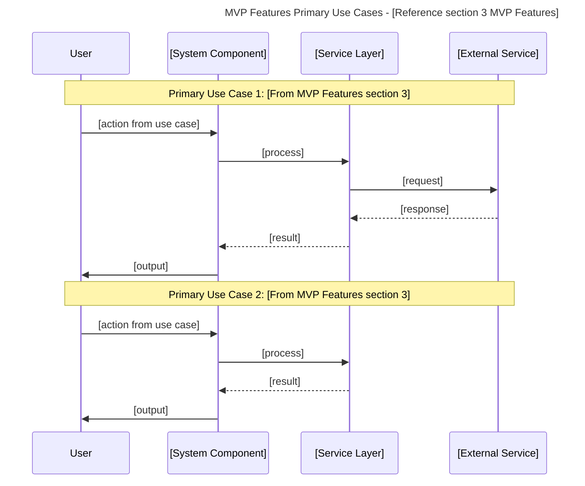

# Initial Context Engineering: {{repository_name}}

> **💡 Context Engineering Note:** This document provides comprehensive repository context for AI assistants, AI Agents, and Developers/Maintainers using proven context engineering methodologies. As highlighted by industry leaders in 2025, context engineering represents a fundamental shift from experimental AI use to enterprise-grade AI operations, providing 10x better accuracy and 100x fewer production failures compared to traditional "vibe coding" approaches. It serves as the foundation for understanding the complete project landscape and enables generation of detailed architecture, tech stack, reference documentation, and other downstream documents.

## What is Context Engineering?

Context engineering has emerged as the dominant methodology in AI development, representing a paradigm shift from simple prompt crafting to comprehensive information architecture design. As noted by [Analytics India Magazine](https://analyticsindiamag.com/ai-features/context-engineering-is-the-new-vibe-coding/), "when LLMs fail, it's not because the model is broken — it's because the system around it didn't set it up for success."

### Key Components of Context Engineering

**Information Ecosystem Management:**

- **System Instructions and Role Definitions**: Clear, structured directives that define AI behavior and capabilities
- **Conversation History and Memory Management**: Tracking past interactions to maintain coherence and build upon previous context
- **Relevant Documents and Knowledge Base**: Curated external knowledge injection with proper prioritization and chunking
- **Tool Outputs and API Integration**: Real-time data from external systems integrated seamlessly into context
- **Structured Information Architecture**: Organizing data to fit within token constraints while maximizing relevance

**Systems-Level Approach:**
Unlike prompt engineering's focus on individual interactions, context engineering orchestrates multiple layers of information to create a dynamic, intelligent environment. This approach transforms AI from simple responders into intelligent collaborators capable of understanding nuance, user preferences, and complex workflows.

### Context Engineering vs. Traditional Approaches

| Approach | Focus | Methodology | Outcomes |
|----------|-------|-------------|----------|
| **Prompt Engineering** | Individual instructions | Crafting better prompts | Variable results, limited scalability |
| **Vibe Coding** | Intuitive AI interaction | "Feeling your way" through tasks | Experimental, high failure rate |
| **Context Engineering** | Information ecosystem | Systematic framework design | Enterprise-grade reliability, scalable AI operations |

---

## Table of Contents

- [Initial Context Engineering: {{repository\_name}}](#initial-context-engineering-repository_name)
  - [What is Context Engineering?](#what-is-context-engineering)
    - [Key Components of Context Engineering](#key-components-of-context-engineering)
    - [Context Engineering vs. Traditional Approaches](#context-engineering-vs-traditional-approaches)
  - [Table of Contents](#table-of-contents)
  - [How to use this document?](#how-to-use-this-document)
    - [Context Engineering Implementation Structure](#context-engineering-implementation-structure)
    - [Context Engineering Methodology Applied](#context-engineering-methodology-applied)
    - [Consistency Across Sections](#consistency-across-sections)
      - [AI Assistant Requirements](#ai-assistant-requirements)
    - [Critical Document Consistency Framework](#critical-document-consistency-framework)
      - [Mandatory Cross-Section Dependencies](#mandatory-cross-section-dependencies)
      - [Consistency Enforcement Protocol](#consistency-enforcement-protocol)
      - [Section-Specific Consistency Guidelines](#section-specific-consistency-guidelines)
      - [Consistency Failure Prevention](#consistency-failure-prevention)
  - [Workflow](#workflow)
    - [Initial Context as an Input for PRP](#initial-context-as-an-input-for-prp)
    - [Steps](#steps)
    - [Context Engineering Flow Principles](#context-engineering-flow-principles)
    - [Inputs \& Outputs](#inputs--outputs)
      - [Visual Flow](#visual-flow)
      - [Input Components](#input-components)
      - [Output Generation](#output-generation)
  - [Context Engineering Initial Context](#context-engineering-initial-context)
    - [1. Initial Codebase Awareness](#1-initial-codebase-awareness)
      - [Output Format](#output-format)
    - [2. Product, Application, or Tool Description](#2-product-application-or-tool-description)
    - [2.1 GitHub Repository](#21-github-repository)
      - [Output Format](#output-format-1)
    - [2.2 Application/Tool/Product Name](#22-applicationtoolproduct-name)
      - [Output Format](#output-format-2)
    - [2.3 Primary Purpose (High-Level Description)](#23-primary-purpose-high-level-description)
      - [Output Format](#output-format-3)
    - [3. Features](#3-features)
      - [Output Format](#output-format-4)
    - [4. Architecture](#4-architecture)
      - [Output Format](#output-format-5)
    - [5. Software Architecture](#5-software-architecture)
      - [Output Format](#output-format-6)
    - [7. Implementation Requirements](#7-implementation-requirements)
      - [Output Format](#output-format-7)
    - [8. Tech Stack](#8-tech-stack)
      - [Output Format](#output-format-8)
    - [6. UX](#6-ux)
      - [Output Format](#output-format-9)
    - [9. Third Party Integrations](#9-third-party-integrations)
      - [Output Format](#output-format-10)
    - [13. Reference \& Documentation](#13-reference--documentation)
      - [Output Format](#output-format-11)
      - [Enhanced Output Format](#enhanced-output-format)
      - [Output Format](#output-format-12)
    - [10. Local Development Setup](#10-local-development-setup)
      - [Output Format](#output-format-13)
    - [11. Deployment](#11-deployment)
      - [Output Format](#output-format-14)
    - [12. AI Assistant Guidance](#12-ai-assistant-guidance)
      - [Output Format](#output-format-15)
    - [13. Reference \& Documentation](#13-reference--documentation-1)
      - [Enhanced Output Format](#enhanced-output-format-1)

---

## How to use this document?

This document implements **context engineering best practices** to create comprehensive information ecosystems for AI systems. Each section is designed following proven context engineering methodologies:

### Context Engineering Implementation Structure

- **🤖 Hint for the AI Assistant**: Structured context guidance that provides semantic understanding and role definition for AI systems, following context engineering principles of clear instruction architecture
- **⬇️ Outcome from this section**: Explicit outcome tracking that enables AI systems to validate completeness and maintain consistency across context layers. No section can be skipped, and each section must be completed with all the required information identified as outcome.
- **📋 Template Variables**: Standardized placeholders (e.g., `{{repository_name}}`) that enable dynamic context adaptation while maintaining structural integrity

### Context Engineering Methodology Applied

This document leverages key context engineering principles:

1. **Structured Information Architecture**: Each section builds upon previous context to create comprehensive understanding
2. **Tool Integration**: Sections are designed to integrate with external data sources and repository analysis tools
3. **Prioritized Information Flow**: Content is organized to maximize AI comprehension within token constraints
4. **Systematic Validation**: Outcome tracking ensures complete context capture before proceeding

### Consistency Across Sections

This section establishes the framework for maintaining consistency across all interdependent sections of the document. The AI assistant must complete each numbered section following context engineering protocols:

- Maintain consistency with established context patterns
- Validate outcomes against provided [example init-context.md](init-context-example.md) file
- Ensure information architecture supports downstream AI operations
- Apply systematic thinking rather than intuitive "vibe-based" approaches

#### AI Assistant Requirements

When completing any section, AI assistants must adhere to the consistency protocols defined in the Critical Document Consistency Framework below. This includes mandatory cross-section dependency validation, systematic enforcement protocols, and failure prevention measures to ensure coherent context generation.

### Critical Document Consistency Framework

> [!IMPORTANT]
> **Interdependent Sections Consistency Requirements**
> 
> This document contains interdependent sections that must maintain consistency to ensure coherent context engineering. Each section builds upon previous sections and informs subsequent ones. AI assistants must follow these consistency protocols:

#### Mandatory Cross-Section Dependencies

**Primary Dependencies (Critical):**
- Section 3 (Features) → Section 4 (Architecture): The system architecture must support all MVP Features and capabilities
- Section 3 (Features) → Section 5 (Software Architecture): The MVP Sequence Diagram must implement the Primary Use Cases from MVP Features
- Section 3 (Features) → Section 6 (UX): UX patterns and flows must support all defined features and target users
- Section 4 (Architecture) → Section 5 (Software Architecture): Software components must implement architectural decisions and constraints
- Section 4 (Architecture) → Section 11 (Deployment): Deployment architecture must support system architecture choices
- Section 8 (Tech Stack) → Section 7 (Implementation Requirements): All requirements must be feasible with chosen technologies
- Section 8 (Tech Stack) → Section 9 (Third Party Integrations): All integrations must be compatible with chosen tech stack
- Section 8 (Tech Stack) → Section 10 (Local Development Setup): Setup procedures must use exact versions from Tech Stack
- Section 8 (Tech Stack) → Section 12 (AI Assistant Guidance): AI pitfalls must be relevant to chosen technologies
- Section 8 (Tech Stack) → Section 13 (Reference & Documentation): Documentation must support all chosen technologies

**Secondary Dependencies (Important):**
- Section 5 (Software Architecture) → Section 7 (Implementation Requirements): Requirements must align with software architectural decisions
- Section 6 (UX) → Section 7 (Implementation Requirements): UX requirements must align with technical implementation constraints
- Section 7 (Implementation Requirements) → Section 10 (Local Development Setup): External service setup must align with integration specifications
- Section 7 (Implementation Requirements) → Section 12 (AI Assistant Guidance): Behavioral guidance must incorporate technical constraints
- Section 9 (Third Party Integrations) → Section 10 (Local Development Setup): Setup must include third-party service configuration
- Section 9 (Third Party Integrations) → Section 11 (Deployment): Deployment must support third-party integration requirements
- Section 9 (Third Party Integrations) → Section 12 (AI Assistant Guidance): AI guidance must address third-party integration pitfalls

**Coherence Dependencies (Application-Type Specific):**
- Section 3 (Features) → Section 4 (Architecture): Architecture components must be coherent with application type (CLI, web, API, library)
- Section 4 (Architecture) → Section 6 (UX): UX section applicability must align with architectural frontend decisions
- Section 6 (UX) → Section 8 (Tech Stack): UX technologies must support defined user experience patterns
- Section 11 (Deployment) → Section 4 (Architecture): Deployment strategy must be coherent with system architecture type

#### Consistency Enforcement Protocol

**Before completing any section, AI assistants must:**

1. Read dependencies: Completely read all sections referenced in the current section's requirements
2. Validate alignment: Ensure all content aligns with referenced sections
3. Verify consistency: Cross-check all interdependent elements for coherence
4. Iterate if needed: Revise content if inconsistencies are found

#### Section-Specific Consistency Guidelines

**For sections with dependencies:**
- Each section's NOTE block includes specific cross-reference requirements
- Follow the detailed validation steps provided in each section
- Ensure all template variables are used consistently across sections
- Validate that examples and use cases align across dependent sections

**For sections without dependencies:**
- Focus on section-specific requirements
- Ensure content supports downstream dependent sections
- Maintain template variable consistency

#### Consistency Failure Prevention

**Common consistency failures to avoid:**
- Creating system architecture without referencing actual application type and MVP features
- Creating sequence diagrams without referencing actual MVP features from Section 3
- Defining UX patterns for applications without user interfaces (e.g., CLI tools, APIs)
- Including frontend architecture components for non-UI applications
- Defining implementation requirements incompatible with chosen tech stack
- Documenting third-party integrations without corresponding tech stack support
- Writing setup procedures that don't match specified technology versions
- Creating deployment strategies incompatible with system architecture
- Documenting AI pitfalls irrelevant to the project's technology choices and integrations
- Gathering documentation that doesn't support the chosen tech stack and integrations

**Application-Type Coherence Failures:**
- CLI Applications: Including traditional frontend architecture or web-based UX patterns
- Web Applications: Missing frontend architecture or comprehensive UX section
- API Services: Including user interface components or end-user UX patterns
- Libraries/SDKs: Including deployment sections or end-user UX patterns

**Validation checkpoints:**
- Before finalizing any section, verify all cross-references are accurate
- Ensure template variables are used consistently throughout
- Confirm all interdependent content aligns properly
- Validate that section outcomes support dependent sections
- Verify application-type coherence across architecture, UX, and deployment sections
- Check that conditional sections (UX, Third Party Integrations, Deployment) are appropriately applied

---

## Workflow

### Initial Context as an Input for PRP

This workflow follows a **context engineering workflow** to assess a first initial context, which's a "vertical slice" of all the neccessary context, and then use that context to create a comprehensive information ecosystem for the AI assistant. This document, once completed, constitutes the most important input for any PRP (Product Requirement Prompt)

### Steps

1. **Context Priming Phase**: User provides initial information through the [helper prompt](init-context-helper-prompt.md) to establish foundational context layers and semantic understanding framework. This [helper prompt](init-context-helper-prompt.md) is a prompt that is used to guide the AI assistant to understand the user's requirements, and complete each section of the [init-context.md](init-context.md) file throughtout an assisted and verified process.
2. **Concrete Context Grounding**: User provides examples to enable pattern recognition and contextual anchoring, supporting the AI's understanding through tangible reference points (following context engineering's emphasis on concrete examples over abstract descriptions)
3. **Structured Context Generation**: The comprehensive initial context is systematically generated in [initial_context.md](../../00_context_engineering/init-context.md) following structured information architecture principles. This document is the most important input for any PRP (Product Requirement Prompt)

### Context Engineering Flow Principles

This process implements key context engineering methodologies:

- **Layered Information Building**: Each step builds upon previous context to create comprehensive understanding. Each section provides key information to specifics PRPs (Product Requirement Prompts) to complete each documentation layer in the [docs](../../../docs/) directory.
- **Concrete Grounding**: Examples in the [examples](../../00_context_engineering/examples/) directory provide essential pattern recognition, guidance, known-patterns and implementation details for AI assistants.
- **Structured Output**: Final context document follows systematic organization for optimal AI consumption.
- **Validation Loops**: Each phase includes outcome verification to ensure context completeness

### Inputs & Outputs

#### Visual Flow

> **🚀 Context Engineering Dual-Input Architecture**
>
> Following [industry research findings](https://medium.com/@tam.tamanna18/understanding-context-engineering-c7bfeeb41889), this dual-input architecture ensures AI systems receive both conceptual guidance and concrete reference points, enabling **10x better accuracy** compared to traditional prompt-based approaches.
>
> **Visual Input Flow:**
>
> ```
> ┌─────────────────────────────────────────────────────────────────┐
> │                    CONTEXT ENGINEERING WORKFLOW                 │
> └─────────────────────────────────────────────────────────────────┘
>                                 │
>                                 ▼
>                    ┌─────────────────────────┐
>                    │       USER INPUTS       │
>                    └─────────────────────────┘
>                                 │
>         ┌───────────────────────┼───────────────────────┐
>         ▼                       │                       ▼
> ┌───────────────────┐           │           ┌───────────────────┐
> │  HELPER PROMPT    │           │           │    EXAMPLES       │
> │  (Required)       │           │           │   (Optional)      │
> │                   │           │           │                   │
> │ • Repository info │           │           │ • Code samples    │
> │ • Tech stack      │           │           │ • Config files   │
> │ • Requirements    │           │           │ • Links/URLs      │
> │ • Architecture    │           │           │ • Documentation  │
> └───────────────────┘           │           └───────────────────┘
>         │                       │                       │
>         └───────────────────────┼───────────────────────┘
>                                 ▼
>                    ┌─────────────────────────┐
>                    │    AI ASSISTANT         │
>                    │    PROCESSES INPUTS     │
>                    └─────────────────────────┘
>                                 │
>                                 ▼
>                    ┌─────────────────────────┐
>                    │       GENERATES         │
>                    └─────────────────────────┘
>                                 │
>         ┌───────────────────────┼───────────────────────┐
>         ▼                       │                       ▼
> ┌───────────────────┐           │           ┌───────────────────┐
> │  init-context.md  │           │           │  examples/        │
> │                   │           │           │  directory        │
> │ • Complete context│           │           │                   │
> │ • PRP-ready       │           │           │ • Refined examples│
> │ • All sections    │           │           │ • Generated files │
> │ • Template vars   │           │           │ • Reference docs  │
> └───────────────────┘           │           └───────────────────┘
> ```
>

#### Input Components

- ✅ **Helper Prompt (Required):** User answers guided questions from [helper prompt](init-context-helper-prompt.md) to provide systematic project information
- ✅ **Examples (Optional):** User provides example files, code samples, documentation, or links in the [examples directory](../../00_context_engineering/examples) for AI reference and pattern recognition

#### Output Generation

- 📄 **init-context.md:** Complete [initial context](../../00_context_engineering/init_context.md) document ready for PRP (Product Requirement Prompt) usage
- 📁 **examples/ directory:** Refined [examples](../../00_context_engineering/examples/), generated reference files, and processed documentation from user inputs

---

## Context Engineering Initial Context

### 1. Initial Codebase Awareness

> [!NOTE]
> **🤖 Instructions for AI Assistant:**
>
> **📋 Process Flow - Follow these steps in order:**
>
> ```
> 1. 🔍 DISCOVER → Run repomix --help to understand tool capabilities
> 2. 📊 ANALYZE → Execute repomix to get complete codebase structure and context
> 3. 🌳 EXTRACT → Generate ASCII codebase tree from repomix output
> 4. 📋 IDENTIFY → Create table of most relevant initial files and configurations
> 5. 🔧 CATEGORIZE → Classify existing configurations, dotfiles, and task executors
> 6. 📤 PRESENT → Comprehensive initial codebase awareness summary
> ```
>
> **🔧 Detailed Steps:**
>
> - 🔍 **Tool Discovery:** Execute `repomix --help` to understand available options and output format
> - 📊 **Codebase Analysis:** Run `repomix` to get comprehensive codebase description and structure analysis
> - 🌳 **Tree Generation:** Extract and format ASCII directory tree showing complete repository structure
> - 📋 **File Identification:** Identify and categorize the most relevant initial files (dotfiles, configurations, task executors like Makefile/Justfile)
> - 🔧 **Configuration Analysis:** Analyze existing configurations, development tools, and automation scripts
> - 📁 **Structure Documentation:** Document initial codebase shape and key components that will influence development
> - 🚫 Avoid making assumptions about codebase without running repomix analysis
> - 🚫 Avoid detailed implementation analysis (focus on structure and existing tooling)
>
> **✅ Validation Requirements:**
>
> - 🔍 Repomix tool capabilities are verified with --help command
> - 📊 Complete codebase analysis is performed using repomix
> - 🌳 ASCII tree accurately represents repository structure
> - 📋 Most relevant files table includes descriptions and purposes
> - 🔧 Existing configurations and task executors are identified and categorized
> - 📁 Initial codebase shape is documented for future reference

#### Output Format

**Repomix Tool Capabilities:**
```bash
# Output from repomix --help command
(Tool capabilities, options, and usage information)
```

**Complete Codebase Structure:**
```
(ASCII tree representation of the repository structure from repomix output)
```

**Most Relevant Initial Files:**
| File/Directory | Type | Purpose | Configuration Details |
|---------------|------|---------|----------------------|
| (File path) | (dotfile/config/task executor/etc.) | (What this file does) | (Key settings or commands) |
| (Another file) | (Category) | (Purpose description) | (Relevant configuration details) |
| (Configuration file) | (Type) | (Role in project) | (Important settings or patterns) |

**Initial Codebase Analysis:**
- **Existing Configurations:** (Description of found dotfiles, config files, and their purposes)
- **Task Executors:** (Makefile, Justfile, npm scripts, or other automation tools found)
- **Development Tools:** (Pre-commit hooks, linting configs, testing setup, etc.)
- **Repository Structure:** (High-level organization and key directories)

---

### 2. Product, Application, or Tool Description

### 2.1 GitHub Repository

> [!NOTE]
> **🤖 Instructions for AI Assistant:**
>
> **📋 Process Flow - Follow these steps in order:**
>
> ```
> 1. 🔍 ANALYZE → Extract repository info from user prompt
> 2. 📂 CATEGORIZE → Separate user-specified vs. auto-inferred settings  
> 3. 📊 GENERATE TABLE → Create summary table with configurable settings
> 4. ⚙️ CREATE YAML → Generate detailed configuration with comments
> 5. ✅ VALIDATE → Check syntax and completeness
> 6. 📤 PRESENT → Output in mandatory structure format
> ```
>
> **🔧 Detailed Steps:**
>
> - 📍 Analyze the repository location from user's helper prompt (default: `github.com/Excoriate/{{repository_name}}`)
> - 🏷️ Extract repository metadata (name, description, tech stack)
> - 🗂️ Categorize settings as user-specified vs. auto-inferred based on analysis
> - 📋 Generate simplified summary table and detailed YAML configuration
> - 📖 Reference [settings.yaml](../../../.github/settings.yml) for complete configuration structure
>
> **🔄 Template Variable Handling:**
>
> - ✏️ Replace `{{repository_name}}` with actual repository name from user input
> - 📝 Replace `{{repository_description}}` with actual description from analysis
> - 🏗️ Keep template variables in YAML only when showing configuration structure/examples
> - 💯 Use actual values in the summary table output
>
> **📋 Template Variable Examples:**
>
> - ✅ **Use Templates:** In YAML configuration examples: `name: "{{repository_name}}"` 
> - ✅ **Use Actual Values:** In summary tables: `cloudcost-cli` (not `{{repository_name}}`)
> - ✅ **Use Templates:** When showing structure: `description: "{{repository_description}}"`
> - ✅ **Use Actual Values:** In final output: `AWS cost optimization CLI tool`
>
> **✅ Validation Requirements:**
>
> - 🔍 Verify repository exists and is accessible (if analyzing existing repo)
> - ⚖️ Check for obvious inconsistencies between stated purpose and detected tech stack
> - 📋 Validate YAML syntax before presenting configuration
> - 🔧 Ensure all required fields have values (use defaults when user input incomplete)
> - 📚 Cross-reference against settings.yml schema for completeness
>
> **🚨 Error Handling & Fallback Strategies:**
>
> - **❌ Missing Repository:** If repository doesn't exist or isn't accessible, proceed with template structure using provided information
> - **⚠️ Incomplete Information:** Use organization defaults (Excoriate standards) for missing user specifications
> - **🔧 Tech Stack Detection Failure:** Request clarification or use "general" labels and minimal CI requirements
> - **❌ Invalid Input:** Politely request correction while providing helpful examples of expected format
> - **⚡ Conflicting Requirements:** Prioritize security and best practices, note conflicts in output

> [!NOTE]
> **⬇️ Expected Outcomes:**
>
> - ☑️ Git Repository Location: `github.com/Excoriate/{{repository_name}}`
> - ☑️ GitHub Repository Settings configuration matching requirements from settings.yaml

#### Output Format

**Mandatory Structure - Present in this exact order:**

1. **Repository Summary Table:**

| GitHub Repository | Description | Configurable Settings |
|------------------|-------------|----------------------|
| `{{repository_name}}` | `{{repository_description}}` | **User-Specified:**<br>- Repository name and description<br>- Technology-specific topics<br>- Team access permissions<br>- Branch protection requirements<br><br>**Auto-Inferred:**<br>- Labels based on tech stack<br>- CI/CD status checks<br>- Security configurations<br>- Best practice defaults |

**Example:**
| GitHub Repository | Description | Configurable Settings |
|------------------|-------------|----------------------|
| `cloudcost-cli` | A powerful CLI tool for AWS cost optimization and resource rightsizing | **User-Specified:**<br>- Repository name: cloudcost-cli<br>- Technology topics: ["cli", "aws", "cost-optimization"]<br>- Team access: maintainers (admin), contributors (push)<br>- Branch protection: require 1 reviewer<br><br>**Auto-Inferred:**<br>- Labels: "go", "terraform", "cli-tool"<br>- CI/CD: ["ci/test", "ci/build", "ci/lint"]<br>- Security: dependabot, code scanning<br>- Best practices: branch protection, required reviews |

2. **Complete GitHub Repository Settings Configuration:**

*Note: Replace template variables `{{variable}}` with actual analyzed values. Variables with `:-default` show fallback values when analysis is incomplete.*

```yml
# Core Repository Configuration (User-Specified + Auto-Inferred)
repository:
  name: {{repository_name}}                    # REPLACE: Actual repository name
  description: {{repository_description}}      # REPLACE: Actual description from analysis
  topics: {{tech_stack_topics}}               # REPLACE: Auto-inferred from primary language & frameworks
                                               # Example: ["typescript", "react", "nodejs"]

# Team Access Configuration (User-Specified or Default Best Practices)
teams:
  - name: maintainers
    permission: admin
  - name: contributors  
    permission: push

# Technology-Specific Labels (Auto-Inferred from Tech Stack)
labels:
  - name: {{primary_language}}                # REPLACE: Detected primary language
    color: "{{language_color}}"               # REPLACE: Standard color for language
    description: "{{primary_language}} related changes"
  - name: {{framework_name}}                  # REPLACE: Detected framework if applicable
    color: "{{framework_color}}"              # REPLACE: Framework-specific color
    description: "{{framework_name}} specific functionality"

# Branch Protection (User Requirements + Security Best Practices)
branches:
  - name: main
    protection:
      required_pull_request_reviews:
        required_approving_review_count: {{min_reviewers:-1}}      # DEFAULT: 1 reviewer minimum
        require_code_owner_reviews: {{require_codeowners:-true}}   # DEFAULT: true
      required_status_checks:
        contexts: {{ci_status_checks}}                             # REPLACE: Auto-inferred from CI/CD workflow
                                                                   # Example: ["ci/lint", "ci/test", "ci/build"]
      restrictions:
        users: [{{repository_owner:-"Excoriate"}}]                # DEFAULT: "Excoriate"
```

Entire [settings.yml](../../../.github/settings.yml) file is present on this repo (on this path `.github/settings.yml`), and is modified according to the user's requirements.

**Example Complete Configuration:**
```yml
# Core Repository Configuration
repository:
  name: cloudcost-cli
  description: "A powerful CLI tool for AWS cost optimization and resource rightsizing"
  topics: ["go", "cli", "aws", "cost-optimization", "devops"]

# Team Access Configuration
teams:
  - name: maintainers
    permission: admin
  - name: contributors  
    permission: push

# Technology-Specific Labels
labels:
  - name: go
    color: "00ADD8"
    description: "Go language related changes"
  - name: cli
    color: "0366d6"
    description: "Command-line interface functionality"

# Branch Protection
branches:
  - name: main
    protection:
      required_pull_request_reviews:
        required_approving_review_count: 1
        require_code_owner_reviews: true
      required_status_checks:
        contexts: ["ci/test", "ci/build", "ci/lint"]
      restrictions:
        users: ["Excoriate"]
```

### 2.2 Application/Tool/Product Name

> [!NOTE]
> **🤖 Instructions for AI Assistant:**
>
> **📋 Process Flow - Follow these steps in order:**
>
> ```
> 1. 🔍 ANALYZE → Extract product name from repository and user input
> 2. ✏️ STANDARDIZE → Convert to proper product naming format (technical and display)
> 3. 🔍 VERIFY → Ensure consistency with repository's canonical name
> 4. 📝 DOCUMENT → Record technical name (for env vars, configs) and display name (for docs)
> 5. ✅ VALIDATE → Check alignment with user specifications
> 6. 📤 PRESENT → Output in standardized format
> ```
>
> **🔧 Detailed Steps:**
>
> - 📝 Use the exact repository name as the **Technical Name** (for environment variable prefixes, config keys, file names)
> - 🔍 Ensure consistency with the GitHub repository's canonical name
> - 🏷️ Only deviate if explicitly specified by the product manager or stakeholder
> - 📌 Create **Display Name** by converting technical names to proper title case for documentation
> - 🔄 Maintain technical accuracy while improving readability
> - 📝 Create comprehensive product summary (2-3 paragraphs) as product manager would describe to stakeholders
>
> **🔄 Template Variable Handling:**
>
> - ✏️ Replace `{{repository_name}}` with actual repository name
> - 📝 Replace `{{repository_description}}` with actual description from analysis
> - 🏗️ Convert technical naming to **Display Name** for documentation (e.g., "ai-assistant-template" → "AI Assistant Template")
>
> **✅ Validation Requirements:**
>
> - 🔍 Verify Technical Name consistency across repository metadata
> - ⚖️ Check for conflicts between technical and display names
> - 📋 Ensure Technical Name follows organization naming conventions (for env vars, configs)
> - 🔧 Validate that Display Name clearly represents the product for documentation
>
> **🚨 Error Handling & Fallback Strategies:**
>
> - **❌ Missing Product Name:** Use repository name as fallback with proper formatting
> - **⚠️ Unclear Repository Purpose:** Extract intent from README, package.json, or repository description
> - **🔧 Inconsistent Naming:** Prioritize user-specified names over auto-detected ones
> - **❌ Invalid Characters:** Clean and standardize name while preserving meaning
> - **⚡ Multiple Naming Conventions:** Use the most descriptive and user-friendly version

#### Output Format

**Mandatory Structure - Present in this exact order:**

1. **Product Identification Summary:**

| Product Name | Display Name | Description |
|--------------|--------------|-------------|
| `{{repository_name}}` | `{{display_name}}` | `{{repository_description}}` |

2. **Product Summary:**

(A comprehensive, complete and descriptive overview of the product, described as a product manager would describe it to a stakeholder. 2-3 paragraphs)
Example:

```text
CloudCost CLI is a powerful command-line interface (CLI) tool designed to help cloud engineers and DevOps teams streamline their Amazon Web Services infrastructure management. By providing intelligent cost analysis, resource rightsizing recommendations, and automated optimization strategies, this tool transforms complex cloud resource management into a simple, actionable process.

The CLI leverages advanced algorithmic analysis to scan existing AWS environments, identifying underutilized or overprovisioned EC2 instances, RDS databases, and EBS volumes. Engineers can quickly generate comprehensive reports that highlight potential cost savings, recommend precise resource adjustments, and provide clear migration or downsizing strategies. With built-in safety checks and preview modes, teams can confidently optimize their cloud infrastructure without risking service disruptions.

By combining real-time performance metrics, historical usage patterns, and machine learning-driven insights, CloudCost CLI empowers organizations to reduce cloud spending, improve operational efficiency, and maintain optimal infrastructure performance. Whether managing small startup environments or complex enterprise deployments, this tool provides a user-friendly, data-driven approach to cloud resource management.
```

3. **Complete Product Definition:**

| Field | Value |
|-------|-------|
| **Technical Name** | `{{repository_name}}` |
| **Display Name** | `{{display_name}}` |
| **Description** | `{{repository_description}}` |
| **Other Details** | `{{other_details}}` |

### 2.3 Primary Purpose (High-Level Description)

> [!NOTE]
> **🤖 Instructions for AI Assistant:**
>
> **📋 Process Flow - Follow these steps in order:**
>
> ```
> 1. 🎯 IDENTIFY → What specific problem does this solve?
> 2. 📝 CLARIFY → Explain the problem in simple, jargon-free terms
> 3. 💡 ARTICULATE → Define the unique value this solution provides
> 4. ✅ VALIDATE → Ensure clarity for non-technical stakeholders
> 5. 📤 PRESENT → Output in clear, concise format
> ```
>
> **🔧 Detailed Steps:**
>
> - 🎯 Identify the core problem being solved (what pain point or challenge?)
> - 📝 Explain this problem using everyday language, avoiding technical jargon
> - 💡 Articulate the specific value this solution delivers (what benefit or outcome?)
> - 🔍 Ensure the value proposition is unique and differentiated
> - ✅ Test clarity by asking: "Would a non-technical person understand this?"
>
> **✅ Validation Requirements:**
>
> - 🔍 Problem statement is specific and concrete (not abstract or vague)
> - 📝 Language is accessible to non-technical stakeholders
> - 💡 Value proposition clearly connects to the identified problem
> - 🎯 Focus remains on WHAT problem is solved and WHY it matters

#### Output Format

**Problem Statement:**
(Clearly explain what specific problem or challenge this solves, using everyday language that anyone can understand)

**Value Proposition:**
(Describe the unique benefit or outcome this solution provides, focusing on why it matters to users)

---

### 3. Features

> [!NOTE]
> **🤖 Instructions for AI Assistant:**
>
> **📋 Process Flow - Follow these steps in order:**
>
 > ```
> 1. 🔍 CATEGORIZE → Group capabilities into logical feature areas
> 2. 📝 ENUMERATE → List specific capabilities within each category
> 3. 🎯 PRIORITIZE → Classify features into MVP, Next Phase, and Nice to Have tiers
> 4. 📝 DEFINE → Create high-level User Acceptance Criteria (UAC) for each capability
> 5. 📁 REFERENCE → Connect to concrete examples when available
> 6. 📤 PRESENT → Output in structured, scannable format
> ```
>
> **🔧 Detailed Steps:**
>
 > - 🗂️ Group related capabilities into 3-5 logical feature categories
> - 👥 Identify target users/roles for each feature category (e.g., developers, administrators, end-users)
> - 📋 List 3-6 specific capabilities per category with clear descriptions
> - 📖 Define 1-2 primary use cases per category showing real-world usage scenarios
> - 🎯 **Classify features into three tiers:** MVP (essential for working version), Next Phase (important enhancements), Nice to Have (optimal user experience)
> - 📝 **Create high-level User Acceptance Criteria (UAC)** for each capability defining what success looks like
> - 📊 Specify measurable success indicators for each feature category
> - 📁 Reference concrete examples from repository or examples/ directory when available
> - 🔍 Focus on what users can accomplish, not how it's implemented
>
> **✅ Validation Requirements:**
>
 > - 🗂️ Feature categories are distinct and logical
> - 📝 Each capability is specific and actionable (not vague)
> - 🎯 **Features are properly classified into MVP, Next Phase, and Nice to Have tiers**
> - 📝 **Each capability includes high-level User Acceptance Criteria (UAC)**
> - 📋 Descriptions focus on user outcomes, not technical implementation
> - 👥 Each feature category has identified target users for PRD context
> - 📖 Use cases provide practical scenarios for user story development
> - 📊 Success indicators are measurable and specific for acceptance criteria

#### Output Format

**MVP Features (Core and Essential for Working Version):**
- **Target Users:** (Who will primarily use these features - roles/personas)
- **Capabilities:** (List essential functionality that defines the solution)
- **Primary Use Cases:** (1-2 key scenarios showing practical usage context)
- **User Acceptance Criteria (UAC):** (High-level acceptance criteria for each capability)
- **Success Indicators:** (Measurable outcomes that define feature effectiveness)

**Next Phase Features:**
- **Target Users:** (Who will primarily use these features - roles/personas)
- **Capabilities:** (List important functionality for enhanced operation)
- **Primary Use Cases:** (1-2 key scenarios showing practical usage context)
- **User Acceptance Criteria (UAC):** (High-level acceptance criteria for each capability)
- **Success Indicators:** (Measurable outcomes that define feature effectiveness)

**Nice to Have Features:**
- **Target Users:** (Who will primarily use these features - roles/personas)
- **Capabilities:** (List additional functionality for optimal user experience)
- **Primary Use Cases:** (1-2 key scenarios showing practical usage context)
- **User Acceptance Criteria (UAC):** (High-level acceptance criteria for each capability)
- **Success Indicators:** (Measurable outcomes that define feature effectiveness)

---

### 4. Architecture

> [!NOTE]
> **🤖 Instructions for AI Assistant:**
>
> **📋 Process Flow - Follow these steps in order:**
>
> ```
> 1. 🏗️ ANALYZE → Application type from Features section to determine architectural components
> 2. 🗄️ DEFINE → Database/Persistence layer architecture (when applicable)
> 3. 🖥️ SPECIFY → Frontend architecture components (when applicable)
> 4. ⚙️ MAP → Backend/Core logic architecture
> 5. 🔧 IDENTIFY → Additional architectural components (message queues, caching, etc.)
> 6. 🔗 VALIDATE → Architectural coherence with application type
> 7. 📤 PRESENT → Complete system architecture summary
> ```
>
> **🔧 Detailed Steps:**
>
> - 🏗️ **Application Type Analysis:** Determine architectural components based on application type from Features section (CLI, web app, API, library, etc.)
> - 🗄️ **Database/Persistence:** Define data storage architecture, database selection, data modeling approach (when applicable)
> - 🖥️ **Frontend Architecture:** Specify client-side architecture, UI framework, state management (when applicable - NOT for CLI tools, APIs, libraries)
> - ⚙️ **Backend/Core Logic:** Define server-side or core application architecture, business logic organization, API design
> - 🔧 **Additional Components:** Identify supporting architectural components (message queues, caching layers, external service integrations, etc.)
> - 🔗 **Coherence Validation:** Ensure architectural components are coherent with application type and don't include irrelevant components
> - 📊 **Architecture Diagram:** Create visual representation of system architecture showing component relationships
>
> **🔗 Cross-Section Dependencies:**
> 
> This section has critical dependencies on Section 3 (Features). See the [Critical Document Consistency Framework](#critical-document-consistency-framework) for complete requirements.
> 
> **Key Requirement:** The system architecture must support all MVP Features and capabilities while being coherent with the application type.
>
> **✅ Validation Requirements:**
>
> - 🏗️ **Application type coherence is maintained** (CLI doesn't have traditional frontend, web apps have frontend components, APIs focus on backend)
> - 🗄️ Database architecture aligns with data requirements from Features section
> - 🖥️ Frontend architecture is only included when application has user interface components
> - ⚙️ Backend/Core logic architecture supports all defined capabilities from Features section
> - 🔧 Additional components are justified by actual requirements, not theoretical needs
> - 🔗 **All architectural components directly support MVP Features from Section 3**
> - 📊 Architecture diagram accurately represents component relationships and data flow
>
> **🚨 Critical Coherence Rules:**
>
> - **CLI Applications:** No traditional frontend architecture; backend becomes "Core Logic"; focus on command processing and output formatting
> - **Web Applications:** Include both frontend and backend architecture; comprehensive UI architecture
> - **API Services:** Backend-focused architecture; no end-user frontend components; focus on service architecture
> - **Libraries/SDKs:** Component-based architecture; no deployment-specific components; focus on modular design
> - **Desktop Applications:** Native UI architecture; local data storage; platform-specific considerations
> - **Mobile Applications:** Mobile-specific frontend architecture; offline capabilities; platform considerations

#### Output Format

**Application Type Assessment:**
(Identify the primary application type based on Features section and justify architectural component selection)

**Database/Persistence Architecture:**
(Define data storage approach, database selection, data modeling, and persistence patterns - when applicable)

**Frontend Architecture:**
(Specify client-side architecture, UI framework, state management, and user interface patterns - when applicable and coherent with application type)

**Backend/Core Logic Architecture:**
(Define server-side or core application architecture, business logic organization, API design, and processing patterns)

**Additional Architectural Components:**
(Identify supporting components like message queues, caching layers, external service integrations, monitoring, etc. - when justified by requirements)

**System Architecture Diagram:**
(Create visual representation using ASCII or Mermaid diagrams showing all architectural components and their relationships)

```
Example for Web Application:
┌─────────────────┐    ┌─────────────────┐    ┌─────────────────┐
│   Frontend      │    │    Backend      │    │   Database      │
│   (React/Vue)   │◄──►│   (Node.js/     │◄──►│   (PostgreSQL/  │
│                 │    │    Python)      │    │    MongoDB)     │
└─────────────────┘    └─────────────────┘    └─────────────────┘
        │                        │                        │
        ▼                        ▼                        ▼
┌─────────────────┐    ┌─────────────────┐    ┌─────────────────┐
│   CDN/Static    │    │   API Gateway/  │    │   Cache Layer   │
│   Assets        │    │   Load Balancer │    │   (Redis)       │
└─────────────────┘    └─────────────────┘    └─────────────────┘
```

**Architectural Rationale:**
(Explain why each architectural component was selected, how it supports the application type, and how components work together to fulfill requirements from Features section)

---

### 5. Software Architecture

> [!NOTE]
> **🤖 Instructions for AI Assistant:**
>
> **📋 Process Flow - Follow these steps in order:**
>
> ```
> 1. 🎨 IDENTIFY → Design patterns used (Factory, Builder, Observer, etc.)
> 2. 🛠️ SPECIFY → Language-specific patterns (e.g., Go builder, Python decorator)
> 3. 🏗️ MAP → Main system components and their responsibilities
> 4. 🏛️ DEFINE → Overall software architecture style (Layered, Hexagonal, etc.)
> 5. 📁 CREATE → Project structure organization as ASCII tree
> 6. 🔄 DIAGRAM → Create Mermaid sequence diagram for MVP Features' Primary Use Cases from section 3
> 7. 🔗 EXPLAIN → How patterns and architecture solve domain problems
> 8. 📤 PRESENT → Comprehensive software architecture summary
> ```
>
> **🔧 Detailed Steps:**
>
> - 🎨 Identify code-level design patterns actually implemented in the codebase
> - 🛠️ Document language-specific patterns relevant to the tech stack
> - 🏗️ Map main system components (services, modules, layers) and responsibilities
> - 🏛️ Define overall software architecture style and organizational approach
> - 📁 Create ASCII representation of recommended project structure for organizing source code
> - 🔄 **Create Mermaid sequence diagram for MVP Features' Primary Use Cases** showing critical user interactions and component message flows based on section 3
> - 🔗 Explain rationale for architectural decisions and pattern choices
> - 📋 Show how components interact and patterns solve specific problems
>
> **🔗 Cross-Section Dependencies:**
> 
> This section has critical dependencies on Section 3 (Features) and Section 4 (Architecture). See the [Critical Document Consistency Framework](#critical-document-consistency-framework) for complete requirements.
> 
> **Key Requirements:** 
> - The MVP Sequence Diagram must implement the Primary Use Cases from MVP Features (Section 3)
> - Software components must implement architectural decisions from Section 4 (Architecture)
>
> **✅ Validation Requirements:**
>
> - 🎨 Only include patterns that are actually implemented
> - 🛠️ Language-specific patterns match the technology stack
> - 🏗️ Components have distinct, clear responsibilities
> - 🏛️ Architecture style aligns with project complexity and requirements
> - 📁 Project structure reflects architectural decisions and component organization
> - 🔄 **Sequence diagram clearly shows MVP Features' Primary Use Cases with proper message flows and component interactions**
> - 🔗 **Sequence diagram components align with the Main System Components defined in this section**
> - ✅ **All sequence diagram actors and flows directly correspond to Primary Use Cases from Section 3**
> - 🏗️ **Software architecture aligns with system architecture from Section 4**

#### Output Format

**Design Patterns Applied:**
(List specific design patterns used in the codebase with concrete implementation examples and location references)

**Software Architecture Style:**
(Define the overall architectural approach with clear justification: Layered, Hexagonal, Clean Architecture, Microservices, etc. Include visual representation using ASCII diagrams or mermaid for complex architectures)

**Main System Components:**
(Identify primary software modules, their specific responsibilities, and inter-component relationships. Use ASCII diagrams to show component hierarchy and interactions)

**Recommended Project Structure:**
(Present technically justified directory organization that aligns with chosen architecture patterns and reflects component separation principles)

```
(ASCII tree representation of recommended source code organization reflecting architectural decisions)
project-name/
├── src/
│   ├── components/          # Core application components
│   │   ├── core/           # Essential business logic components
│   │   └── shared/         # Reusable utility components
│   ├── services/           # External service integrations
│   ├── utils/              # Helper functions and utilities
│   ├── config/             # Configuration files and constants
│   └── main.ext            # Application entry point
├── tests/                  # Test files mirroring src structure
├── docs/                   # Documentation
├── scripts/                # Build and development scripts
└── examples/               # Usage examples and demos
```

**Architectural Rationale:**
(Provide technical justification for architecture and design pattern choices, explaining how they address specific project requirements and constraints)

**Data Flow Diagram:**
(Visualize how data moves through system components, including input/output flows, transformations, and storage interactions. Use ASCII or mermaid diagrams to show complete data processing pipeline)

**MVP Sequence Diagram:**
(Create a Mermaid sequence diagram showing the Primary Use Cases from MVP Features in section 3. Include key actors, system components, and message flows for the most critical user scenarios. Each sequence should correspond to a Primary Use Case defined in the MVP Features section)



---

### 7. Implementation Requirements

> [!NOTE]
> **🤖 Instructions for AI Assistant:**
>
> **📋 Process Flow - Follow these steps in order:**
>
> ```
> 1. 🎯 DEFINE → Technical quality attributes and constraints
> 2. 📈 SPECIFY → Performance benchmarks and scalability targets
> 3. 🔒 IDENTIFY → Security constraints and compliance requirements
> 4. 🔗 MAP → Integration specifications and protocols
> 5. 🛠️ DOCUMENT → Development and deployment constraints
> 6. 📤 PRESENT → Implementation-focused requirements summary
> ```
>
> **🔧 Detailed Steps:**
>
> - 🎯 Define technical quality attributes (maintainability, testability, modularity)
> - 📈 Specify measurable performance benchmarks and scalability targets
> - 🔒 Identify security constraints, compliance needs, and regulatory requirements
> - 🔗 Document integration protocols, API specifications, and data exchange formats
> - 🛠️ Specify development environment constraints and deployment requirements
> - 🚫 Avoid duplicating feature capabilities (covered in section 3)
> - 🚫 Avoid duplicating architecture patterns (covered in sections 4-5)
> - 🚫 Avoid duplicating technology choices (covered in section 8)
>
> **🔗 Cross-Section Dependencies:**
> 
> This section has critical dependencies on Section 8 (Tech Stack). See the [Critical Document Consistency Framework](#critical-document-consistency-framework) for complete requirements.
> 
> **Key Requirement:** Implementation Requirements must align with and support the Tech Stack defined in Section 8.
>
> **✅ Validation Requirements:**
>
> - 🎯 Quality attributes include measurable acceptance criteria
> - 📈 Performance requirements specify concrete metrics and benchmarks
> - 🔒 Security requirements address specific threats and compliance standards
> - 🔗 Integration specifications include protocols, formats, and error handling
> - 🛠️ Implementation constraints are actionable for development teams
> - 🔗 **All requirements are technically feasible with the Tech Stack from Section 8**
> - ✅ **Performance benchmarks are realistic for the chosen primary language and frameworks**
> - 🔒 **Security constraints leverage the security features of selected technologies**

#### Output Format

**Quality Attributes:**
(Define technical quality requirements: maintainability, testability, reliability, usability with measurable acceptance criteria)

**Performance & Scalability:**
(Specify concrete performance benchmarks, response times, throughput targets, and scalability requirements with measurable metrics)

**Security & Compliance:**
(Identify security constraints, threat mitigation requirements, compliance standards, and regulatory requirements that constrain implementation)

**Integration Specifications:**
(Define protocols, data formats, API standards, error handling requirements, and external system interaction constraints)

**Development & Deployment Constraints:**
(Specify development environment requirements, deployment constraints, testing requirements, and operational considerations)

---

### 8. Tech Stack

> [!NOTE]
> **🤖 Instructions for AI Assistant:**
>
> **📋 Process Flow - Follow these steps in order:**
>
> ```
> 1. 🔍 IDENTIFY → Primary programming language and version
> 2. 📦 MAP → Core frameworks and essential libraries
> 3. 🛠️ LIST → Development tools and build systems
> 4. 🐳 SPECIFY → Containerization and deployment tools (if applicable)
> 5. ☁️ DETAIL → Cloud platform and infrastructure tools (if applicable)
> 6. 📝 JUSTIFY → Document rationale for key technology choices
> 7. 📤 PRESENT → Organized tech stack summary
> ```
>
 > **🔧 Detailed Steps:**
>
> - 🔍 Identify primary programming language with version requirements
> - 📦 List core frameworks, libraries, and essential dependencies
> - 🛠️ Document development tools, package managers, and build tools
> - 🐳 Include containerization, CI/CD, and deployment technologies when used
> - ☁️ Specify cloud platform and infrastructure tools when applicable
> - 📝 Document rationale for major technology choices (why this framework vs alternatives)
> - 🚫 Avoid implementation details (covered in section 7)
> - 🚫 Avoid architectural patterns (covered in sections 4-5)
>
> **🔗 Cross-Section Dependencies:**
> 
> This section has critical dependencies on Section 3 (Features). See the [Critical Document Consistency Framework](#critical-document-consistency-framework) for complete requirements.
> 
> **Key Requirement:** Tech Stack choices must directly support the Features defined in Section 3.
>
> **✅ Validation Requirements:**
>
> - 🔍 Primary language includes specific version requirements and compatibility constraints
> - 📦 **Core technologies are essential and directly support identified features from section 3**
> - 🛠️ Development tools enable the development workflow and architecture patterns from sections 4-5
> - 🐳 Only include deployment technologies actually used in the project lifecycle
> - 🔗 Tech stack choices are technically justified with rationale for major decisions
> - ⚖️ Technology selections support performance and scalability requirements from section 7
> - 🏷️ Tech stack aligns with GitHub repository configuration and organizational standards
> - ✅ **All technology choices directly enable MVP Features from Section 3**
> - 🎯 **Framework selections support the Target Users and Primary Use Cases from Section 3**
> - 📊 **Development tools enable the Success Indicators measurement from Section 3**

#### Output Format

**Primary Language & Version:**
(Main programming language with version requirements)

**Core Technologies:**
(Essential frameworks, libraries, and runtime dependencies)

**Development Environment:**
(Development tools, package managers, build tools, testing frameworks)

**Deployment & Infrastructure:**
(Containerization, CI/CD, cloud platform, infrastructure tools - if applicable)

**Technology Decision Rationale:**
(Explain key technology choices: why this language/framework was selected, what alternatives were considered, and how choices support project requirements)

---

### 6. UX

> [!NOTE]
> **🤖 Instructions for AI Assistant:**
>
> **📋 Process Flow - Follow these steps in order:**
>
> ```
> 1. 🔍 ASSESS → Application type from Features and Architecture sections for UX relevance
> 2. 🎨 DEFINE → User interface patterns and design system approach
> 3. 🗺️ MAP → User experience flows and interaction patterns
> 4. 📱 SPECIFY → Platform-specific UX considerations
> 5. ♿ IDENTIFY → Accessibility and usability requirements
> 6. 🔗 VALIDATE → UX coherence with application type and architecture
> 7. 📤 PRESENT → Complete UX specification (when applicable)
> ```
>
> **🔧 Detailed Steps:**
>
> - 🔍 **Applicability Assessment:** Determine if UX section is relevant based on application type (web apps, mobile apps, desktop apps have UX; CLI tools, APIs, libraries have different UX considerations)
> - 🎨 **Design System:** Define UI patterns, component libraries, design tokens, visual hierarchy, and styling approach
> - 🗺️ **User Flows:** Map critical user journeys, interaction patterns, navigation structure, and user task completion flows
> - 📱 **Platform Considerations:** Specify responsive design, mobile-first approach, platform-specific guidelines (iOS, Android, web, desktop)
> - ♿ **Accessibility:** Define accessibility standards, keyboard navigation, screen reader support, and inclusive design principles
> - 🔗 **Coherence Validation:** Ensure UX specifications align with application type and don't include irrelevant patterns
> - 📊 **UX Metrics:** Define user experience success metrics and usability testing approaches
>
> **🔗 Cross-Section Dependencies:**
> 
> This section has critical dependencies on Section 3 (Features) and Section 4 (Architecture). See the [Critical Document Consistency Framework](#critical-document-consistency-framework) for complete requirements.
> 
> **Key Requirements:** 
> - UX patterns and flows must support all defined features and target users from Section 3
> - UX section applicability must align with architectural frontend decisions from Section 4
>
> **✅ Validation Requirements:**
>
> - 🔍 **UX section is only included when application has user interface components**
> - 🎨 Design system specifications align with target users from Features section
> - 🗺️ User flows directly support Primary Use Cases from MVP Features
> - 📱 Platform considerations match architectural decisions from Section 4
> - ♿ Accessibility requirements are specific and measurable
> - 🔗 **UX patterns are coherent with application type** (no web UX patterns for CLI tools)
> - 📊 UX metrics align with Success Indicators from Features section
>
> **🚨 Critical Coherence Rules:**
>
> - **CLI Applications:** Focus on command-line UX (help text, error messages, output formatting, command discoverability)
> - **Web Applications:** Comprehensive web UX (responsive design, browser compatibility, web accessibility standards)
> - **Mobile Applications:** Mobile-specific UX (touch interactions, platform guidelines, offline capabilities)
> - **Desktop Applications:** Native desktop UX (platform conventions, keyboard shortcuts, window management)
> - **API Services:** Developer UX (documentation, error responses, SDK design, API discoverability)
> - **Libraries/SDKs:** Developer UX (API design, documentation, examples, integration patterns)
>
> **⚠️ Conditional Applicability:**
>
> This section should be **SKIPPED** for applications without direct user interaction (pure backend services, data processing pipelines, infrastructure tools without UI). When skipped, clearly state: "UX section not applicable for this application type."

#### Output Format

**UX Applicability Assessment:**
(Determine if UX section is relevant based on application type and architectural decisions. If not applicable, clearly state why and skip remaining sections)

**User Interface Design System:**
(Define UI patterns, component libraries, design tokens, visual hierarchy, color schemes, typography, and styling approach - when applicable)

**User Experience Flows:**
(Map critical user journeys, interaction patterns, navigation structure, and task completion flows that support MVP Features from Section 3)

**Platform-Specific UX Considerations:**
(Specify responsive design, mobile-first approach, platform-specific guidelines, and technical UX constraints based on architectural decisions)

**Accessibility & Usability Standards:**
(Define accessibility standards, keyboard navigation, screen reader support, inclusive design principles, and usability testing approaches)

**UX Success Metrics:**
(Define measurable user experience metrics, usability testing criteria, and success indicators that align with Features section requirements)

**UX Architecture Integration:**
(Explain how UX decisions integrate with system architecture from Section 4 and support technical implementation)

---

### 9. Third Party Integrations

> [!NOTE]
> **🤖 Instructions for AI Assistant:**
>
> **📋 Process Flow - Follow these steps in order:**
>
> ```
> 1. 🔧 SETUP → Local environment setup procedures
> 2. ✅ VALIDATE → Environment validation commands
> 3. 🔧 CONFIGURE → Project-specific configuration
> 4. 🌐 CONNECT → External service setup
> 5. 📤 PRESENT → Complete setup guide
> ```
>
> **🔧 Detailed Steps:**
>
> - 🔧 Provide step-by-step local environment setup procedures and installation commands
> - ✅ Include environment validation commands to verify correct setup
> - 🔧 Document project-specific configuration and initialization requirements
> - 🌐 Specify external service connection and authentication setup procedures
> - 🔍 Include common setup troubleshooting and resolution steps
> - 🚫 Avoid duplicating tech stack tools and versions (covered in section 8)
> - 🚫 Avoid duplicating technical constraints (covered in section 7)
>
> **🔗 Cross-Section Dependencies:**
> 
> This section has critical dependencies on Section 8 (Tech Stack) and Section 7 (Implementation Requirements). See the [Critical Document Consistency Framework](#critical-document-consistency-framework) for complete requirements.
> 
> **Key Requirements:** 
> - Local Development Setup must directly implement the Tech Stack defined in Section 8
> - External service setup must align with Integration Specifications from Section 7
>
> **✅ Validation Requirements:**
>
> - 🔧 Setup procedures are complete with step-by-step commands
> - ✅ Validation commands verify successful environment setup
> - 🔧 Configuration steps are specific and actionable
> - 🌐 External service setup includes authentication and connection verification
> - 🔍 Troubleshooting covers common setup issues with solutions
> - 🔗 **Setup procedures align with tech stack from section 8**
> - ✅ **All installation commands use exact versions from Section 8**
> - 🛠️ **Development tools setup matches the Development Environment from Section 8**
> - 🔗 **External service setup aligns with Integration Specifications from Section 7**

#### Output Format

**Setup Procedures:**

1. **Install {{primary_language}} {{version_requirement}}**
   ```bash
   # Platform-specific installation commands based on tech stack from section 8
   # Include multiple platform options (macOS, Linux, Windows)
   # Reference official installation documentation
   ```

2. **Verify {{primary_language}} installation**
   ```bash
   # Version verification command
   # Environment validation commands
   ```

3. **Clone the repository**
   ```bash
   git clone https://github.com/{{organization}}/{{repository_name}}.git
   cd {{repository_name}}
   ```

4. **Install project dependencies**
   ```bash
   # Language-specific dependency installation commands
   # Based on tech stack from section 8
   ```

5. **Install development tools referenced in current codebase**
   ```bash
   # Install tools found in justfile, Makefile, or scripts/
   # Include pre-commit, linting tools, testing frameworks
   # Reference actual tools present in the repository
   ```

6. **Setup development workflow tools**
   ```bash
   # Commands to initialize hooks, linting, formatting
   # Use actual commands from justfile/Makefile when available
   ```

**Environment Validation:**

1. **Verify {{primary_language}} environment**
   ```bash
   # Language-specific environment verification commands
   # Path, version, and configuration validation
   ```

2. **Test project build**
   ```bash
   # Build command specific to the project and tech stack
   # Verify successful compilation/build process
   ```

3. **Run development workflow validation**
   ```bash
   # Execute linting, formatting, and pre-commit hooks
   # Use actual commands from project's development setup
   ```

4. **Verify external service access (if applicable)**
   ```bash
   # Test connections to external services from section 7
   # Authentication and permission validation
   ```

**Project Configuration:**

1. **Initialize project configuration**
   ```bash
   # Copy and configure project-specific configuration files
   # Reference actual config files in the repository
   ```

2. **Configure external service credentials**
   ```bash
   # Service-specific credential setup from section 7
   # Multiple authentication methods when applicable
   ```

3. **Set up local environment variables**
   ```bash
   # Environment variable configuration
   # Reference actual .env files or environment setup
   ```

**External Service Setup:**

1. **Configure service permissions and access**
   ```bash
   # Service-specific permission setup from section 7
   # Test required permissions and access levels
   ```

2. **Test external service connections**
   ```bash
   # Validate connectivity to external services
   # Test API endpoints, database connections, etc.
   ```

**Troubleshooting:**

**Common Issues and Solutions:**
- **Issue:** (Common setup problem specific to this tech stack)
  **Solution:** (Step-by-step resolution with specific commands)
- **Issue:** (Environment validation failure patterns)
  **Solution:** (Diagnostic steps and fix procedures)
- **Issue:** (Dependency installation problems for this tech stack)
  **Solution:** (Alternative installation methods and troubleshooting)

---

### 13. Reference & Documentation

> [!NOTE]
> **🤖 Instructions for AI Assistant:**
>
> **📋 Process Flow - Follow these steps in order:**
>
 > ```
> 1. 🧠 IDENTIFY → AI assistant common pitfalls with definitions and identification methods
> 2. 🛠️ ANALYZE → How to solve and overcome each identified pitfall
> 3. 🎯 SPECIFY → Context-specific behavioral guidance for optimal performance
> 4. 🔗 REFERENCE → Integration with technical constraints from section 5
> 5. 📤 PRESENT → Comprehensive AI guidance summary
> ```
>
> **🔧 Detailed Steps:**
>
 > - 🧠 **AI Pitfalls Table:** Create a comprehensive table with "Pitfall", "What It Is", "How to Identify", and "How to Solve/Overcome" columns showing specific mistakes, definitions, identification methods, and concrete prevention strategies
> - 🎯 Provide context-specific behavioral guidance for optimal AI assistant performance
> - 🔍 Include domain-specific patterns, conventions, and best practices AI should follow
> - 🤖 Specify user interaction patterns and response preferences for this project context
> - 🚫 Avoid duplicating technical constraints (reference section 5 instead)
> - 🚫 Avoid duplicating tech stack or setup details (covered in sections 6-7)
>
> **🔗 Cross-Section Dependencies:**
> 
> This section has critical dependencies on Section 6 (Tech Stack) and Section 5 (Implementation Requirements). See the [Critical Document Consistency Framework](#critical-document-consistency-framework) for complete requirements.
> 
> **Key Requirements:** 
> - AI Assistant Guidance must be relevant to the Tech Stack (Section 6) and Implementation Requirements (Section 5)
> - AI pitfalls must be specific to the chosen technologies and constraints
>
> **✅ Validation Requirements:**
>
 > - 🧠 **AI pitfalls table includes specific pitfalls with clear definitions, identification methods, and actionable prevention strategies**
> - 🎯 Behavioral guidance is actionable and context-specific
> - 🔍 Domain patterns include clear implementation examples
> - 🤖 User interaction guidance improves AI assistant effectiveness
> - 🔗 References to section 5 for technical constraints are clear and appropriate
> - 🛠️ **AI pitfalls are specific to the Tech Stack from Section 6**
> - 🔒 **Behavioral guidance incorporates security constraints from Section 5**
> - 📊 **Domain-specific patterns align with the primary language and frameworks from Section 6**
> - ✅ **User interaction guidance supports the development workflow from Section 7**

#### Output Format

**AI Common Pitfalls:**

| Pitfall | What It Is | How to Identify | How to Solve/Overcome |
|---------|------------|-----------------|----------------------|
| (Specific mistake name) | (Clear definition of the pitfall and why it occurs in this domain) | (Observable signs, symptoms, or indicators that this pitfall is happening) | (Concrete prevention strategy with actionable steps and validation methods) |
| (Another domain-specific pitfall) | (Detailed explanation of the mistake and its technical context) | (Specific warning signs and detection methods) | (Detailed solution strategy with technical specifics and best practices) |
| (Implementation-related error) | (Description of the assumption or error and its impact) | (How to recognize when this mistake is being made) | (Validation approach, correction steps, and prevention guidance) |
| (User interaction mistake) | (Explanation of the workflow or communication error) | (Signs that user interaction is suboptimal) | (Proper procedure, safety measures, and improvement strategies) |
| (Technical complexity oversight) | (Definition of the technical blind spot or oversimplification) | (Indicators of insufficient technical depth or analysis) | (Systematic approach, constraint awareness, and comprehensive analysis methods) |

**Behavioral Guidance:**
(Context-specific guidance for optimal AI assistant performance and user interaction patterns)

**Domain-Specific Patterns:**
(Project-specific conventions, best practices, and patterns AI assistants should follow)

**Technical Constraints Reference:**
(Reference section 7 for security, compliance, deployment, and technical implementation constraints)

---

> [!NOTE]
> **🤖 Instructions for AI Assistant:**
>
> **📋 Enhanced Process Flow - Follow these steps in order:**
>
> ```
> 1. 📝 COLLECT → Direct user links and documentation requirements
> 2. ✅ VALIDATE → Verify accessibility and relevance of user-provided links
> 3. 🔧 GATHER → Tech stack documentation using Context7 and web tools
 > 4. 🌐 RESEARCH → Additional authoritative sources with validation
> 5. 📊 ORGANIZE → Categorize with Context7 indicators and access methods
> 6. ⚠️ IDENTIFY → Document missing, incomplete, or outdated documentation gaps
> 7. 📤 PRESENT → Comprehensive reference list with validation status and gap documentation
> ```
>
> **🔧 Enhanced Detailed Steps:**
>
> - 📝 **Direct Links Collection:** Accept and document user-provided links with immediate validation, categorize by type (official, tutorial, reference, community), document user context and relevance notes
> - ✅ **Link Validation:** Validate accessibility and current status of all user-provided links, save with metadata (source, validation status, relevance score, timestamp), document any broken or outdated links with alternatives
> - 🔧 **Tech Stack Documentation:** Use Context7 MCP (if available: `resolve-library-id`, `get-library-docs`) for frameworks and libraries from section 6, document Context7 availability using structured format: `Documentation | Description | Link | How to Obtain`, supplement with web research for official sources
> - 🌐 **Additional Research:** Search for authoritative sources, GitHub repositories, standards, and community resources using web tools, validate accessibility and authority, document discovery method (Context7, web research, inference)
 > - 📊 **Organization:** Categorize by type with Context7 indicators using structured format, validate relevance to tech stack from section 6, include access method documentation for future reference
> - ⚠️ **Gap Identification:** Document any missing, incomplete, or outdated documentation with risk assessment and user action requirements, specify why missing documentation is critical and what users should provide
> - 📋 **Comprehensive Presentation:** Include validation status for all links to support future markdown conversion, provide brief descriptions explaining value and relevance, maintain Context7 availability indicators, include gap documentation section
> - 🚫 Avoid outdated, deprecated, or duplicate documentation
> - 🚫 Avoid including resources not relevant to the tech stack from section 6
>
> **🔗 Cross-Section Dependencies:**
> 
> This section has critical dependencies on Section 6 (Tech Stack). See the [Critical Document Consistency Framework](#critical-document-consistency-framework) for complete requirements.
> 
> **Key Requirement:** Reference & Documentation must directly support the Tech Stack defined in Section 6.
>
> **🔧 MCP Server Usage Guidelines:**
>
> - **Context7 (if available):** Prioritize for library and framework documentation (React, Node.js, Python packages, etc.) - document availability using format: `Documentation | Description | Link | How to Obtain`
> - **Web Tools:** Use for official project sites, GitHub repositories, standards bodies, and community resources - indicate as "Direct Web: [URL]" in access method
> - **Firecrawl (if available):** Employ for deep research on complex topics or comprehensive documentation extraction - indicate as "Firecrawl Research: [topic]" in access method
> - **Microsoft Docs (if available):** Utilize specifically for Azure, .NET, TypeScript, and Microsoft ecosystem documentation - indicate as "Microsoft Docs: [URL]" in access method
>
> **✅ Enhanced Validation Requirements:**
>
> - 📝 All user-provided direct links are validated for accessibility and documented with context
> - ✅ Link validation includes metadata saving: source, validation status, relevance score, timestamp
> - 🔧 **Tech stack documentation aligns with technologies from section 6 and includes Context7 availability indicators**
> - 🌐 Additional sources are current, authoritative, and properly validated with discovery method documentation
 > - 📊 Documentation is properly categorized with Context7 indicators using structured format
> - ⚠️ Missing or incomplete documentation is identified with risk assessment and specific user action requirements
> - ✅ All links include validation status and access method for future markdown conversion support
> - 🛠️ **All documentation directly supports the Primary Language & Version from Section 6**
> - 📦 **Official documentation is included for all Core Technologies from Section 6**
> - 🔧 **Development resources cover all Development Environment tools from Section 6**
> - ✅ **Documentation version compatibility is verified against tech stack versions**
> - ⚠️ **Documentation gaps are identified specifically for Section 6 technologies**

#### Enhanced Output Format

**Official Documentation:**
| Documentation | Description | Link | How to Obtain | Validation Status |
|--------------|-------------|------|---------------|-------------------|
| (Primary documentation sources with Context7 availability indicators and validation status) |

**Library & Framework Documentation:**
| Documentation | Description | Link | How to Obtain | Validation Status |
|--------------|-------------|------|---------------|-------------------|
| (Context7-sourced documentation with structured format and access method documentation) |

**Development Resources:**
| Documentation | Description | Link | How to Obtain | Validation Status |
|--------------|-------------|------|---------------|-------------------|
| (Tutorials, guides, best practices with validation status and discovery method) |

**Community & Tools:**
| Documentation | Description | Link | How to Obtain | Validation Status |
|--------------|-------------|------|---------------|-------------------|
| (Community resources with relevance scoring and access method documentation) |

**Standards & Specifications:**
| Documentation | Description | Link | How to Obtain | Validation Status |
|--------------|-------------|------|---------------|-------------------|
| (Technical standards, RFCs, specifications with validation status and authority verification) |

**User-Provided Links:**
| Documentation | Description | Link | How to Obtain | Validation Status |
|--------------|-------------|------|---------------|-------------------|
| (Direct user links with context, relevance notes, and validation metadata) |

**Missing or Incomplete Documentation:**

> [!WARNING]
> **📋 Documentation Gaps & Risks**
>
> If any required documentation could not be obtained, is outdated, or appears incomplete, document it here so users can provide missing resources if needed.

| Missing Documentation | Why It's Needed | Risk Level | User Action Required |
|----------------------|-----------------|------------|---------------------|
| (Specific missing documentation) | (Explanation of why this documentation is critical for the project) | (High/Medium/Low) | (Specific request for user to provide or verify this documentation) |
| (Outdated documentation concern) | (Description of why current documentation may be insufficient) | (High/Medium/Low) | (Request for user to verify or provide updated documentation) |
| (Incomplete documentation) | (Areas where documentation exists but lacks critical information) | (High/Medium/Low) | (Specific gaps user should help fill) |

**Note:** Users should review this section and provide missing documentation or verify the completeness of flagged resources to ensure comprehensive project context.

---
>
> **📋 Process Flow - Follow these steps in order:**
>
> ```
> 1. 🔍 ASSESS → Integration requirements from Features and Architecture sections
> 2. 🔌 IDENTIFY → Required third-party services and APIs
> 3. 🔐 SPECIFY → Authentication and security requirements
> 4. 📊 DOCUMENT → Data exchange formats and protocols
> 5. 🚨 PLAN → Error handling and fallback strategies
> 6. 🔗 VALIDATE → Integration coherence with tech stack
> 7. 📤 PRESENT → Complete integration specification (when applicable)
> ```
>
> **🔧 Detailed Steps:**
>
> - 🔍 **Integration Assessment:** Determine if third-party integrations are required based on Features and Architecture sections
> - 🔌 **Service Identification:** Identify required external services (AI APIs, payment processors, authentication providers, data services)
> - 🔐 **Security Specifications:** Define authentication methods, API key management, security protocols, and data privacy requirements
> - 📊 **Data Exchange:** Document API specifications, data formats, request/response structures, and rate limiting considerations
> - 🚨 **Error Handling:** Plan for service failures, timeout handling, circuit breakers, and graceful degradation
> - 🔗 **Tech Stack Alignment:** Ensure integrations are compatible with chosen technologies and architectural decisions
> - 📋 **Configuration Management:** Define environment-specific configuration and secrets management
>
> **🔗 Cross-Section Dependencies:**
> 
> This section has critical dependencies on Section 8 (Tech Stack). See the [Critical Document Consistency Framework](#critical-document-consistency-framework) for complete requirements.
> 
> **Key Requirement:** All integrations must be compatible with chosen tech stack and architectural decisions.
>
> **✅ Validation Requirements:**
>
> - 🔍 **Third-party integrations are only included when required by Features section**
> - 🔌 Each integration directly supports specific capabilities from MVP Features
> - 🔐 Security specifications align with overall security requirements
> - 📊 Data exchange formats are compatible with chosen tech stack
> - 🚨 Error handling strategies are technically feasible with selected technologies
> - 🔗 **All integrations are compatible with Tech Stack from Section 8**
> - 📋 Configuration management aligns with deployment architecture
>
> **🚨 Critical Integration Categories:**
>
> - **AI Services:** OpenAI, Anthropic, Google AI, Azure AI - for AI-powered features
> - **Payment Processing:** Stripe, PayPal, Square - for e-commerce functionality
> - **Authentication:** Auth0, Firebase Auth, AWS Cognito - for user management
> - **Data Services:** External APIs, databases, analytics services
> - **Communication:** Email services, SMS providers, push notification services
> - **Monitoring:** Error tracking, analytics, performance monitoring services
>
> **⚠️ Conditional Applicability:**
>
> This section should be **SKIPPED** for applications without external service dependencies (standalone applications, libraries without external API calls). When skipped, clearly state: "Third Party Integrations section not applicable - no external service dependencies."

#### Output Format

**Integration Requirements Assessment:**
(Determine if third-party integrations are required based on Features and Architecture sections. If not applicable, clearly state why and skip remaining sections)

**Required Third-Party Services:**
(List essential external services with specific providers, API versions, and integration purposes)

**Authentication & Security:**
(Define authentication methods, API key management, security protocols, and data privacy requirements for each integration)

**Data Exchange Specifications:**
(Document API specifications, data formats, request/response structures, rate limiting, and error response handling)

**Error Handling & Resilience:**
(Plan for service failures, timeout handling, circuit breakers, graceful degradation, and fallback strategies)

**Configuration Management:**
(Define environment-specific configuration, secrets management, and deployment considerations for integrations)

**Integration Architecture:**
(Explain how third-party integrations fit into the overall system architecture and align with tech stack choices)

---

### 10. Local Development Setup

> [!NOTE]
> **🤖 Instructions for AI Assistant:**
>
> **📋 Process Flow - Follow these steps in order:**
>
> ```
> 1. 🔧 SETUP → Local environment setup procedures
> 2. ✅ VALIDATE → Environment validation commands
> 3. 🔧 CONFIGURE → Project-specific configuration
> 4. 🌐 CONNECT → External service setup
> 5. 📤 PRESENT → Complete setup guide
> ```
>
> **🔧 Detailed Steps:**
>
> - 🔧 Provide step-by-step local environment setup procedures and installation commands
> - ✅ Include environment validation commands to verify correct setup
> - 🔧 Document project-specific configuration and initialization requirements
> - 🌐 Specify external service connection and authentication setup procedures
> - 🔍 Include common setup troubleshooting and resolution steps
> - 🚫 Avoid duplicating tech stack tools and versions (covered in section 8)
> - 🚫 Avoid duplicating technical constraints (covered in section 7)
>
> **🔗 Cross-Section Dependencies:**
> 
> This section has critical dependencies on Section 8 (Tech Stack) and Section 7 (Implementation Requirements). See the [Critical Document Consistency Framework](#critical-document-consistency-framework) for complete requirements.
> 
> **Key Requirements:** 
> - Local Development Setup must directly implement the Tech Stack defined in Section 8
> - External service setup must align with Integration Specifications from Section 7
>
> **✅ Validation Requirements:**
>
> - 🔧 Setup procedures are complete with step-by-step commands
> - ✅ Validation commands verify successful environment setup
> - 🔧 Configuration steps are specific and actionable
> - 🌐 External service setup includes authentication and connection verification
> - 🔍 Troubleshooting covers common setup issues with solutions
> - 🔗 **Setup procedures align with tech stack from section 8**
> - ✅ **All installation commands use exact versions from Section 8**
> - 🛠️ **Development tools setup matches the Development Environment from Section 8**
> - 🔗 **External service setup aligns with Integration Specifications from Section 7**

#### Output Format

**Setup Procedures:**

1. **Install {{primary_language}} {{version_requirement}}**
   ```bash
   # Platform-specific installation commands based on tech stack from section 8
   # Include multiple platform options (macOS, Linux, Windows)
   # Reference official installation documentation
   ```

2. **Verify {{primary_language}} installation**
   ```bash
   # Version verification command
   # Environment validation commands
   ```

3. **Clone the repository**
   ```bash
   git clone https://github.com/{{organization}}/{{repository_name}}.git
   cd {{repository_name}}
   ```

4. **Install project dependencies**
   ```bash
   # Language-specific dependency installation commands
   # Based on tech stack from section 8
   ```

5. **Install development tools referenced in current codebase**
   ```bash
   # Install tools found in justfile, Makefile, or scripts/
   # Include pre-commit, linting tools, testing frameworks
   # Reference actual tools present in the repository
   ```

6. **Setup development workflow tools**
   ```bash
   # Commands to initialize hooks, linting, formatting
   # Use actual commands from justfile/Makefile when available
   ```

**Environment Validation:**

1. **Verify {{primary_language}} environment**
   ```bash
   # Language-specific environment verification commands
   # Path, version, and configuration validation
   ```

2. **Test project build**
   ```bash
   # Build command specific to the project and tech stack
   # Verify successful compilation/build process
   ```

3. **Run development workflow validation**
   ```bash
   # Execute linting, formatting, and pre-commit hooks
   # Use actual commands from project's development setup
   ```

4. **Verify external service access (if applicable)**
   ```bash
   # Test connections to external services from section 7
   # Authentication and permission validation
   ```

**Project Configuration:**

1. **Initialize project configuration**
   ```bash
   # Copy and configure project-specific configuration files
   # Reference actual config files in the repository
   ```

2. **Configure external service credentials**
   ```bash
   # Service-specific credential setup from section 7
   # Multiple authentication methods when applicable
   ```

3. **Set up local environment variables**
   ```bash
   # Environment variable configuration
   # Reference actual .env files or environment setup
   ```

**External Service Setup:**

1. **Configure service permissions and access**
   ```bash
   # Service-specific permission setup from section 7
   # Test required permissions and access levels
   ```

2. **Test external service connections**
   ```bash
   # Validate connectivity to external services
   # Test API endpoints, database connections, etc.
   ```

**Troubleshooting:**

**Common Issues and Solutions:**
- **Issue:** (Common setup problem specific to this tech stack)
  **Solution:** (Step-by-step resolution with specific commands)
- **Issue:** (Environment validation failure patterns)
  **Solution:** (Diagnostic steps and fix procedures)
- **Issue:** (Dependency installation problems for this tech stack)
  **Solution:** (Alternative installation methods and troubleshooting)

---

### 11. Deployment

> [!NOTE]
> **🤖 Instructions for AI Assistant:**
>
> **📋 Process Flow - Follow these steps in order:**
>
> ```
> 1. 🔍 ASSESS → Deployment requirements from Features and Architecture sections
> 2. ☁️ IDENTIFY → Target deployment platforms and environments
> 3. 🏗️ SPECIFY → Infrastructure requirements and configurations
> 4. 🚀 DOCUMENT → Deployment procedures and automation
> 5. 🔐 PLAN → Security and monitoring considerations
> 6. 🔗 VALIDATE → Deployment coherence with system architecture
> 7. 📤 PRESENT → Complete deployment specification (when applicable)
> ```
>
> **🔧 Detailed Steps:**
>
> - 🔍 **Deployment Assessment:** Determine if deployment section is relevant based on application type and requirements
> - ☁️ **Platform Selection:** Identify target deployment platforms (cloud providers, hosting services, on-premise)
> - 🏗️ **Infrastructure Requirements:** Define server specifications, scaling requirements, and resource allocation
> - 🚀 **Deployment Procedures:** Document deployment automation, CI/CD pipelines, and release processes
> - 🔐 **Security & Monitoring:** Plan for security configurations, monitoring, logging, and alerting
> - 🔗 **Architecture Alignment:** Ensure deployment strategy supports system architecture and tech stack choices
> - 📋 **Environment Management:** Define staging, production, and development environment configurations
>
> **🔗 Cross-Section Dependencies:**
> 
> This section has critical dependencies on Section 4 (Architecture) and Section 8 (Tech Stack). See the [Critical Document Consistency Framework](#critical-document-consistency-framework) for complete requirements.
> 
> **Key Requirements:** 
> - Deployment architecture must support system architecture choices from Section 4
> - Deployment technologies must be compatible with Tech Stack from Section 8
>
> **✅ Validation Requirements:**
>
> - 🔍 **Deployment section is only included when application requires deployment**
> - ☁️ Platform choices align with architectural requirements and constraints
> - 🏗️ Infrastructure specifications support system architecture from Section 4
> - 🚀 Deployment procedures are compatible with chosen tech stack
> - 🔐 Security configurations align with overall security requirements
> - 🔗 **Deployment strategy is coherent with system architecture type**
> - 📋 Environment configurations support development and operational workflows
>
> **🚨 Critical Deployment Categories:**
>
> - **Web Applications:** Cloud hosting, CDN, database hosting, SSL certificates
> - **API Services:** Container orchestration, load balancing, API gateways, monitoring
> - **Mobile Applications:** App store deployment, backend service hosting, push notification services
> - **Desktop Applications:** Distribution platforms, update mechanisms, installer creation
> - **Libraries/SDKs:** Package registry publishing, documentation hosting, version management
> - **CLI Tools:** Binary distribution, package manager publishing, cross-platform builds
>
> **⚠️ Conditional Applicability:**
>
> This section should be **SKIPPED** for applications that don't require deployment (development tools, local utilities, proof-of-concept projects). When skipped, clearly state: "Deployment section not applicable for this application type."

#### Output Format

**Deployment Requirements Assessment:**
(Determine if deployment is required based on application type and architectural decisions. If not applicable, clearly state why and skip remaining sections)

**Target Deployment Platforms:**
(Identify specific cloud providers, hosting services, or deployment targets with justification based on requirements)

**Infrastructure Requirements:**
(Define server specifications, scaling requirements, resource allocation, and technical infrastructure needs)

**Deployment Architecture:**
(Explain how deployment architecture supports system architecture and integrates with chosen technologies)

**Deployment Procedures:**
(Document step-by-step deployment processes, automation scripts, and CI/CD pipeline configurations)

**Environment Management:**
(Define staging, production, and development environment configurations with promotion procedures)

**Security & Monitoring:**
(Plan for security configurations, monitoring, logging, alerting, and operational considerations)

**Deployment Validation:**
(Define deployment verification procedures, health checks, and rollback strategies)

---

### 12. AI Assistant Guidance

> [!NOTE]
> **🤖 Instructions for AI Assistant:**
>
> **📋 Process Flow - Follow these steps in order:**
>
> ```
> 1. 🧠 IDENTIFY → AI assistant common pitfalls with definitions and identification methods
> 2. 🛠️ ANALYZE → How to solve and overcome each identified pitfall
> 3. 🎯 SPECIFY → Context-specific behavioral guidance for optimal performance
> 4. 🔗 REFERENCE → Integration with technical constraints from section 7
> 5. 📤 PRESENT → Comprehensive AI guidance summary
> ```
>
> **🔧 Detailed Steps:**
>
> - 🧠 **AI Pitfalls Table:** Create a comprehensive table with "Pitfall", "What It Is", "How to Identify", and "How to Solve/Overcome" columns showing specific mistakes, definitions, identification methods, and concrete prevention strategies
> - 🎯 Provide context-specific behavioral guidance for optimal AI assistant performance
> - 🔍 Include domain-specific patterns, conventions, and best practices AI should follow
> - 🤖 Specify user interaction patterns and response preferences for this project context
> - 🚫 Avoid duplicating technical constraints (reference section 7 instead)
> - 🚫 Avoid duplicating tech stack or setup details (covered in sections 8-10)
>
> **🔗 Cross-Section Dependencies:**
> 
> This section has critical dependencies on Section 8 (Tech Stack) and Section 7 (Implementation Requirements). See the [Critical Document Consistency Framework](#critical-document-consistency-framework) for complete requirements.
> 
> **Key Requirements:** 
> - AI Assistant Guidance must be relevant to the Tech Stack (Section 8) and Implementation Requirements (Section 7)
> - AI pitfalls must be specific to the chosen technologies and constraints
>
> **✅ Validation Requirements:**
>
> - 🧠 **AI pitfalls table includes specific pitfalls with clear definitions, identification methods, and actionable prevention strategies**
> - 🎯 Behavioral guidance is actionable and context-specific
> - 🔍 Domain patterns include clear implementation examples
> - 🤖 User interaction guidance improves AI assistant effectiveness
> - 🔗 References to section 7 for technical constraints are clear and appropriate
> - 🛠️ **AI pitfalls are specific to the Tech Stack from Section 8**
> - 🔒 **Behavioral guidance incorporates security constraints from Section 7**
> - 📊 **Domain-specific patterns align with the primary language and frameworks from Section 8**
> - ✅ **User interaction guidance supports the development workflow from Section 10**

#### Output Format

**AI Common Pitfalls:**

| Pitfall | What It Is | How to Identify | How to Solve/Overcome |
|---------|------------|-----------------|----------------------|
| (Specific mistake name) | (Clear definition of the pitfall and why it occurs in this domain) | (Observable signs, symptoms, or indicators that this pitfall is happening) | (Concrete prevention strategy with actionable steps and validation methods) |
| (Another domain-specific pitfall) | (Detailed explanation of the mistake and its technical context) | (Specific warning signs and detection methods) | (Detailed solution strategy with technical specifics and best practices) |
| (Implementation-related error) | (Description of the assumption or error and its impact) | (How to recognize when this mistake is being made) | (Validation approach, correction steps, and prevention guidance) |
| (User interaction mistake) | (Explanation of the workflow or communication error) | (Signs that user interaction is suboptimal) | (Proper procedure, safety measures, and improvement strategies) |
| (Technical complexity oversight) | (Definition of the technical blind spot or oversimplification) | (Indicators of insufficient technical depth or analysis) | (Systematic approach, constraint awareness, and comprehensive analysis methods) |

**Behavioral Guidance:**
(Context-specific guidance for optimal AI assistant performance and user interaction patterns)

**Domain-Specific Patterns:**
(Project-specific conventions, best practices, and patterns AI assistants should follow)

**Technical Constraints Reference:**
(Reference section 7 for security, compliance, deployment, and technical implementation constraints)

---

### 13. Reference & Documentation

> [!NOTE]
> **🤖 Instructions for AI Assistant:**
>
> **📋 Enhanced Process Flow - Follow these steps in order:**
>
> ```
> 1. 📝 COLLECT → Direct user links and documentation requirements
> 2. ✅ VALIDATE → Verify accessibility and relevance of user-provided links
> 3. 🔧 GATHER → Tech stack documentation using Context7 and web tools
> 4. 🌐 RESEARCH → Additional authoritative sources with validation
> 5. 📊 ORGANIZE → Categorize with Context7 indicators and access methods
> 6. ⚠️ IDENTIFY → Document missing, incomplete, or outdated documentation gaps
> 7. 📤 PRESENT → Comprehensive reference list with validation status and gap documentation
> ```
>
> **🔧 Enhanced Detailed Steps:**
>
> - 📝 **Direct Links Collection:** Accept and document user-provided links with immediate validation, categorize by type (official, tutorial, reference, community), document user context and relevance notes
> - ✅ **Link Validation:** Validate accessibility and current status of all user-provided links, save with metadata (source, validation status, relevance score, timestamp), document any broken or outdated links with alternatives
> - 🔧 **Tech Stack Documentation:** Use Context7 MCP (if available: `resolve-library-id`, `get-library-docs`) for frameworks and libraries from section 8, document Context7 availability using structured format: `Documentation | Description | Link | How to Obtain`, supplement with web research for official sources
> - 🌐 **Additional Research:** Search for authoritative sources, GitHub repositories, standards, and community resources using web tools, validate accessibility and authority, document discovery method (Context7, web research, inference)
> - 📊 **Organization:** Categorize by type with Context7 indicators using structured format, validate relevance to tech stack from section 8, include access method documentation for future reference
> - ⚠️ **Gap Identification:** Document any missing, incomplete, or outdated documentation with risk assessment and user action requirements, specify why missing documentation is critical and what users should provide
> - 📋 **Comprehensive Presentation:** Include validation status for all links to support future markdown conversion, provide brief descriptions explaining value and relevance, maintain Context7 availability indicators, include gap documentation section
> - 🚫 Avoid outdated, deprecated, or duplicate documentation
> - 🚫 Avoid including resources not relevant to the tech stack from section 8
>
> **🔗 Cross-Section Dependencies:**
> 
> This section has critical dependencies on Section 8 (Tech Stack). See the [Critical Document Consistency Framework](#critical-document-consistency-framework) for complete requirements.
> 
> **Key Requirement:** Reference & Documentation must directly support the Tech Stack defined in Section 8.
>
> **🔧 MCP Server Usage Guidelines:**
>
> - **Context7 (if available):** Prioritize for library and framework documentation (React, Node.js, Python packages, etc.) - document availability using format: `Documentation | Description | Link | How to Obtain`
> - **Web Tools:** Use for official project sites, GitHub repositories, standards bodies, and community resources - indicate as "Direct Web: [URL]" in access method
> - **Firecrawl (if available):** Employ for deep research on complex topics or comprehensive documentation extraction - indicate as "Firecrawl Research: [topic]" in access method
> - **Microsoft Docs (if available):** Utilize specifically for Azure, .NET, TypeScript, and Microsoft ecosystem documentation - indicate as "Microsoft Docs: [URL]" in access method
>
> **✅ Enhanced Validation Requirements:**
>
> - 📝 All user-provided direct links are validated for accessibility and documented with context
> - ✅ Link validation includes metadata saving: source, validation status, relevance score, timestamp
> - 🔧 **Tech stack documentation aligns with technologies from section 8 and includes Context7 availability indicators**
> - 🌐 Additional sources are current, authoritative, and properly validated with discovery method documentation
> - 📊 Documentation is properly categorized with Context7 indicators using structured format
> - ⚠️ Missing or incomplete documentation is identified with risk assessment and specific user action requirements
> - ✅ All links include validation status and access method for future markdown conversion support
> - 🛠️ **All documentation directly supports the Primary Language & Version from Section 8**
> - 📦 **Official documentation is included for all Core Technologies from Section 8**
> - 🔧 **Development resources cover all Development Environment tools from Section 8**
> - ✅ **Documentation version compatibility is verified against tech stack versions**
> - ⚠️ **Documentation gaps are identified specifically for Section 8 technologies**

#### Enhanced Output Format

**Official Documentation:**
| Documentation | Description | Link | How to Obtain | Validation Status |
|--------------|-------------|------|---------------|-------------------|
| (Primary documentation sources with Context7 availability indicators and validation status) |

**Library & Framework Documentation:**
| Documentation | Description | Link | How to Obtain | Validation Status |
|--------------|-------------|------|---------------|-------------------|
| (Context7-sourced documentation with structured format and access method documentation) |

**Development Resources:**
| Documentation | Description | Link | How to Obtain | Validation Status |
|--------------|-------------|------|---------------|-------------------|
| (Tutorials, guides, best practices with validation status and discovery method) |

**Community & Tools:**
| Documentation | Description | Link | How to Obtain | Validation Status |
|--------------|-------------|------|---------------|-------------------|
| (Community resources with relevance scoring and access method documentation) |

**Standards & Specifications:**
| Documentation | Description | Link | How to Obtain | Validation Status |
|--------------|-------------|------|---------------|-------------------|
| (Technical standards, RFCs, specifications with validation status and authority verification) |

**User-Provided Links:**
| Documentation | Description | Link | How to Obtain | Validation Status |
|--------------|-------------|------|---------------|-------------------|
| (Direct user links with context, relevance notes, and validation metadata) |

**Missing or Incomplete Documentation:**

> [!WARNING]
> **📋 Documentation Gaps & Risks**
>
> If any required documentation could not be obtained, is outdated, or appears incomplete, document it here so users can provide missing resources if needed.

| Missing Documentation | Why It's Needed | Risk Level | User Action Required |
|----------------------|-----------------|------------|---------------------|
| (Specific missing documentation) | (Explanation of why this documentation is critical for the project) | (High/Medium/Low) | (Specific request for user to provide or verify this documentation) |
| (Outdated documentation concern) | (Description of why current documentation may be insufficient) | (High/Medium/Low) | (Request for user to verify or provide updated documentation) |
| (Incomplete documentation) | (Areas where documentation exists but lacks critical information) | (High/Medium/Low) | (Specific gaps user should help fill) |

**Note:** Users should review this section and provide missing documentation or verify the completeness of flagged resources to ensure comprehensive project context.

---
