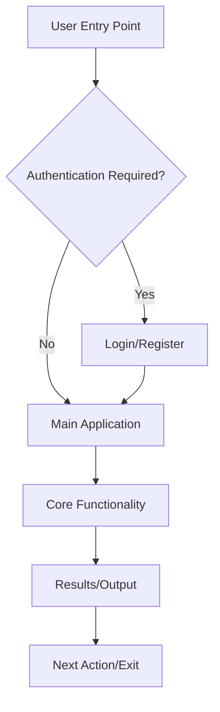

# Repository Context Template

<!-- Template for AI agents and humans to understand repository structure and make appropriate modifications -->
<!-- This provides comprehensive context for automated repository customization and interactive prompting -->
<!-- When completed, this document will be used to determine all repository configuration aspects including:
     - Dotfiles (.gitignore, .editorconfig, etc.)
     - Package managers and dependency configuration
     - Task runners and build tools
     - Documentation structure and format
     - GitHub-specific configurations (.github folder)
     - Markdown styling and linting
     - Technology-specific configuration files
     - And other repository-wide settings -->

> [!IMPORTANT]
> **Template Usage**: This template is designed for interactive completion by humans or AI agents. Each section includes detailed guidance on what information to gather and how to use it for repository customization.

## 📋 Project Overview

### Project Identity

> [!NOTE]
> **Interactive Guidance**: Start with these fundamental questions to establish project identity:
> - "What is the official name of your project?"
> - "What type of project are you building?" (Show options: CLI Tool, Web App, Library, etc.)
> - "In 1-2 sentences, what does your project do and what problem does it solve?"
> - "Who is your target audience?" (Developers, end users, enterprises, etc.)

- **Name**: {Project Name}
- **Type**: {CLI Tool | Web Application | Library | Framework | API Service | Mobile App | Desktop Application | Other}
- **Purpose**: {1-2 sentence description of what this project does and why it exists}
- **Target Audience**: {Who will use this project - developers, end users, enterprises, etc.}

> [!TIP]
> **For AI Agents**: Use the project type to automatically determine which configuration patterns to apply (e.g., CLI tools need different .gitignore patterns than web applications).

### Primary Language & Runtime

> [!NOTE]
> **Interactive Guidance**: Essential technical foundation questions:
> - "What is your primary programming language?"
> - "What runtime or platform does it use?"
> - "What's the minimum version you want to support?"
> 
> **Why This Matters**: This determines tooling, dependency management, and build configurations.

- **Main Language**: {Go | JavaScript/TypeScript | Python | Rust | Java | C# | Other}
- **Runtime/Platform**: {Node.js | .NET | JVM | Native | Browser | Other}
- **Minimum Version**: {Specify minimum supported version}

> [!WARNING]
> **Version Compatibility**: Be specific about minimum versions to avoid compatibility issues. This affects CI/CD setup and documentation.

## 🛠️ Technology Stack

### Core Technologies

> [!NOTE]
> **Interactive Guidance**: Ask about the main architectural components:
> - "What framework or library forms the backbone of your project?"
> - "Do you use a database? Which one?"
> - "How do you handle authentication?" (if applicable)
> - "What testing framework do you use?"
> 
> **Context**: These choices drive configuration file patterns and development setup.

- **Primary Framework**: {Express.js | React | Django | Gin | FastAPI | Spring Boot | Other | None}
- **Database**: {PostgreSQL | MySQL | MongoDB | SQLite | Redis | None | Other}
- **Authentication**: {JWT | OAuth2 | Session-based | None | Other}
- **Testing Framework**: {Jest | pytest | go test | JUnit | Other | None}

> [!TIP]
> **Framework-Specific Configs**: Each framework has specific configuration needs (e.g., React projects need .env handling, Django needs specific .gitignore patterns).

### Development Tools

> [!NOTE]
> **Interactive Guidance**: Development workflow questions:
> - "What build system do you use?" (npm, go modules, pip, etc.)
> - "Do you use a linter? Which one?"
> - "Do you use code formatting? Which tool?"
> - "What CI/CD platform do you use?"
> 
> **Purpose**: Determines .editorconfig, pre-commit hooks, and workflow configurations.

- **Build System**: {npm/yarn | go modules | pip | cargo | gradle | maven | other}
- **Linting**: {ESLint | golangci-lint | flake8 | clippy | other | none}
- **Formatting**: {Prettier | gofmt | black | rustfmt | other | none}
- **CI/CD**: {GitHub Actions | GitLab CI | Jenkins | other | none}

> [!IMPORTANT]
> **Consistency Impact**: These tools directly affect .editorconfig, .gitignore, and CI/CD workflow configurations.

### External Dependencies

> [!NOTE]
> **Interactive Guidance**: Focus on major dependencies:
> - "What are the 3-5 most important external libraries or services your project depends on?"
> - "What role does each dependency play in your project?"
> 
> **Note**: Don't list every dependency—focus on key ones that define capabilities or affect configuration.

List key external libraries, frameworks, or services:
- {Dependency 1}: {Purpose/Role in project}
- {Dependency 2}: {Purpose/Role in project}
- {Dependency 3}: {Purpose/Role in project}

> [!TIP]
> **Configuration Impact**: Major dependencies often require specific .gitignore patterns, environment variables, or documentation sections.

## 🏗️ Architecture & Structure

### Project Type Classification

> [!NOTE]
> **Interactive Guidance**: Multiple selection question:
> - "Which of these best describe your project architecture?" (Allow multiple selections)
> - Use this to determine repository structure and configuration needs.

- [ ] **Command Line Interface (CLI)**
- [ ] **Web API/Service**
- [ ] **Frontend Application**
- [ ] **Full-Stack Application**
- [ ] **Library/Package**
- [ ] **Microservice**
- [ ] **Monorepo**
- [ ] **Docker-based Application**
- [ ] **Serverless Function**

> [!WARNING]
> **Configuration Dependencies**: Each architecture type requires different .gitignore patterns, CI/CD setups, and documentation structures.

### Project Structure Diagram

> [!NOTE]
> **Interactive Guidance**: Ask users to describe their repository structure:
> - "What are your main directories and what do they contain?"
> - "Do you follow any specific organizational patterns?"
> 
> **For AI Agents**: Use this to generate accurate .gitignore patterns and documentation.

```mermaid
graph TD
    A[{project-root}/] --> B[{src/|lib/|app/}]
    A --> C[{tests/|__tests__/|test/}]
    A --> D[{docs/|documentation/}]
    A --> E[{config/|configs/}]
    A --> F[{scripts/|bin/}]
    A --> G[{other key directories}]
    
    B --> B1[{Main source code}]
    C --> C1[{Test files and fixtures}]
    D --> D1[{Documentation files}]
    E --> E1[{Configuration files}]
    F --> F1[{Build/deployment scripts}]
    G --> G1[{Specify purpose}]
```

> [!TIP]
> **Customization**: Replace the generic directory names with your actual directory structure and describe their specific purposes.

### Data Flow Architecture

> [!NOTE]
> **Interactive Guidance**: For applications with data flow:
> - "How does data move through your system?"
> - "What are the main data sources and destinations?"
> - "Are there any external APIs or services involved?"
> 
> **Skip if**: Your project is a simple library or doesn't have complex data flow.

```mermaid
flowchart LR
    A[{Data Source 1}] --> B[{Processing Layer}]
    C[{Data Source 2}] --> B
    B --> D[{Business Logic}]
    D --> E[{Data Storage}]
    D --> F[{External API}]
    D --> G[{Output/Response}]
```

> [!IMPORTANT]
> **Replace Placeholders**: Customize this diagram with your actual data sources, processing steps, and outputs.

### User Flow Diagram

> [!NOTE]
> **Interactive Guidance**: For user-facing applications:
> - "What are the main user interactions with your application?"
> - "What is the typical user journey?"
> - "Are there different user types with different flows?"
> 
> **Skip if**: Your project is a library, CLI tool without complex workflows, or API-only service.



> [!TIP]
> **User-Centric Design**: Focus on the user's perspective and main interaction patterns, not internal system details.

## 🎯 Configuration Requirements

### Configuration Files Present

> [!NOTE]
> **Interactive Guidance**: Inventory existing configuration:
> - "Which of these configuration files does your project have or need?"
> - "Are there any other important config files specific to your tech stack?"
> 
> **For AI Agents**: Use this checklist to determine which files need updates.

- [ ] **package.json** (Node.js projects)
- [ ] **go.mod** (Go projects)
- [ ] **requirements.txt/pyproject.toml** (Python projects)
- [ ] **Cargo.toml** (Rust projects)
- [ ] **pom.xml/build.gradle** (Java projects)
- [ ] **Dockerfile** (Container deployment)
- [ ] **docker-compose.yml** (Multi-container setup)
- [ ] **Other**: {Specify any other important config files}

### Files Requiring Technology-Specific Updates

> [!WARNING]
> **Critical for Functionality**: These files must be updated correctly or the development environment won't work properly.

#### Configuration Files (.gitignore, .gitattributes, .editorconfig)

> [!NOTE]
> **Interactive Guidance**: Technical configuration questions:
> - "What build artifacts does your project generate?"
> - "Are there any IDE-specific files to ignore?"
> - "Do you have preferences for line endings?" (Windows vs Unix)
> - "Are there any file types that need special git handling?"

- **Language-specific patterns**: {What build artifacts, cache files, or temporary files to ignore}
- **IDE support**: {What editor configurations are needed}
- **Line ending preferences**: {LF vs CRLF requirements}
- **File associations**: {What file types need special git handling}

#### Documentation Updates

> [!NOTE]
> **Interactive Guidance**: Documentation scope questions:
> - "How do users install your project?"
> - "What are the main usage examples they need?"
> - "What configuration options should be documented?"
> - "What additional documentation do you need?" (API docs, deployment guides, etc.)

- **README.md sections to customize**:
  - [ ] Installation instructions (package manager, build tools)
  - [ ] Usage examples (CLI commands, API endpoints, code samples)
  - [ ] Configuration options
  - [ ] Dependencies and prerequisites
  - [ ] Development setup
- **Additional docs needed**: {API docs, user guides, deployment guides, etc.}

#### GitHub Repository Settings

> [!NOTE]
> **Interactive Guidance**: Repository management questions:
> - "What types of issues do you expect?" (bugs, features, questions)
> - "What should contributors check before submitting PRs?"
> - "Do you need automated testing/deployment workflows?"
> - "How do you want to protect your main branch?"

- **Issue templates**: {Bug reports, feature requests, etc.}
- **Pull request templates**: {Code review checklist, testing requirements}
- **GitHub Actions workflows**: {CI/CD, testing, deployment}
- **Branch protection rules**: {Main branch, release branches}
- **Repository settings**: {Merge strategies, discussions, wikis}

### Environment & Deployment

> [!NOTE]
> **Interactive Guidance**: Environment and deployment questions:
> - "What environment variables does your application need?"
> - "How do you handle secrets and API keys?"
> - "Where do you plan to deploy?" (Heroku, Vercel, AWS, etc.)
> - "What files are generated when you build for production?"

- **Environment variables**: {What env vars does the app need}
- **Secrets management**: {API keys, database credentials, etc.}
- **Deployment target**: {Heroku | Vercel | AWS | Docker | GitHub Pages | npm registry | other}
- **Build artifacts**: {What files are generated during build}

> [!WARNING]
> **Security**: Never commit secrets to version control. Ensure .gitignore excludes environment files with sensitive data.

## 🔧 Development Workflow

### Getting Started Process

> [!NOTE]
> **Interactive Guidance**: Step-by-step setup questions:
> - "What steps does a new developer need to take to get your project running locally?"
> - "Are there any prerequisites they need to install first?"
> - "What's the typical development workflow?"

1. {Step 1 - e.g., Clone repository}
2. {Step 2 - e.g., Install dependencies}
3. {Step 3 - e.g., Set up environment}
4. {Step 4 - e.g., Run development server}

### Common Commands

> [!NOTE]
> **Interactive Guidance**: Command documentation questions:
> - "What command installs dependencies?"
> - "How do you start the development server or run the application?"
> - "What's the build command for production?"
> - "How do you run tests, linting, and formatting?"

- **Install**: `{command to install dependencies}`
- **Run/Start**: `{command to start development server or run application}`
- **Build**: `{command to build for production}`
- **Test**: `{command to run tests}`
- **Lint**: `{command to run linting}`
- **Format**: `{command to format code}`

> [!TIP]
> **Consistency**: These commands will be documented in the README and potentially automated in scripts.

### Code Style & Standards

> [!NOTE]
> **Interactive Guidance**: Code style questions:
> - "What naming convention do you prefer?" (camelCase, snake_case, etc.)
> - "How do you organize files and directories?"
> - "Are there specific patterns for imports or modules?"
> - "How do you handle errors and logging?"

- **Naming conventions**: {camelCase | snake_case | PascalCase | kebab-case}
- **File organization**: {How files should be structured}
- **Import/module patterns**: {How dependencies should be imported}
- **Error handling**: {How errors should be handled and logged}

> [!IMPORTANT]
> **.editorconfig Impact**: These preferences directly influence .editorconfig and linting configurations.

## 🚀 Features & Capabilities

### Core Features

> [!NOTE]
> **Interactive Guidance**: Feature documentation questions:
> - "What are the 3-5 main features of your project?"
> - "Why is each feature important to users?"
> - "How do these features work together?"

- {Feature 1}: {Description and importance}
- {Feature 2}: {Description and importance}
- {Feature 3}: {Description and importance}

### Planned Features

> [!NOTE]
> **Interactive Guidance**: Roadmap questions:
> - "What features are you planning to add?"
> - "What's the priority and timeline for each?"
> - "Are there any major architectural changes planned?"

- {Future feature 1}: {Timeline and priority}
- {Future feature 2}: {Timeline and priority}

### Integration Points

> [!NOTE]
> **Interactive Guidance**: Integration questions:
> - "Does your project connect to external APIs or services?"
> - "What data does it store or retrieve?"
> - "Are there any third-party integrations?"

- {External API 1}: {Purpose and usage}
- {External service 2}: {Purpose and usage}
- {Database connections}: {What data is stored/retrieved}

> [!TIP]
> **Documentation Impact**: Integrations often require API documentation, authentication setup, and environment variable configuration.

## 📦 Distribution & Packaging

### Package Distribution

> [!NOTE]
> **Interactive Guidance**: Distribution questions:
> - "How do you plan to distribute your project?"
> - "What package registries or platforms will you use?"
> - "Do you need automated releases?"

- [ ] **npm package** (JavaScript/TypeScript)
- [ ] **PyPI package** (Python)
- [ ] **crates.io** (Rust)
- [ ] **Go modules** (Go)
- [ ] **Docker image** (Containerized)
- [ ] **GitHub Releases** (Binaries)
- [ ] **Other**: {Specify distribution method}

### Release Process

> [!NOTE]
> **Interactive Guidance**: Release workflow questions:
> - "What versioning scheme do you want to use?"
> - "How should releases be triggered?" (tags, manual, automated)
> - "Do you want to maintain a changelog?"

- **Versioning scheme**: {Semantic versioning | CalVer | other}
- **Release triggers**: {Tags | manual | automated}
- **Changelog format**: {Keep a Changelog | auto-generated | other}

> [!IMPORTANT]
> **CI/CD Integration**: Release process affects GitHub Actions workflows and repository settings.

## 🧪 Testing & Quality Assurance

### Testing Strategy

> [!NOTE]
> **Interactive Guidance**: Testing approach questions:
> - "What types of testing do you want?" (unit, integration, e2e)
> - "What coverage expectations do you have?"
> - "Do you need performance or load testing?"

- **Unit tests**: {Coverage expectations and tools}
- **Integration tests**: {What systems are tested together}
- **End-to-end tests**: {User workflow testing}
- **Performance tests**: {Load testing, benchmarks}

### Code Quality Tools

> [!NOTE]
> **Interactive Guidance**: Quality tooling questions:
> - "What static analysis tools do you want to use?"
> - "Do you need security scanning?"
> - "How do you want to monitor dependencies for vulnerabilities?"

- **Static analysis**: {What tools check code quality}
- **Security scanning**: {What tools check for vulnerabilities}
- **Dependency auditing**: {How dependencies are monitored}

> [!TIP]
> **Automation**: These tools can be integrated into CI/CD workflows for automated quality checks.

## 🔒 Security Considerations

### Security Requirements

> [!NOTE]
> **Interactive Guidance**: Security assessment questions:
> - "How do users authenticate with your application?"
> - "What different permission levels exist?"
> - "What type of data does your project handle?"
> - "Are there any compliance requirements?" (GDPR, HIPAA, etc.)

- **Authentication needs**: {How users authenticate}
- **Authorization levels**: {What permissions exist}
- **Data sensitivity**: {What data needs protection}
- **Compliance requirements**: {GDPR, HIPAA, SOC2, etc.}

### Security Tools & Practices

> [!NOTE]
> **Interactive Guidance**: Security tooling questions:
> - "How do you scan for vulnerable dependencies?"
> - "How do you manage secrets and API keys?"
> - "Do you need specific HTTP security headers?"

- **Dependency scanning**: {How vulnerable dependencies are detected}
- **Secret management**: {How secrets are stored and accessed}
- **Security headers**: {What HTTP security headers are needed}

> [!WARNING]
> **Security-First**: Security considerations affect .gitignore patterns, environment setup, and CI/CD configurations.

---

## 🤖 AI Agent Instructions

> [!IMPORTANT]
> **Processing Guide**: This section provides specific instructions for AI agents processing the completed template.

### Critical Modifications Based on This Context

When processing this repository context, AI agents should:

#### 1. Update Configuration Files
- **`.gitignore`**: Add language-specific build artifacts, IDE files, and dependency directories
- **`.gitattributes`**: Configure line endings and diff handling for file types
- **`.editorconfig`**: Set consistent coding standards for the primary language
- **`.dockerignore`**: Exclude development files from Docker builds (if Docker is used)

#### 2. Customize Documentation
- **README.md**: Update installation, usage, and development sections based on tech stack
- **CONTRIBUTING.md**: Add language-specific contribution guidelines and coding standards
- **Documentation files**: Create or update based on project type and complexity

#### 3. Set Up Development Environment
- **Package files**: Ensure dependencies and scripts match the described workflow
- **CI/CD workflows**: Configure automated testing and deployment based on the tech stack
- **Issue/PR templates**: Create templates appropriate for the project type

#### 4. Repository Settings
- **Branch protection**: Configure based on release process and team size
- **Labels**: Create issue/PR labels relevant to the project type
- **Security policies**: Ensure SECURITY.md matches the project's security requirements

### Validation Checklist

Before completing repository customization, verify:
- [ ] All technology-specific patterns are in `.gitignore`
- [ ] README.md accurately reflects the installation and usage process
- [ ] CI/CD workflows match the testing and deployment strategy
- [ ] Documentation structure supports the identified user types
- [ ] Security policies align with the project's security requirements
- [ ] Package/dependency files are consistent with the described tech stack

### Risk Assessment

> [!WARNING]
> **Priority Levels**: Focus on high-priority updates first to prevent breaking the development workflow.

**High Priority Updates** (Will break development workflow if missed):
- Package manager configuration files
- Build tool configurations
- Environment variable documentation

**Medium Priority Updates** (Will cause confusion or inefficiency):
- Documentation accuracy
- Development setup instructions
- Contribution guidelines

**Low Priority Updates** (Nice to have but not critical):
- Repository metadata
- Advanced CI/CD features
- Optional tooling configurations

---

## 📝 Interactive Template Usage

> [!TIP]
> **For Interactive AI Assistants**: Use the guidance notes in each section to create conversational prompts that gather the required information systematically. Start with Project Overview and work through each section, using the provided questions as a foundation for natural conversation.

> [!NOTE]
> **Template Completion**: Once filled out, this template provides comprehensive context for automated repository customization, ensuring all configuration files, documentation, and settings align with the project's specific technology stack and requirements.
